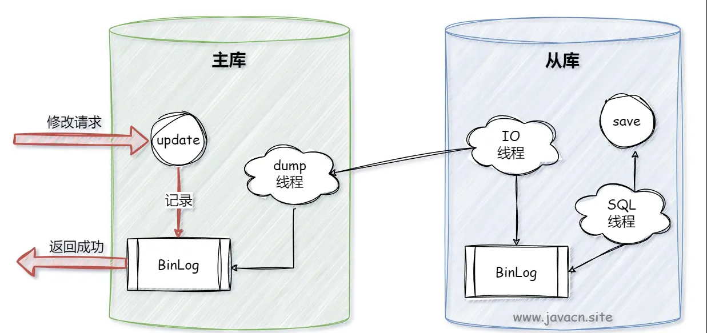
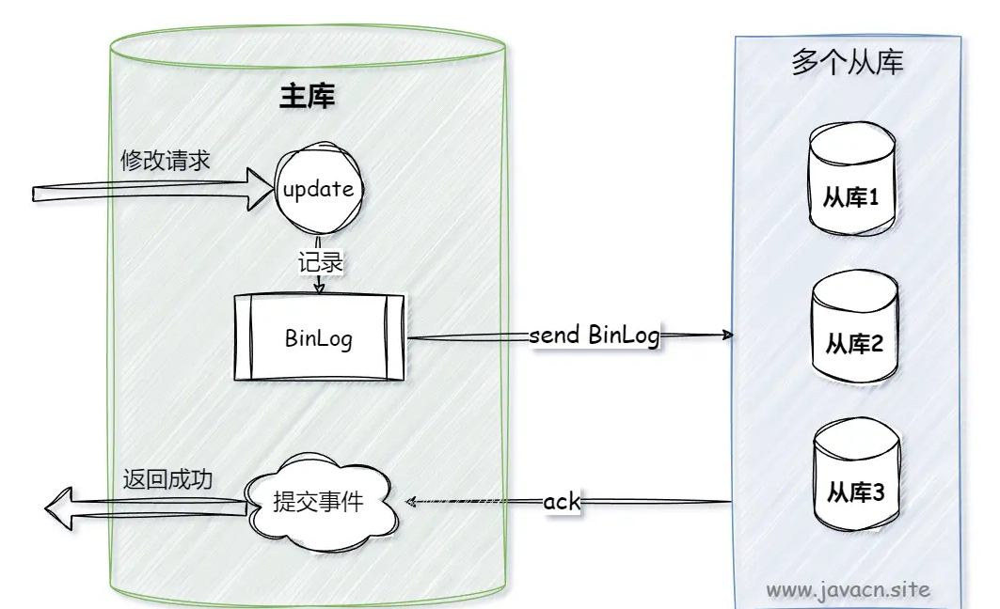
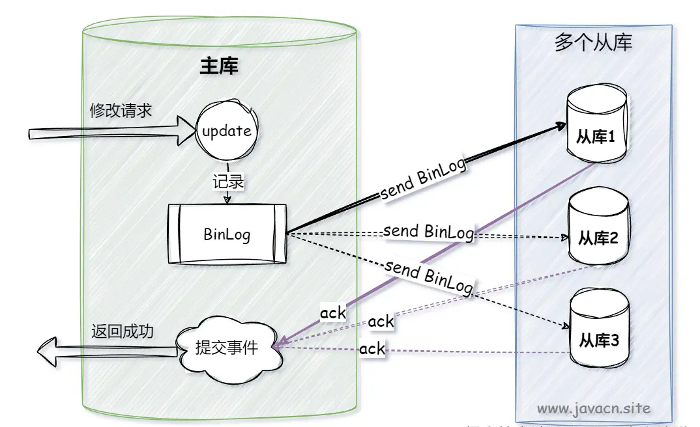

title: 数据一致性
---

### 数据一致性

数据一致性是指在一个系统中，数据在不同的部分、不同的时间点，以及不同的操作之间保持一致的状态。

数据一致性通常体现在以下几点：

- 数据一致性：确保数据的完整性意味着数据在存储和传输过程中没有被损坏或丢失。这包括数据的准确性、完整性和有效性。例如，在一个电商系统中，商品的库存数量应该是准确的。如果一个用户购买了一件商品，库存数量应该相应地减少。如果库存数量显示不正确，就会导致数据不一致。
- 事务一致性：在数据库系统中，事务是一组操作的集合，这些操作要么全部成功执行，要么全部回滚。事务一致性确保在一个事务中对数据的修改在事务提交后对所有用户都是可见的，并且如果事务失败，数据将恢复到事务开始之前的状态。例如，在一个在线预订系统中，用户预订了一个酒店房间，系统应该确保这个房间在预订期间不能被其他用户预订。如果出现多个用户同时预订同一个房间的情况，就会导致数据不一致。
- 多副本一致性：在分布式系统中，数据通常会存储在多个副本中，以提高系统的可用性和性能。多副本一致性确保不同副本之间的数据保持一致。例如，在一个云存储服务中，用户上传了一个文件，这个文件会被存储在多个数据中心的服务器上。如果用户对文件进行了修改，云存储服务应该确保所有副本都被更新，以保证用户在任何地方访问文件时都能看到最新的版本。
- 时间一致性：时间一致性要求数据在不同的时间点上保持一致，这包括数据的时效性和顺序性。例如，在一个股票交易系统中，交易订单的处理应该按照时间顺序进行。如果订单的处理顺序出现错误，就会导致交易数据不一致。

#### 数据一致性重要性

**数据可靠性**: 数据一致性可以保证数据的可靠性，确保多个节点中存储的数据副本之间保持相同的状态和值，从而避免数据的丢失或错误。

**系统可用性**: 数据一致性可以提高分布式系统的可用性，确保多个节点中存储的数据副本之间保持一致，从而避免系统出现故障或不可用的情况。

**业务可靠性**: 数据一致性可以提高业务的可靠性，确保不同的业务操作之间的数据保持一致，从而避免业务出现错误或不一致的情况。

**用户体验**: 数据一致性可以提高用户的体验，确保用户在使用分布式系统时，数据的正确性和一致性，从而提高用户的满意度。

**合规性要求**: 一些行业或法规对数据的一致性有着严格的要求，如金融、医疗等行业。数据一致性可以保证企业符合行业和法规的要求。

#### 一致性的模型

**线性一致性**: 线性一致性又叫做原子一致性，**强一致性**。线性一致性可以看做只有一个单核处理器，或者可以看做只有一个数据副本，并且所有操作都是原子的。在可线性化的分布式系统中，如果某个节点更新了数据，那么在其他节点如果都能读取到这个最新的数据。可以看见线性一致性和我们的CAP中的C是一致的。

**顺序一致性**: 顺序一致性弱于严格一致性。对变量的写操作不一定要在瞬间看到，但是，不同处理器对变量的写操作必须在所有处理器上以相同的顺序看到，这里处理器再分布式系统中可以换成不同的节点。

**因果一致性**: 因果一致性是弱于顺序一致性的一致性模型，顺序一致性要求所有的操作的顺序都必须按照某个单个处理器(节点)的顺序，而因果一致性只需要满足有因果关系的操作是顺序一致性即可。

**处理器一致性**: 处理器一致性是更加弱的一致性模型，他只需要保证处理器看到某个处理器或者多个不同处理对相同位置的写入都是一致的。不需要考虑因果关系，而是对同一个内存或者同一个数据更新需要看到一致的顺序。

**FIFO一致性**: FIFO一致性是比处理器一致性还更加弱的一种，它不需要保证对相同位置的写入是一致的。 是指在一个处理器上完成的所有写操作，将会被以它实际发生的顺序通知给所有其它的处理器；但是在不同处理器上完成的写操作也许会被其它处理器以不同于实际执行的顺序所看到。

**最终一致性**: 其实除了强一致以外，其他的一致性都可以看作为最终一致性，只是根据一致性不同模型的不同要求又衍生出了很多具体一致性模型。当然最简单的最终一致性，是不需要关注中间变化的顺序，只需要保证在某个时间点一致即可。只是这个某个时间点需要根据不同的系统，不同业务再去衡量。再最终一致性完成之前，有可能返回任何的值，不会对这些值做任何顺序保证。

### 分布式数据库一致性

**选举算法**: 对于分布式系统中的主节点选举，可以使用Paxos、Raft等一些选举算法来保证数据一致性。

**分布式事务**: 在分布式系统中，可以使用分布式事务来保证数据的一致性。分布式事务可以将多个数据库操作作为一个整体事务进行提交，从而保证数据的一致性。

**两阶段提交**: 是一种常见的分布式事务协议，可以确保所有节点在进行写操作时，都具有相同的数据值。该协议分为投票阶段和提交阶段，通过多个节点的协作来保证数据的一致性。

**三阶段提交**: 是一种改进的两阶段提交协议，通过引入预提交阶段来减少阻塞时间和减轻数据不一致的风险。

**去中心化协议**: 在去中心化系统中，可以使用Gossip协议、Scuttlebutt协议等一些去中心化协议，来保证数据的一致性。这些协议可以通过节点之间的信息传递来达到数据的一致性。

**版本控制**: 在分布式系统中，可以使用版本控制来保证数据的一致性。版本控制可以确保每个节点都具有相同的数据版本，从而避免数据不一致的问题。

**数据复制**: 在分布式系统中，可以通过数据复制来保证数据的一致性。数据复制可以将数据复制到多个节点中，从而避免数据的丢失或错误。

**缓存更新**: 在分布式系统中，可以通过缓存更新来保证数据的一致性。缓存更新可以确保缓存中的数据与数据库中的数据保持一致。

### Redis缓存与数据的一致性

“数据一致”一般指的是：缓存中有数据，缓存的数据值 = 数据库中的值。

但根据缓存中是有数据为依据，则”一致“可以包含两种情况：

- 缓存中有数据，缓存的数据值 = 数据库中的值（需均为最新值，本文将“旧值的一致”归类为“不一致状态”）
- 缓存中本没有数据，数据库中的值 = 最新值（有请求查询数据库时，会将数据写入缓存，则变为上面的“一致”状态）

”数据不一致“：缓存的数据值 ≠ 数据库中的值；缓存或者数据库中存在旧值，导致其他线程读到旧数据。

#### 只读缓存
只读缓存：新增数据时，直接写入数据库；更新（修改/删除）数据时，先删除缓存。 后续，访问这些增删改的数据时，会发生缓存缺失，进而查询数据库，更新缓存。

#### 读写缓存
读写缓存：增删改在缓存中进行，并采取相应的回写策略，同步数据到数据库中

- 同步直写：使用事务，保证缓存和数据更新的原子性，并进行失败重试（如果Redis 本身出现故障，会降低服务的性能和可用性）
- 异步回写：写缓存时不同步写数据库，等到数据从缓存中淘汰时，再写回数据库（没写回数据库前，缓存发生故障，会造成数据丢失）
该策略在秒杀场中有见到过，业务层直接对缓存中的秒杀商品库存信息进行操作，一段时间后再回写数据库。

一致性：同步直写 > 异步回写 因此，对于读写缓存，要保持数据强一致性的主要思路是：利用同步直写 同步直写也存在两个操作的时序问题：更新数据库和更新缓存

#### 强一致性策略

（1）暂存并发读请求

在更新数据库时，先在 Redis 缓存客户端暂存并发读请求，等数据库更新完、缓存值删除后，再读取数据，从而保证数据一致性。

（2）串行化

读写请求入队列，工作线程从队列中取任务来依次执行

1. 修改服务Service连接池，id取模选取服务连接，能够保证同一个数据的读写都落在同一个后端服务上
2. 修改数据库DB连接池，id取模选取DB连接，能够保证同一个数据的读写在数据库层面是串行的

（3）使用Redis分布式读写锁

将淘汰缓存与更新库表放入同一把写锁中，与其它读请求互斥，防止其间产生旧数据。读写互斥、写写互斥、读读共享，可满足读多写少的场景数据一致，也保证了并发性。并根据逻辑平均运行时间、响应超时时间来确定过期时间。

```java
public void write() {
    Lock writeLock = redis.getWriteLock(lockKey);
    writeLock.lock();
    try {
        redis.delete(key);
        db.update(record);
    } finally {
        writeLock.unlock();
    }
}

public void read() {
    if (caching) {
        return;
    }
    // no cache
    Lock readLock = redis.getReadLock(lockKey);
    readLock.lock();
    try {
        record = db.get();
    } finally {
        readLock.unlock();
    }
    redis.set(key, record);
}
```

### MySQL主从数据一致性

#### 异步复制
主服务器提交事务后立即返回客户端，无需等待从服务器确认是否成功接收并应用了事务，从服务器会在后台独立地接收并应用事务日志。



优点

1. 性能：异步复制模式下，主服务器的写操作不会因为等待从服务器的确认而被阻塞，因此可以提供更高的写入吞吐量。
2. 简单：配置和管理相对简单。
3. 成本：不需要额外的硬件资源支持，因为不需要高速的网络连接来保证同步。

缺点
数据丢失问题：在主服务器故障的情况下，可能存在数据未完全同步到从服务器的情况，导致数据丢失或不一致。

#### 同步复制
主服务器在提交一个事务之前，必须等待所有从服务器确认确认接收到并应用了事务之后，主服务器才会向客户端返回事务提交成功的消息。



优点

1. 数据一致性：提供了更高的数据一致性保障，因为主服务器必须等待从服务器确认才能完成事务提交。
2. 容错性：即使主服务器发生故障，至少有一个从服务器拥有最新的数据，从而减少了数据丢失的风险。

缺点

1. 性能开销大：主库需要等待所有从库的响应，这会导致事务提交的延迟增加，尤其是在从库数量较多或网络状况不佳时，性能下降明显。
2. 单点故障风险：如果一个从库出现故障，可能会导致整个系统的阻塞，因为主库需要等待所有从库的确认。

#### 半同步复制
主服务器在提交一个事务之前，需要等待至少一个从服务器确认接收到该事务的日志，但不需要等待从服务器完成应用。



优点

1. 数据一致性较好：相比异步复制，提供了更好的数据一致性保障。
2. 性能影响较小：相比同步复制，半同步复制的性能开销较小，因为只需要等待一个从库的确认。
3. 灵活性较高：可以根据需要调整等待的从服务器数量，以适应不同的性能和可靠性需求。

缺点

1. 性能波动风险：在网络延迟较高或从库负载较大的情况下，可能会导致主库等待从库确认的时间过长，从而影响性能。
2. 配置复杂：相比异步复制，配置和管理稍微复杂一些。

### 其他

#### 常见问题

- 如何在数据迁移和备份过程中保证数据一致性？

```text
事务控制: 在数据迁移和备份过程中，可以使用事务控制来保证数据的一致性。在数据迁移和备份过程中，应该将所有的操作作为一个整体事务进行提交，避免数据出现不一致的情况。

写锁定: 在进行数据备份时，可以使用写锁定来保证数据的一致性。使用写锁定可以确保备份时数据不被修改，从而避免数据的不一致。

镜像卷: 在进行数据备份时，可以使用镜像卷来保证数据的一致性。镜像卷可以将数据复制到另一个卷上，从而保证备份的数据与原始数据保持一致。

增量备份: 在进行数据备份时，可以使用增量备份来保证数据的一致性。增量备份只备份发生变化的数据，从而减少备份数据的数量，保证备份数据与原始数据的一致性。

数据校验: 在数据迁移和备份过程中，可以使用数据校验来保证数据的一致性。数据校验可以对备份数据和原始数据进行比对，以确保备份数据与原始数据保持一致。

压缩和加密: 在数据迁移和备份过程中，可以使用压缩和加密技术来保证数据的一致性。压缩可以减少备份数据的大小，加密可以保护备份数据的安全性，从而保证备份数据与原始数据的一致性。
```
- 如何在实时数据处理中保证数据一致性？

```text
事件驱动架构: 在实时数据处理中，可以使用事件驱动架构来保证数据的一致性。事件驱动架构可以将数据处理分成多个事件，每个事件相互独立，从而避免数据的不一致性。

流处理: 在实时数据处理中，可以使用流处理来保证数据的一致性。流处理可以将数据流分成多个流，每个流相互独立，从而避免数据的不一致性。

数据缓存: 在实时数据处理中，可以使用数据缓存来保证数据的一致性。数据缓存可以将数据缓存在内存中，从而提高数据的访问速度和处理效率。

数据校验: 在实时数据处理中，可以使用数据校验来保证数据的一致性。数据校验可以对数据进行验证，确保数据的正确性和一致性。

并发控制: 在实时数据处理中，可以使用并发控制来保证数据的一致性。并发控制可以控制多个并发操作，确保数据的正确性和一致性。

分布式事务: 在实时数据处理中，可以使用分布式事务来保证数据的一致性。分布式事务可以将多个数据操作作为一个整体事务进行提交，从而保证数据的一致性。

去重机制: 在实时数据处理中，可以使用去重机制来保证数据的一致性。去重机制可以避免重复数据的出现，从而保证数据的一致性。
```

- 如何评估和监控数据一致性？

```text
数据质量指标: 可以定义一些数据质量指标，如数据准确性、数据完整性、数据一致性等，通过监控这些指标来评估和监控数据一致性。

数据校验: 可以对数据进行校验，确保数据的正确性和一致性。数据校验可以通过数据比对、数据统计等方式进行。

数据可视化: 可以将数据可视化，通过图表、报表等方式展现数据的一致性和变化情况，从而帮助我们及时发现和解决数据不一致的问题。

数据监控工具: 可以使用数据监控工具，如数据质量管理工具、实时监控工具等，来监控数据的一致性和变化情况。

数据审计: 可以对数据进行审计，记录数据的修改、删除等操作，从而帮助我们发现和解决数据不一致的问题。

数据回滚: 可以使用数据回滚技术，将数据恢复到之前的状态，从而保证数据的一致性。

数据订正: 可以对错误的数据进行订正，将数据恢复到正确的状态，从而保证数据的一致性。
```
#### 参考
- https://juejin.cn/post/7404778905400639499
- https://cloud.tencent.com/developer/techpedia/1704
- https://juejin.cn/post/7373136303179792395
- https://zhuanlan.zhihu.com/p/707647961
- https://cloud.tencent.com/developer/article/1520172
