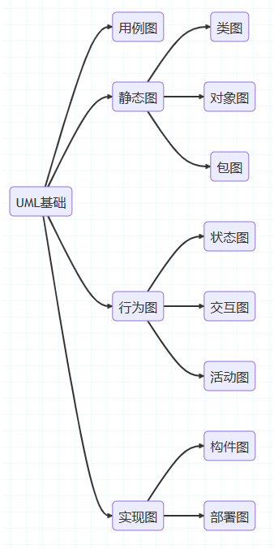
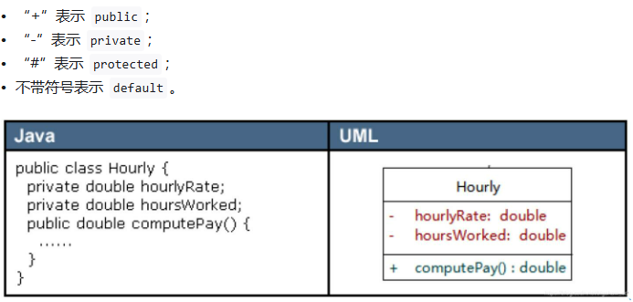
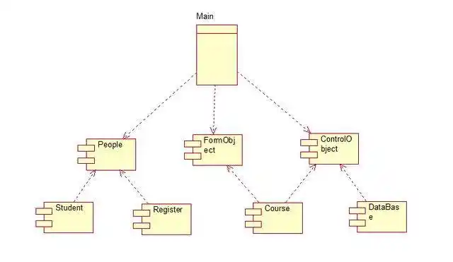
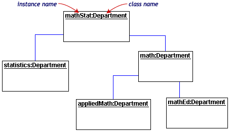
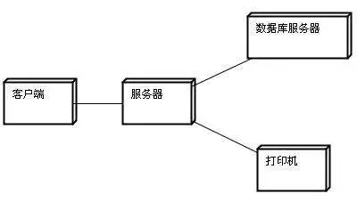
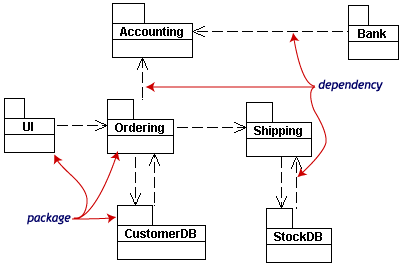
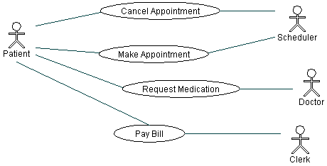
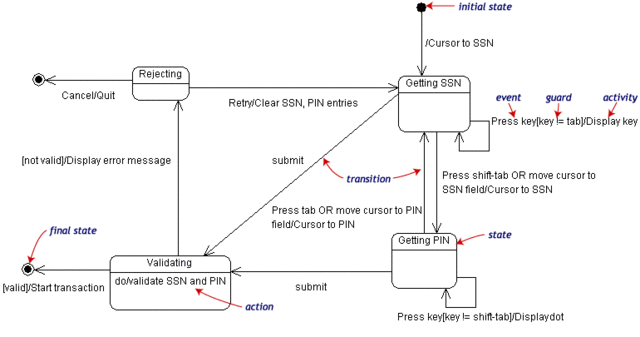
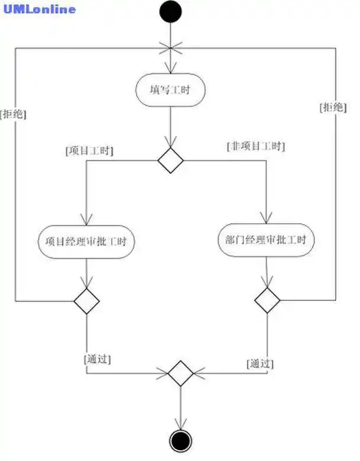
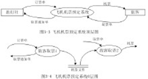

title: UML图
---

统一建模语言（Unified Modeling Language，UML）又称标准建模语言。

UML从考虑系统的不同角度出发，定义了用例图、类图、对象图、包图、状态图、活动图、序列图、通信图、构件图、部署图等10种图。下图中红字部分为 UML2.0新增。

### 分类

#### 类图
类图(class diagram)。描述- -组类、接口、协作和它们之间的关系。在面向对象系统的建模中，最常见的图就是类图。类图给出了系统的静态设计视图，活动类的类图给出了系统的静态进程视图。

> uml类图具体概念，请看 [30分钟学会UML类图](https://zhuanlan.zhihu.com/p/109655171)

类与类之间的关系 在UML类图中，常见的有以下几种关系: 泛化（Generalization）, 实现（Realization），关联（Association)，聚合（Aggregation），组合(Composition)，依赖(Dependency).

#### 构件图
构件图( component diagram)。 描述一- 个封装的类和它的接口、端口，以及由内嵌的构件和连接件构成的内部结构。构件图用于表示系统的静态设计实现视图。对于由小的部件构建大的系统来说，构件图是很重要的。构件图是类图的变体。

#### 对象图
对象图(object diagram)。描述一组对 象及它们之间的关系。对象图描述了在类图中所建立的事物实例的静态快照。和类图一样，这些图给出系统的静态设计视图或静态进程视图，但它们是从真实案例或原型案例的角度建立的。

#### 部署图
部署图(deployment diagram)。描述对运行时的处理节点及在其中生存的构件的配置。部署图给出了架构的静态部署视图，通常一个节点包含一个或多个部署图。

#### 包图
包图(packagediagram)。描述由模型本身分解而成的组织单元，以及它们的依赖关系。

#### 用例图
用例图(use case diagram)。描述一组用例、 参与者(- -种特殊的类)及它们之间的关系。用例图给出系统的静态用例视图。这些图在对系统的行为进行组织和建模时是非常重要的。

#### 状态图
状态图(state diagram)。描述-一个状态机，它由状态、转移、事件和活动组成。状态图给出了对象的动态视图。它对于接口、类或协作的行为建模尤为重要，而且它强调事件导致的对象行为，这非常有助于对反应式系统建模。

#### 活动图
活动图(activitydiagram)。将进程或其他计算的结构展示为计算内部--步步的控制流和数据流。活动图专注于系统的动态视图。它对系统的功能建模特别重要，并强调对象间的控制流程。

### 数据流图
在数据库设计的需求分析阶段，需要形成 **需求说明文档**、**数据字典**、**数据流图**

数据流图（Data Flow Diagram）：简称DFD，它从数据传递和加工角度，以图形方式来表达系统的逻辑功能、数据在系统内部的逻辑流向和逻辑变换过程，是结构化系统分析方法的主要表达工具及用于表示软件模型的一种图示方法。

数据流图中，基本的元素包括种：数据流、加工、数据存储（文 件）、外部实体。

### 程序流程图和盒图
- 程序流程图：

程序流程图描绘用来表示程序执行过程中的控制流，常用于数据流程的可视化。以下是一个简单的程序流程图示例：

- 盒图：

盒图（Box diagram）常用于描述系统的静态结构，表示对象和类以及它们之间的交互。以下是一个盒图示例：

