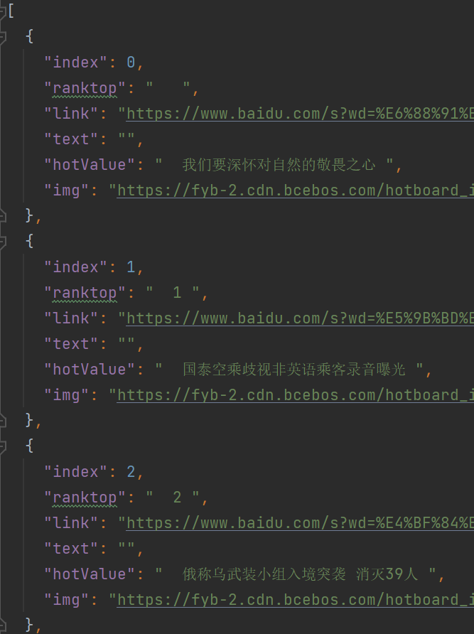

title: NodeJs爬虫
---

### 前言

网络爬虫（又称为网页蜘蛛，网络机器人，在FOAF社区中间，更经常的称为网页追逐者），是一种按照一定的规则，自动地抓取万维网信息的程序或者脚本。另外一些不常使用的名字还有蚂蚁、自动索引、模拟程序或者蠕虫。

目前几乎所有语言都可以实现爬虫，较为流行的有NodeJs、python等。 简单场景使用nodejs即可，专业级的爬虫考虑的比较多，像多线程、吞吐量、分布式爬取、拓展性等，应该使用python做爬虫更合适。

本文简单介绍nodejs爬虫的使用，并实现几个较为简单的程序作为小玩具，只为学习交流。**不要恶意爬取网站数据，和谐网络环境需要大家共同维护。**

### 介绍

爬取数据一般简单来说就是 `目标请求` -> `获取数据` -> `处理数据` 这几个阶段。

获取数据一般有直接**从接口获取**、**解析JS构造运行环境获取**和**页面解析获取**等几种方式。

从接口获取是最简单的，到目标网站直接F12找到相应接口，然后构造请求函数获取数据，最后将数据处理。

有的网站的页面可能是混合生成，比如某些部分是异步获取JS再动态生成对应内容，这时需要JS引擎对异步JS内容做解析才能获取数据。

有些页面是服务端渲染生成的，这种情况要对目标网站做页面解析，可查看页面DOM结构，然后获取相应数据。

### 程序实现

#### 1. 美女图片

我们通过**爬取接口的方式**实现获取数据并下载图片保存到本地。

* 设置接口相关参数(通过axios)；
* 通过接口获取数据(这里是图片的url)；
* 将图片下载到本地(通过download)；

对于这个美女网站我们可以直接爬取接口来获取图片url，然后将图片保存。结果如图：


完整源代码请看 `src/beauty.js`。

#### 2. 微博/百度热搜

有的网站并不是通过接口的方式来获取数据，比如服务端渲染的页面。这时我们可以通过**页面解析的方式**来爬取数据。

- 百度热搜

像[百度热搜](https://top.baidu.com/board?platform=pc&sa=pcindex_a_right)，我们通过分析页面DOM结构可知热搜数据位于 `.theme-hot[theme="realtime"] .list_1EDla a` ，通过 `cheerio` 框架来使用选择器获取热搜文案及其他数据。
然后可以直接使用nodejs 内置工具函数 `fs.writeFileSync` 来将数据保存到本地。结果如下：



可以运行 `npm run baidu-hot` 然后在 `static/baidu_realtime_hot.json` 查看。

- 微博热搜

有些网站为了防爬虫加了一些校验，如[微博热搜](https://s.weibo.com/top/summary?cate=realtimehot)需要设置 `Cookie`。一般来说比较简单，我们F12查看可以通过分析看文件请求 `Request Headers` 字段是否有校验字段，通常是cookie和token这种。
可以对微博热搜设置headers来通过校验。结果如下：


可以运行 `npm run weibo-hot` 然后在 `static/weibo_realtime_hot.json` 查看。

> cheerio作为选择器使用要处理，cheerio.load(res.data)。具体使用请看：https://github.com/cheeriojs/cheerio

#### 3. 天天基金

同样的，这个程序也是通过**抓取接口形式**来爬取数据。规则是爬取 `今年前50，资金规模不超过10亿` 的基金。

* 通过axios获取接口数据;
* 并对获取到的数据做处理，将会得到 `var rankData ={ /.../ }` 形式数据;
* 使用 `node-xlsx` 将[[str, str, str], [str, str, str]]形式数据转换为buffer;
* 将buffer通过fs模块下载到本地，这里是指定了下载位置到 `/static`;


源码请看 `src/tiantian-fund.js`。

#### 4. 国家统计局

通过**爬取接口的方式**获取相应的数据，并生成xlsx文件。这里我爬取了 `国民经济核算最近6季度的数据`。


#### 5. 高清素材

通过**爬取接口的方式**获取相应高清图片素材，这个网站有token校验，要自己登录获取相应字段值 `Sentry-Trace` 和 `Cookie`。


#### 6. 4k高清壁纸

通过**页面分析的方式**获取相应高清壁纸。


### 项目本地预览

项目已开源，欢迎点赞: [一款基于nodejs的爬虫程序集](https://github.com/Zuojiangtao/nodejs-spider)

#### Clone repo

```bash
git clone --depth=1 https://github.com/Zuojiangtao/nodejs-spider.git my-project
cd my-project
```

#### 安装依赖

```shell
yarn install
```

#### 运行爬虫指令

```shell
yarn beauty // 爬取美女图片

yarn weibo-hot // 爬取微博热搜

yarn baidu-hot // 爬取百度热搜

yarn tiantian-fund // 爬取天天基金筛选数据
```

#### 内容查看

所有生成内容均在 `/static` 下找到。

### 常用模块推荐

#### 下载文件常用模块

1. 可使用内置模块 'fs' ;
2. 使用第三方插件 'node-downloader-helper' ;
3. 使用第三方插件 'download' ;

#### 获取数据常用模块

1. 如果node版本17.5.0以上，可以使用fetch模块;
2. 使用axios、request、superagent等第三方插件;
3. 使用内置模块 'http';

#### 其他优秀依赖及模块推荐

1. 一款轻量级nodejs爬虫工具：[node-crawler](https://github.com/bda-research/node-crawler);
2. 一个验证码相关工具：[node-tesseract](https://github.com/desmondmorris/node-tesseract);
3. 爬虫定时爬取：[node-schedule](https://github.com/node-schedule/node-schedule);
4. 将markdown文件转成PDF文件：[markdown-pdf](https://github.com/alanshaw/markdown-pdf);
5. xlsx：[node-xlsx](https://github.com/mgcrea/node-xlsx);
6. csv：[node-csv](https://github.com/adaltas/node-csv);
7. 其他依赖资源汇总：[awesome-nodejs](https://github.com/sindresorhus/awesome-nodejs);

### 参考资料

- [网络爬虫-百度百科](https://baike.baidu.com/item/%E7%BD%91%E7%BB%9C%E7%88%AC%E8%99%AB/5162711?fromtitle=%E7%88%AC%E8%99%AB&fromid=22046949&fr=aladdin)
- [Node.js 爬虫相关模块小整合](https://juejin.cn/post/6844903449054674952)
