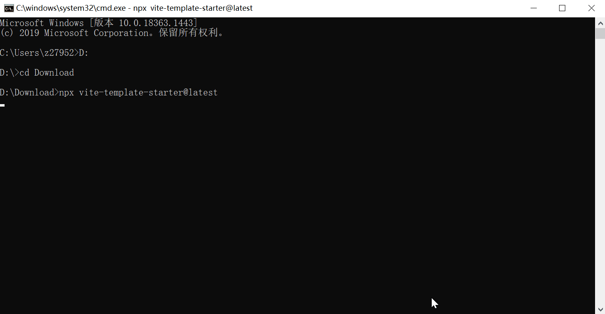

title: 基于vite的轻量化前端脚手架
---

### 前言

在开发项目时，我们对一些重复的、有价值的功能模块希望能够沉淀下来供之后的新项目使用；在创建新项目时我们又希望能够自定义插件和功能，添加自己喜欢的插件或者业务相关的功能模块。

vue/react官方的脚手架提供了方便精简的cli创建方式，但是对有自定义需求或对业务开发提升效能还是不能完全满足的，所以还是有需要开发自己的前端脚手架的。本文带大家从零开始，开发一款自己的脚手架。

> 本文默认大家使用过vue/react的官方脚手架；由于是基于vite的脚手架，所以node版本需要 14.18+ 或 16+ 或 更高。

先看下最终效果：


### 一、官方源码解读

#### 1. create-vue

vue的脚手架对源码做下简单解读，具体源码可看：[create-vue源码](https://github.com/vuejs/create-vue)。

主要函数都在根目录下的 `index.ts`，主要函数是 `init()`， 把一些变量定义和判空逻辑去除，只梳理下核心业务逻辑。

先是prompts收集各项指令，再是根据各项的选择拷贝对应文件，还有就是ejs文件转换，如果是启用ts要js转成ts，最后是readme文件生成和创建成功的可执行命令提示。


如图：从150行开始直到314行收集各项输入指令，都赋值到result中，result将用于后续的文件拷贝和转换。


如图：从316行开始直到494行都是文件的拷贝，拷贝函数 `render`，格式都是 `if() { render(path) }`，意思是如果之前配置的指令配置了需要此插件到对应的文件将其拷贝到最终生成的项目文件夹。 


如图：从504行开始是对ejs文件的转换，大概逻辑是转换ejs文件并将源文件删除。


如图：从521行到566行则是说尽可能保持js文件和ts文件的公用，如果启用ts则将js文件转换成ts文件并删除源文件。


如图：从568行到594行则是包管理器和生成readme文件，之前prompts指令和包管理器都会生成到最终的文件。


如图：最后的596行到608行则是创建项目成功的可运行指令提示了。

从上面的分析可知，vue的脚手架创建是遵循：收集指令->生成文件->最终提示和readme生成的核心逻辑。

#### 2. create-react-app

再对react的脚手架对源码做下简单解读，具体源码可看：[create-react-app源码](https://github.com/facebook/create-react-app/blob/main/packages/create-react-app/createReactApp.js)。

react脚手架的主要逻辑则是在 `createReactApp.js` 文件，主要函数也是 `init()`，功能模块的逻辑则单独封装了函数，`createApp`,`install`，`run`, `getInstallPackage`等，咱们仍然看核心逻辑。

create-react-app使用了 `commander` 作为指令交互的收集，仍然是先收集指令交互结果再执行后续操作。


如图：从59行到144行，典型的commander的指令交互形式的使用，将各项指令申明，并收集交互指令的参数。


如图：后续逻辑是先检测版本是否最新，再创建项目。


如图：`createApp` 函数从235行到331行先创建项目目录，再在对输入的参数做处理，最后执行 `run` 函数。

### 二、前置技能

对源码分析过后，想要开发自己的脚手架还不够，需要准备一些前置技能才能够。

#### 1. node的fs和path模块

1). **fs模块**

在处理模板文件时会涉及到fs模块。fs模块是node内置的模块，用于对文件的读写操作。

[node官方文档-fs模块](https://nodejs.p2hp.com/api/v18/fs/)

fs常用方法：

| 方法	               | 说明	          |
|-------------------|--------------|
| mkdir             | 创建目录         |
| rmdir             | 删除目录         |
| readdir           | 读取目录         |
| stat              | 检测文件还是目录     |
| writeFile         | 创建写入文件       |
| unlink            | 删除文件         |
| readFile          | 读取文件         |
| rename            | 重命名/更改存放路径   |
| appendFile        | 追加文件         |
| createWriteStream | 流式写入         |
| exists            | 判断目录是否存在     |

> 以上都是异步方法，同步方法在后面加Sync即可，比如同步写入文件 fs.writeFileSync()。

2). **path模块**

对文件的读写都会使用到path路径。path模块也是node的内置模块，用于对文件路径的解析。

[node官方文档-path模块](https://nodejs.p2hp.com/api/v18/path/)

path常用方法：

| 方法	               | 说明	       |
|-------------------|-----------|
| join              | 拼接路径      |
| resolve           | 路径解析为绝对路径 |
| basename          | 返回文件名     |
| dirname           | 返回路径目录    |
| extname           | 返回文件拓展名   |
| normalize         | 规范化路径     |

我们拿其中的extname举例怎么使用：

```js
import path from 'node:path';
// src = '/data/log.txt'
const extName = path.extname(src);
console.log(extname) // '.txt'
```

3). **__dirname**变量

特殊文件路径: **__dirname** 指当前所在目录的绝对路径，可与其他路径或文件名直接拼接。比如：

```js
import fs from 'node:fs';
const file = fs.readFile(__dirname + '/log.txt');
console.log(file); // 这里的readFile 路径会是 -> 'D:\\my-project\data\log.txt'
```

#### 2. 用到的第三方插件

1). **chalk**

chalk 是一个用于给终端输出文本添加颜色的 Node.js 库。它让你可以轻松地给命令行中的输出添加各种颜色和样式，以提高可读性和美观度。

chalk源码：[chalk](https://github.com/chalk/chalk)

使用示例：

```js
import chalk from 'chalk';

console.log(chalk.blue('Hello World!')) // 直接颜色输出想要的文本

console.log(chalk.bgTellow.black('背景黄色的演示')) // 带背景色的文本

console.log(chalk.bold('字体样式')) // 给文本添加样式

console.log(chalk.red.bold.underline('组合样式')) // 组合多个样式
```

2). **ejs**

EJS（Embedded JavaScript Templating）是一个简单、轻量且强大的模板引擎，用于生成 HTML 页面。它的语法基于 JavaScript，容易上手，常用于 Node.js 应用中来构建动态网页。

[ejs官网](https://ejs.co/#promo) | [ejs源码](https://github.com/mde/ejs)

使用示例：

先创建一个ejs文件 - template.ejs
```ejs
<!DOCTYPE html>
<html>
<head>
    <title><%= title %></title>
</head>
<body>
    <h1>Welcome, <%= user %>!</h1>
    <ul>
        <% for(let i = 0; i < items.length; i++) { %>
            <li><%= items[i] %></li>
        <% } %>
    </ul>
</body>
</html>
```

再渲染模板
```js
const ejs = require('ejs');
const fs = require('fs');

const templateString = fs.readFileSync('template.ejs', 'utf-8');

const data = {
    title: 'My EJS Page',
    user: 'John Doe',
    items: ['Item 1', 'Item 2', 'Item 3']
};

const html = ejs.render(templateString, data);
console.log(html);
```

这样最后会得到一个最终的html文件，其中的变量会被替换为传入的data变量值。

3). **prompts**

prompts 是一个轻量级的 Node.js 库，用于在命令行中进行交互式询问和获取用户输入。它支持多种类型的提示，包括文本、选择、确认、多选等，适用于需要与用户进行互动的命令行工具或脚本。

[prompts源码](https://github.com/terkelg/prompts)

使用示例：

```js
import prompts from 'prompts';

const questions = [
    {
        type: 'text',
        name: 'name',
        message: 'What is your name?'
    },
    {
        type: 'number',
        name: 'age',
        message: 'How old are you?'
    }
];

(async () => {
    const responses = await prompts(questions);
    console.log(responses);
})();
```

4). **tsup**

tsup 是一个用于构建 TypeScript 项目的打包工具。它致力于快速、简洁地打包 TypeScript 代码，并可以使用现代 ES 模块、CommonJS 以及 UMD 格式输出。tsup 是基于 esbuild 构建的，因而具备非常高的构建速度和良好的性能。

[tsup文档](https://tsup.egoist.dev/) | [tsup源码](https://github.com/egoist/tsup)

tsup的使用很简单，几乎可以做到零配置构建。在 `package.json` build字段配置 `"build": "tsup"` 即可，如果需要自定义可在根目录增加 `tsup.config.ts` 来做额外配置。

具体配置字段可参考 [tsup 配置文档](https://www.jsdocs.io/package/tsup)。

图里为截取其中一些配置字段：


### 三、cli开发流程

#### 1. 插件选择

使用prompts来收集各项的参数，代替commander、inquirer等复杂命令行交互的方式。

#### 2. 文件结构


如图：主要看 `src`, `template`, `locales` 和 `package.json` 文件，src下是主要的逻辑，locales是国家化多语言字段，template是各项的配置文件，package.json则是基础发布的包和脚手架启动命令。

> package.json文件的files字段是发布时将要上传的文件名列表，bin字段是运行命令。

#### 3. 代码逻辑

根据上面的vue/react的脚手架源码分析，可以确定下脚手架的逻辑：1. 先收集各项指令参数； 2. 根据收集的参数生成或转换对应文件； 3. 结束创建并提示可执行命令。

这样一个轻量级的脚手架大致的逻辑架构就有了，整个项目分为start启动模块、setting收集prompts交互指令参数模块、create创建项目文件和成功提示可执行模块。

具体流程及各项参数图示：


1). index.ts

```ts
#!/usr/bin/env node

import start from './core/start';
import setting from './core/setting';
import create from './core/create';
import info from './core/info';

(async function initViteStarterCommand() {
    // start
    const lang = await start();

    // setting
    const options = await setting(lang);

    // create
    await create(lang, options);

    // install
    await info(lang, options);
})();
```

第一行的 `#!/usr/bin/env node` 意思是以node环境来执行，**不要删除**。后续则是切分的各模块函数执行。

2). start模块

```ts
import prompts from 'prompts';
import { LANGUAGE } from '@/config/compile.config';
import chalk from 'chalk';

export default async function start(): Promise<prompts.Answers<any>> {
  console.log();
  console.log('A vite-based front-end startup template generator.');
  console.log();
  console.log(
    chalk.red('Note: This cli is built based on vite, and the node version requires 14.18+ or 16+ or higher'),
  );
  console.log();
  return await prompts([
    {
      type: 'select',
      name: 'language',
      message: 'Select your language:',
      choices: LANGUAGE.map(framework => {
        return {
          title: framework.label,
          value: framework.value,
        };
      }),
    },
  ]);
}
```

这个模块很简单，就是开始执行先给个提示，然后prompts选择语言，并且要return出去给后续的模块使用。

3). setting模块

```ts
import path from 'node:path';
import fs from 'node:fs';
import prompts from 'prompts';

export default async function setOption(lang: object): Promise<Options> {
    const language = getLanguage(lang.language);
    const result = await prompts([
        {
            type: 'text',
            name: 'projectName',
            message: language.projectName.message,
            initial: DEFAULT_PROJECT_NAME,
        },
        // 其他条目指令收集
    ])

    return result;
}
```

本模块是将各项指令的交互参数给收集起来，最终也要return出去给创建模块使用。这里只用创建项目的名称做演示。

4). setting设置

```ts
import path from 'node:path';
import fs from 'node:fs';
import chalk from 'chalk';
import { copyTemplate } from '@/utils/copyTemplate';
import { ejsRender } from '@/utils/ejsRender';
import { DEFAULT_PROJECT_NAME } from '@/config/compile.config';
import { getLanguage } from '@/utils/getLanguage';

function recursiveDeleteFolder(filePath) {
    for (const fileName of fs.readdirSync(filePath)) {
        const fullPath = path.resolve(filePath, fileName);
        if (fs.lstatSync(fullPath).isDirectory()) {
            recursiveDeleteFolder(fullPath);
            continue;
        }
        fs.unlinkSync(fullPath);
    }
}

export default async function create(lang: object, options: Options) {
    const {
        projectName,
        overwrite: shouldOverwrite,
        framework,
        useEslint: needsEslint,
        usePrettier: needsPrettier,
        useHusky: needsHusky,
    } = options;

    const name = projectName || DEFAULT_PROJECT_NAME;
    const filePath = path.resolve(process.cwd(), name);
    const language = getLanguage(lang.language);

    // ================= generate info =================
    console.log();
    console.log(chalk.cyan(`${language.infos.scaffolding} ...`));

    // ================= overwrite =================
    if (fs.existsSync(filePath) && shouldOverwrite) {
        recursiveDeleteFolder(filePath);
    } else if (!fs.existsSync(filePath)) {
        fs.mkdirSync(filePath);
    }

    // ================= copy template =================
    // ========= base =========
    await copyTemplate(path.resolve(__dirname, '../template/base'), filePath);

    // ================= ejs render =================
    // ========= base =========
    await ejsRender(path.resolve(__dirname, '../template/base'), filePath, options);
}
```

这个模块是根据收集的参数来创建文件及转换ejs文件，这里只拿base文件的拷贝和ejs转换来做示例。

5). info模块

```ts
import chalk from 'chalk';
import { getLanguage } from '@/utils/getLanguage';

export default async function showGenerationInfo(lang: object, option: Options) {
  const { projectName, packageManager } = option;
  const language = getLanguage(lang.language);

  console.log(`\n${chalk.cyan(language.infos.done)}\n`);

  console.log(chalk.green(`  cd ${projectName}`));
  console.log(chalk.green(`  ${packageManager} install`));
  if (packageManager === 'npm') {
    console.log(chalk.green(`  ${packageManager} run dev`));
  } else {
    console.log(chalk.green(`  ${packageManager} dev`));
  }
  console.log();
}
```

这个模块是最终完成给出提示，接下来可以执行 `npm install`, `npm run dev` 等操作的指令。

6). 其他函数

文件拷贝函数，对文件夹进行一个递归，直到目标文件不是一个文件夹或目录，ejs文件则跳过，json文件针对性处理，其他文件做个拷贝。
```ts
/**
 * copy template without ejs file
 *
 * @param {string} src - source filename to copy
 * @param {string} dest - destination filename of the copy operation
 * @param {function} [callback]
 * @returns {Promise}
 * */
export async function copyTemplate(src: string, dest: string, callback: void): Promise<void> {
  const fileName = path.basename(src);
  const extName = path.extname(src);

  if (fs.statSync(src).isDirectory()) {
    // ================= skip node_modules file =================
    if (fileName === 'node_modules') return;
    fs.mkdirSync(dest, { recursive: true });
    for (const file of fs.readdirSync(src)) {
      await copyTemplate(path.resolve(src, file), path.resolve(dest, file), callback);
    }
    return;
  }

  // ================= skip ejs file =================
  if (extName === '.ejs') return;

  // ================= json file copy =================
  const jsonWriteFile = dest => {
    const existing = JSON.parse(fs.readFileSync(dest, 'utf8'));
    const newPackage = JSON.parse(fs.readFileSync(src, 'utf8'));
    return deepMerge(existing, newPackage);
  };

  if (fileName === 'package.json' && fs.existsSync(dest)) {
    const pkg = jsonWriteFile(dest);
    fs.writeFileSync(dest, JSON.stringify(sortDependencies(pkg), null, 2) + '\n');
    return;
  }

  if (fileName === 'extensions.json' && fs.existsSync(dest)) {
    const extensions = jsonWriteFile(dest);
    fs.writeFileSync(dest, JSON.stringify(extensions, null, 2) + '\n');
    return;
  }

  if (fileName === 'settings.json' && fs.existsSync(dest)) {
    const settings = jsonWriteFile(dest);
    fs.writeFileSync(dest, JSON.stringify(settings, null, 2) + '\n');
    return;
  }

  // ================= other file copy =================
  fs.copyFileSync(src, dest);
}
```

ejs转换函数，同样的要递归处理文件夹，保证所有路径下的ejs都被覆盖到，然后render内置函数转换就行了，最后做个格式美化。

```ts
/**
 * transform ejs file to outfile
 *
 * @param {string} src - source file path
 * @param {string} dest - destination filename of the ejs render operation
 * @param {Options} options - render options
 * @returns {Promise}
 * */
export async function ejsRender(src: string, dest: string, options: Options): Promise<void> {
  const fileName = path.basename(src);
  const extName = path.extname(src).replace(/[.]/g, '');

  if (fs.statSync(src).isDirectory()) {
    if (fileName === 'node_modules') return;
    // !fs.statSync(dest).isDirectory() && fs.mkdirSync(dest, { recursive: true });
    for (const file of fs.readdirSync(src)) {
      await ejsRender(path.resolve(src, file), path.resolve(dest, file), options);
    }
    return;
  }

  // ================= skip not ejs file =================
  if (extName !== 'ejs') return;

  try {
    let prettierCode = null;
    // 需要转换的ejs文件
    const ejsFilePath = path.resolve(src);
    // 转换后的文件
    const outputFilePath = path.resolve(dest.split('.ejs')[0]);
    // buffer code
    const templateBufferCode = await fs.readFileSync(ejsFilePath);
    // ejs render code
    const code = ejs.render(templateBufferCode.toString(), { options });
    // 获取后缀
    const _extname = path.extname(dest.split('.ejs')[0]).replace(/[.]/g, '');
    // outputPath
    const opts = await prettier.resolveConfig(src);

    try {
      switch (_extname) {
        case 'ts':
          prettierCode = await prettier.format(code, {
            parser: 'typescript',
            ...opts,
          });
          break;
        case 'tsx':
          prettierCode = await prettier.format(code, {
            parser: 'babel',
            ...opts,
          });
          break;
        case 'jsx':
          prettierCode = await prettier.format(code, {
            parser: 'babel',
            ...opts,
          });
          break;
        case 'js':
          prettierCode = await prettier.format(code, {
            parser: 'babel',
            ...opts,
          });
          break;
        case '':
          prettierCode = code;
          break;
        default:
          prettierCode = await prettier.format(code, { parser: _extname });
          break;
      }
    } catch (err) {
      console.log(err);
    }

    // 文件写入
    fs.writeFileSync(outputFilePath, prettierCode);
    // fs.unlinkSync(ejsFilePath);
  } catch (e) {
    console.error(e);
  }
}
```

#### 4. 本地开发和测试

在开发过程中一般来说是需要build构建后再执行来看效果的，这样比较繁琐。但是使用tsup可以通过添加 `--watch` 来实时监听代码编译，这样方便我们的开发。具体做法可在 `package.json` 添加命令 `"dev": "pnpm run build --watch"`。
这样可以在开发时开2个窗口，一个运行 dev 来监听代码变化，一个用来测试更改的代码是否有效。


如图，local窗口运行 `pnpm dev` 来监听代码变化，local2窗口则在代码执行完执行node命令运行 `node dist/index.js` 查看最终效果。这样代码有更新直接在local2查看更改效果。

### 四、npm发布及效果

#### 1. npm发布

npm发布需要自己的账号才可以，可以到npm官方网站申请：[npm](https://www.npmjs.com/)

有了自己的账号后，先在脚手架根目录 `npm login` 登录，输入账号和密码，然后**将脚手架项目构建后运行** `npm publish` 这步就可以发布成功了，在发布时可能要验证码，验证码发送申请账号时填写的邮箱。最后再 `npm logout`退出。

发布后在npm官网自己的账号下可以看到已经发布的包。

#### 2. 最终效果

在终端命令运行 `npx vite-template-starter@latest` 执行然后自行选择，最终效果：


打开代码看下：


安装依赖并运行，最终效果：


### 最后

这个脚手架尽可能的精简，做到只做必要的流程和参数，没有把安装依赖步骤和各种颜色样式美化加入进去。

看完这篇文章，我想大家应该可以按照自己的需求建立一个自己的前端脚手架。
