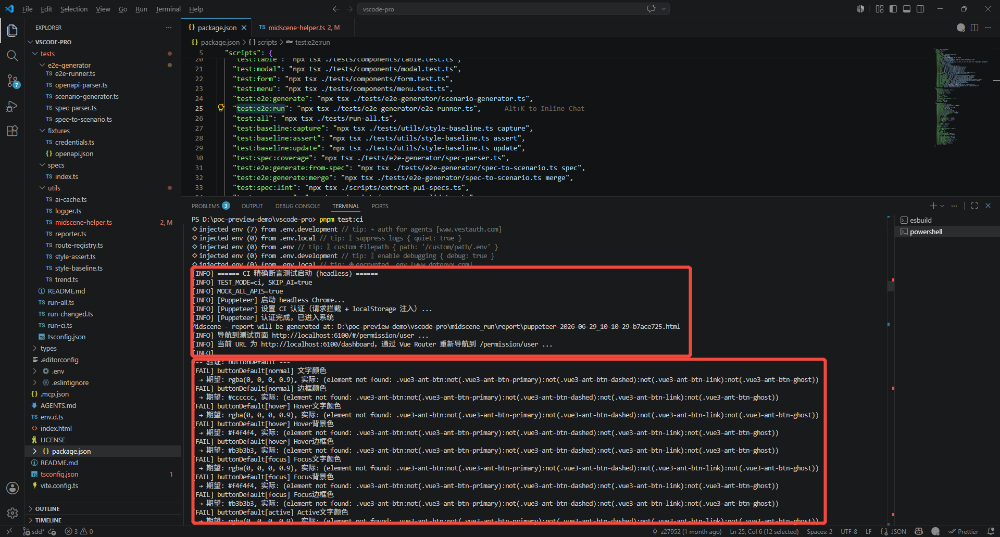
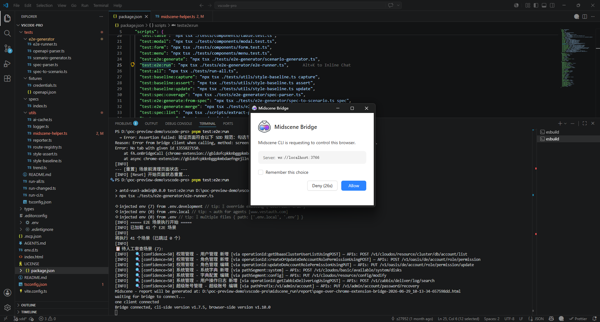
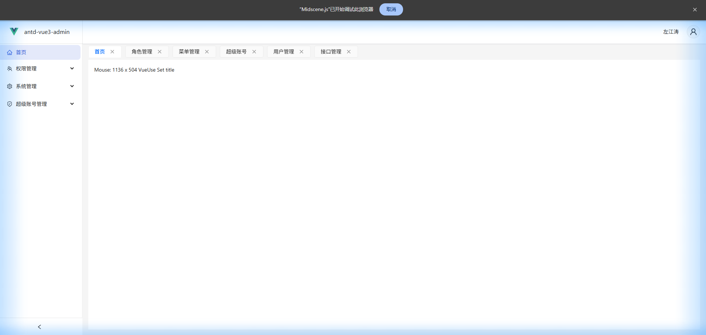
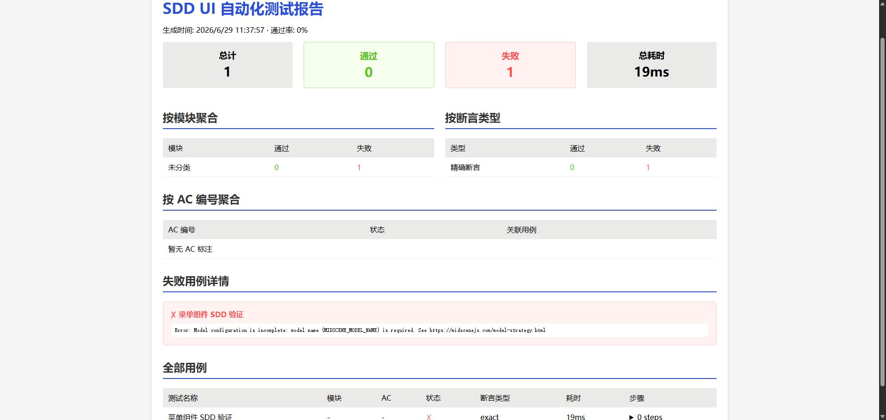

title: 基于AI的前端UI自动化测试
---

### 一、前言

前端应用开发后希望能够借助AI的能力来高效测试，但是在边界条件和异常情况的处理相对麻烦。尤其是现在代码中AI开发的比例越来越大，人工编写测试案例的成本很高，所以我期望能够借助AI生成对应的测试案例并自动进行测试。通过一段时间的调研，我决定采用**SDD规范约束项目的前端UI自动化测试方案**。

SDD（Specification-Driven Development，规范驱动开发）通过规范来约束测试案例，并抽象项目的样式规范作为基准。它把 `src/style/` 下沉淀的 Ant Design Vue 样式规范提取成可执行的测试契约，再通过组件级测试、OpenAPI/Spec 驱动的 E2E 场景和 CI 门禁组成闭环。换句话说，测试不只是验证“页面能不能点”，而是验证“页面是否按规范长出来、按业务路径运行、并且能在持续迭代中守住一致性”。

### 二、方案详解

#### 1. 核心目标

| 能力 | 选型 | 作用 |
|------|------|------|
| UI 自动化执行 | `@midscene/web` | 本地通过 Chrome Bridge 驱动浏览器，执行 AI 操作与断言 |
| 精确样式断言 | `page.evaluate` + `getComputedStyle` | 校验颜色、字号、边框、圆角、间距等 CSS 计算值 |
| 场景生成 | OpenAPI Spec + OpenSpec AC | 从接口和验收条件生成结构化 E2E 场景 |
| 脚本运行 | `tsx` | 直接运行 TypeScript 测试文件 |
| 报告沉淀 | 自定义 Logger / Reporter | 输出控制台日志、截图和 HTML 报告 |
| CI 门禁 | Puppeteer headless | 在无桌面环境下执行精确断言，默认跳过 AI 视觉断言 |

这套方案的重点不是引入某个单点工具，而是把“规范、场景、执行、报告、门禁”拆成清晰的工程层次。

#### 2. 方案架构

采用四层架构：规范定义层 → AI测试生成层 → 测试执行层 → 报告层

```
规范来源层                       AI测试生成层               测试执行层             报告层

┌──────────────────────┐    ┌────────────────────┐    ┌────────────────┐    ┌───────────────┐
│ SDD规范(样式)         │    │ AI Test Generator  │    │ Midscene Agent │    │ 综合测试报告   │
│  - 颜色/字体/间距     │    │                    │    │ (ChromeBridge) │    │  - E2E通过率   │
│  - 组件状态样式       │───>│ ①解析OpenAPI/Spec  │───>│                │───>│  - SDD规范符合  │
│  - 布局规范           │    │ ②AI映射 API → UI   │    │ navigate →     │    │  - 失败截图     │
│                      │    │ ③生成E2E测试场景    │    │ interact →     │    │  - 覆盖分析     │
│ OpenAPI Spec         │    │ ④注入SDD断言       │    │ assert         │    └───────────────┘
│  (Apifox MCP)        │    └────────────────────┘    └────────────────┘
│  - API端点           │              │                       │
│  - 请求/响应Schema   │              ▼                       ▼
│  - 业务描述          │    ┌────────────────────┐    ┌────────────────┐
└──────────────────────┘    │ 测试案例(结构化)    │    │ Chrome浏览器    │
                            │  - 业务流步骤       │    │ (pnpm dev)     │
                            │  - 预期断言         │    └────────────────┘
                            │  - SDD验证点       │
                            └────────────────────┘
```

规范来源层有三类输入：

- `src/style/`：项目内 30+ 个组件的样式规范，是颜色、边框、圆角、间距等 UI 契约的事实来源。
- `openspec/specs/spec.md`：以 AC 编号维护验收条件，例如 `AC-S001`、`AC-U001`，方便做覆盖率和文档同步校验。
- `tests/fixtures/openapi.json`：由 Apifox MCP 预获取的 OpenAPI Spec 缓存，用于推理接口对应的业务页面和操作路径。

执行层则分两种模式：本地开发使用 Chrome Bridge 连接真实 Chrome，适合 AI 视觉和交互调试；CI 使用 Puppeteer headless，聚焦可重复、可量化的 CSS 精确断言。

#### 3. 规范先行

SDD 的第一步，是把视觉规范从“文档描述”变成“程序能判断的断言”。项目在 `tests/specs/index.ts` 中维护 `SDDSpec`，统一定义组件选择器、状态和期望样式值。例如按钮、表格、弹窗、表单、菜单等核心组件都被抽象成结构化规范：

```ts
buttonPrimary: {
  selector: '.ant-btn-primary',
  description: '主按钮',
  states: {
    normal: [
      { property: 'color', value: COLORS.white, description: '文字颜色' },
      { property: 'background-color', value: COLORS.primary, description: '背景色' },
      { property: 'border-color', value: COLORS.primary, description: '边框色' },
    ],
    hover: [
      { property: 'background-color', value: COLORS.primaryHover, description: 'Hover背景色' },
    ],
  },
}
```

这样做有几个直接收益：

1. 样式规范集中维护，避免每个测试文件散落一堆 selector 和 expected value。
2. 规范变更时优先修改契约，再由测试暴露影响范围。
3. 测试报告能按组件和状态聚合失败项，而不是只给出“页面截图不一致”。

比如我的一个项目可能核心指标包括主色 `#2a50d7`、边框色 `#cccccc`、文字色 `rgba(0,0,0,0.9)`、表头背景 `#eaeae9`、基础字号 `14px`、Card 圆角 `6px`、Table 圆角 `0`、按钮间距 `8px`、表单项间距 `12px`、输入框高度 `32px` 等。

#### 4. 双模式断言

UI 自动化测试最容易踩的坑，是把所有视觉判断都交给截图或 AI。我没有这么做，而是采用“精确 CSS 断言 70%，AI 视觉断言 30%”的策略。

对颜色、字号、边框、圆角、间距这类可量化属性，测试通过 `window.getComputedStyle()` 获取真实计算值，并做颜色归一化、零值归一化和视口单位兼容。例如 `#2a50d7` 会被归一化为 `rgb(42,80,215)` 后比较，避免浏览器返回格式差异导致误报。

对布局感知、元素存在、操作路径、按钮排列是否合理这类难以稳定量化的内容，才交给 Midscene 的 `aiAssert`、`aiAction` 和 `aiQuery`。这样既保留 AI 对页面语义和交互的理解能力，也让关键视觉契约具备可重复的门禁价值。

交互态也被单独处理。对于 hover、focus、active 等状态，测试不会静态读取伪类，而是通过浏览器事件触发后再采集计算样式，确保“用户真实操作后的样式变化”也能被验证。

#### 5. 组件级验证

组件测试位于 `tests/components/`，覆盖 Button、Table、Modal、Form、Menu 五类高频基础组件。组件级验证的价值在于把问题尽早拦在最小单元：如果主按钮 hover 色错了，不需要跑完整用户新增流程才发现。

当前覆盖重点包括：

| 组件 | 覆盖内容 |
|------|----------|
| Button | default / primary / dashed / link / ghost，多状态样式验证 |
| Table | 表头背景、边框颜色、无圆角、行 hover 背景 |
| Modal | 标题字重、body 内边距、footer 布局 |
| Form | 表单项间距、label 对齐、控件行高 |
| Menu | 选中态、hover 态、子菜单展开、折叠宽度 |

本地全量入口 `tests/run-all.ts` 会先并发执行这些组件测试，并发度由 `TEST_CONCURRENCY` 控制，默认值为 3。组件测试通过后，再进入 E2E 场景执行。

#### 6. E2E案例

传统 E2E 常见的问题是测试脚本写死，一旦接口或页面变动，维护成本会迅速升高。本项目把场景来源拆成两条线：

**第一条线来自 OpenAPI**。`tests/e2e-generator/openapi-parser.ts` 解析接口路径、方法、参数、响应和实体模型，`scenario-generator.ts` 再把接口映射到页面和业务动作。例如：

- `GET /api/users` 对应用户管理页面的表格加载。
- `POST /api/users` 对应点击“新增”、填写表单、提交并断言成功提示。
- `PUT /api/users/{id}` 对应编辑弹窗、数据回填和保存。
- `DELETE /api/users/{id}` 对应删除确认和列表刷新。

**第二条线来自 OpenSpec AC**。`openspec/specs/spec.md` 维护规范化的验收条件，`spec-parser.ts` 可以解析 AC 条目并与场景快照比对，输出覆盖率。`spec-to-scenario.ts` 则支持从 AC 生成或合并 E2E 场景。

生成后的场景会缓存到 `tests/e2e-generator/__snapshots__/`，支持人工审查和二次调整。执行时，`e2e-runner.ts` 逐个加载场景，驱动 Midscene Agent 完成导航、点击、填表、断言，同时在关键步骤注入 SDD 样式验证。

#### 7. 测试隔离与认证

这套方案还处理了后台系统测试中两个实际问题。

第一个是登录。项目存在 SSO 路由守卫，测试不能每次依赖真实登录页面。因此 `tests/fixtures/credentials.ts` 和 `tests/utils/midscene-helper.ts` 提供认证绕过能力：本地模式优先复用已有 session，必要时注入 localStorage；CI 模式则通过请求拦截和 localStorage 注入完成认证准备。

第二个是隔离。E2E 场景之间容易残留弹窗、Toast、表单状态或路由状态，因此执行器在场景前后进行页面状态清理，降低串行执行时的上下文污染。

这些处理让测试不再只是“在我机器上能跑的脚本”，而是可以进入团队工作流的工程资产。

#### 8. 三种运行形态

项目把不同阶段的运行诉求拆成了三类命令。

**本地开发阶段**，开发者可以单独验证某个组件，也可以运行完整链路：

```bash
pnpm test:button
pnpm test:table
pnpm test:e2e:generate
pnpm test:e2e:run
pnpm test:all
```

**CI 阶段**，脚本默认设置 `TEST_MODE=ci` 和 `SKIP_AI=true`，使用 Puppeteer headless 执行精确 CSS 断言，避免 AI 视觉判断带来的不稳定性：

```bash
pnpm test:ci
```

**变更验证阶段**，`tests/run-changed.ts` 会基于 `git diff` 推断受影响测试。例如 `src/style/` 变化会触发组件测试，权限或系统页面变化会触发 E2E 执行，路由变化也会进入 E2E 校验：

```bash
pnpm test:changed
```

此外，项目还提供规范同步和覆盖分析命令：

```bash
pnpm test:spec:sync
pnpm test:spec:coverage
pnpm test:spec:lint
pnpm test:baseline:capture
pnpm test:baseline:assert
pnpm test:baseline:update
```

这几类命令共同形成了从开发调试、提交前自检到 CI 门禁的分层测试策略。

#### 9. 报告与反馈闭环

测试执行结果会通过自定义 Logger 和 Reporter 汇总，输出到 `midscene_run/report/`。报告关注几类信息：

- 哪些组件规范通过或失败。
- 失败项的实际值和期望值。
- E2E 场景执行步骤和失败上下文。
- 规范覆盖率和场景覆盖关系。
- 必要时记录截图，辅助定位视觉或交互问题。

这种报告结构比单纯的截图对比更适合团队排障。比如当表格头部背景失败时，报告可以直接指出实际 `background-color` 与期望 `rgb(234,234,233)` 不一致，而不是让开发者在截图里猜问题。

### 三、项目配置

#### 1. 安装依赖

方案使用了[Midscene AI](https://midscenejs.com/)作为前端视觉测试插件，我们采用Chrome桥接模式，通过本地项目脚本来控制桌面版Chrome。这种方式能复用本地浏览器的 cookies、插件和页面状态，与自动化脚本协作完成任务。

1) 浏览器安装[Midscene.js](https://chromewebstore.google.com/detail/midscenejs/gbldofcpkknbggpkmbdaefngejllnief)；

2) 项目安装依赖；
```
pnpm install -D @midscene/web dotenv puppeteer
```

3) 配置AI模型
在项目`.env`文件中配置模型；
```text
MIDSCENE_MODEL_BASE_URL="https://替换为你的模型服务地址/v1"
MIDSCENE_MODEL_API_KEY="替换为你的 API Key"
MIDSCENE_MODEL_NAME="替换为你的模型名称"
MIDSCENE_MODEL_FAMILY="替换为你的模型系列"
```

#### 2. 目录结构

```
..\your-project\tests\
├── specs/
│   └── index.ts                    # SDD规范定义文件。从src/style/提取
├── utils/
│   ├── midscene-helper.ts         # Midscene工具封装（Agent管理+导航+登录绕过）
│   ├── reporter.ts                # 测试报告生成工具（HTML报告）
│   ├── logger.ts                  # 日志工具（步骤记录 + 截图管理）
│   ├── style-assert.ts           # 精确样式断言（page.evaluate计算样式）
│   └── style-baseline.ts         # 样式基线管理（capture/assert/update三模式）
├── components/
│   ├── button.test.ts             # 按钮组件规范验证（5类型×4状态）
│   ├── table.test.ts              # 表格组件规范验证（表头/行hover/bordered）
│   ├── modal.test.ts              # 模态框规范验证
│   ├── form.test.ts               # 表单组件规范验证
│   └── menu.test.ts               # 菜单组件规范验证
├── e2e-generator/                 # E2E测试生成器（核心创新）
│   ├── openapi-parser.ts          # OpenAPI Spec解析器
│   │                               # - 解析 tests/fixtures/openapi.json
│   │                               # - 提取 API endpoints、methods、params、responses
│   │                               # - 识别 entity 类型（User/Role/Menu/Dictionary等）
│   ├── scenario-generator.ts      # AI测试场景生成器
│   │                               # - 接收 OpenAPI 解析结果
│   │                               # - AI推理 API→UI 映射关系
│   │                               # - 输出结构化测试场景数组
│   │                               # - 自动注入对应的 SDD 断言规则
│   ├── e2e-runner.ts              # E2E场景执行器
│   │                               # - 遍历生成的测试场景
│   │                               # - 驱动 Midscene Agent 执行每一步
│   │                               # - 每一步同步执行 SDD 规范验证
│   │                               # - 失败自动重试 + 截图
│   │                               # - 返回详细执行报告
│   ├── spec-parser.ts             # OpenSpec规范解析器（解析openspec/specs/目录）
│   ├── spec-to-scenario.ts        # 规范到场景转换器（从spec.md生成E2E场景）
│   └── __snapshots__/             # 自动生成的测试案例快照（可手动调整）
│       └── scenarios.json           # AI生成的场景缓存，减少重复生成
├── fixtures/
│   ├── credentials.ts             # 测试登录凭据配置（Token绕过SSO）
│   └── openapi.json               # MCP预获取的OpenAPI Spec缓存
├── run-all.ts                     # 全量执行入口（组件→E2E→报告）
├── README.md                      # 测试方案说明书
└── tsconfig.json                  # 测试专用TypeScript配置（继承项目tsconfig）
```

#### 3. 脚本命令

```json
{
  "script": {
    // ...
    "ui-test": "npx tsx ./build/demo-new-tab.ts",
    "test:button": "npx tsx ./tests/components/button.test.ts",
    "test:table": "npx tsx ./tests/components/table.test.ts",
    "test:modal": "npx tsx ./tests/components/modal.test.ts",
    "test:form": "npx tsx ./tests/components/form.test.ts",
    "test:menu": "npx tsx ./tests/components/menu.test.ts",
    "test:spec:coverage": "npx tsx ./tests/e2e-generator/spec-parser.ts",
    "test:spec:lint": "npx tsx ./scripts/extract-pui-specs.ts",
    "test:spec:sync": "npx tsx ./scripts/spec-sync-validator.ts",
    "test:e2e:generate": "npx tsx ./tests/e2e-generator/scenario-generator.ts",
    "test:e2e:run": "npx tsx ./tests/e2e-generator/e2e-runner.ts",
    "test:e2e:generate:from-spec": "npx tsx ./tests/e2e-generator/spec-to-scenario.ts spec",
    "test:e2e:generate:merge": "npx tsx ./tests/e2e-generator/spec-to-scenario.ts merge",
    "test:baseline:capture": "npx tsx ./tests/utils/style-baseline.ts capture",
    "test:baseline:assert": "npx tsx ./tests/utils/style-baseline.ts assert",
    "test:baseline:update": "npx tsx ./tests/utils/style-baseline.ts update",
    "test:changed": "npx tsx ./tests/run-changed.ts",
    "test:all": "npx tsx ./tests/run-all.ts",
    "test:ci": "cross-env TEST_MODE=ci SKIP_AI=true npx tsx ./tests/run-ci.ts",
    "test:full": "cross-env TEST_MODE=local SKIP_AI=false npx tsx ./tests/run-all.ts",
    "test:trend": "npx tsx ./tests/utils/trend.ts"
  }
}
```

- 单组件验证

```bash
pnpm test:button         # 按钮组件
pnpm test:table          # 表格组件
pnpm test:modal          # 模态框
pnpm test:form           # 表单
pnpm test:menu           # 菜单
```

- Spec 校验与覆盖

```bash
pnpm test:spec:sync            # ⚡ 校验 AC 格式 + 总览同步 + 映射表完整性（不通过则阻断）
pnpm test:spec:coverage        # 查看 AC 覆盖率报告（比对 spec 与 scenario）
pnpm test:spec:lint            # 校验 SDD 规范定义与实际样式一致性
```

- E2E 生成与执行

```bash
pnpm test:e2e:generate              # 读取 OpenAPI → 生成 E2E 场景 → 缓存
pnpm test:e2e:generate:from-spec    # 从 AC 条目自动生成测试场景
pnpm test:e2e:generate:merge        # 合并新增场景到已有快照
pnpm test:e2e:run                   # 加载缓存 → 执行 E2E → SDD 断言
```

- 样式基线

```bash
pnpm test:baseline:capture    # 捕获当前页面样式快照
pnpm test:baseline:assert     # 断言样式无回归
pnpm test:baseline:update     # 更新样式基线
```

- 全量执行

```bash
pnpm test:all            # 组件 → 页面 → E2E → 报告
pnpm test:full           # 本地完整执行（含 AI 视觉断言）
pnpm test:ci             # CI 模式执行（跳过 AI 断言）
pnpm test:changed        # 仅执行变更相关的测试
```

#### 4. spec使用

在项目根目录运行相关命令OpenSpec/SpecKit初始化项目，便于后续的spec使用。具体可以参考官方使用文档。

> spec 的生成可以将需求prd使用ai直接转换成md格式，也可以利用mcp将设计稿的url输入解析生成。但是spec与实际需求还需要人工对比。

### 四、项目测试

#### 1. 使用流程

1. `pnpm dev` -- 启动开发服务器
2. 打开 Chrome 浏览器（需安装 Midscene 扩展）
3. 独立验证模式：

- `pnpm test:button` -- 单独验证按钮组件（适合开发调试）

4. E2E生成执行模式（核心流程）：

- `pnpm test:e2e:generate` -- 读取 OpenAPI Spec → AI生成E2E测试场景 → 缓存到快照
- `pnpm test:e2e:run` -- 加载快照 → Midscene逐一步骤执行 → 同步SDD断言 → 记录结果

5. 全量执行：

- `pnpm test:all` -- 并发执行组件级 SDD 验证 → 串行执行 E2E 场景 → 生成报告

6. 查看报告：控制台输出 + `midscene_run/report/` 下的HTML报告

#### 2. 测试效果

- ci测试


- e2e测试（chrome bridge模式）
给浏览器授权：

ai模型驱动Midscene插件进行测试：


- 测试报告


#### 3. 关键工程取舍

这套方案有几个值得复用的取舍。

第一，MCP 预获取优于运行时依赖 MCP。`tsx` 脚本无法直接调用 IDE 进程中的 MCP 工具，因此项目把 Apifox OpenAPI Spec 预获取到 `tests/fixtures/openapi.json`。这样测试生成器可以离线运行，也方便把接口规范变更纳入版本管理。

第二，测试契约要使用编译后的选择器。我的项目Ant Design 前缀由环境变量控制，测试规范中通过 `VITE_ANT_PREFIXCLS` 适配实际 CSS 类名前缀，避免源码变量和浏览器 DOM 不一致。

第三，AI 不进入强门禁的核心判断。AI 擅长理解页面语义和操作路径，但颜色、字号、边框这类门禁项更适合精确断言。项目把 AI 放在它更擅长的位置，稳定性会好很多。

第四，场景生成要可缓存、可审查。完全动态生成 E2E 场景虽然很酷，但团队协作需要可解释和可追溯。快照缓存让 AI 生成结果可以被人工校正，也让后续执行更稳定。

#### 4. 落地收益

这套 SDD UI 自动化测试方案带来的收益主要体现在四个方面：

1. 规范不再停留在文档里，而是变成可以执行、可以失败、可以阻断的测试契约。
2. UI 回归更早暴露，组件级测试能快速定位基础样式偏差。
3. E2E 不再完全依赖手写脚本，可以从 OpenAPI 和 AC 条目推导业务场景。
4. 本地、CI、增量测试有各自边界，既能保持反馈速度，也能覆盖关键风险。

对于一个持续演进的管理后台来说，这种测试体系的价值不只是“自动化覆盖率更高”，而是把设计规范、接口契约、业务验收和工程门禁接到同一个反馈回路里。随着页面和组件增多，规范越早被程序化，后续维护成本就越可控。

### 五、结语

当前方案已经覆盖组件规范、页面场景、OpenAPI 场景生成、OpenSpec 覆盖率、CI 精确断言和增量测试。极大提效UI测试，但是相当一部分时间花费在了前期spec的生成与矫正上。

参考资料：
- [Midscene](https://midscenejs.com/zh/introduction.html) 
- [OpenSpec](https://github.com/Fission-AI/OpenSpec)
- [SpecKit](https://github.com/github/spec-kit)
