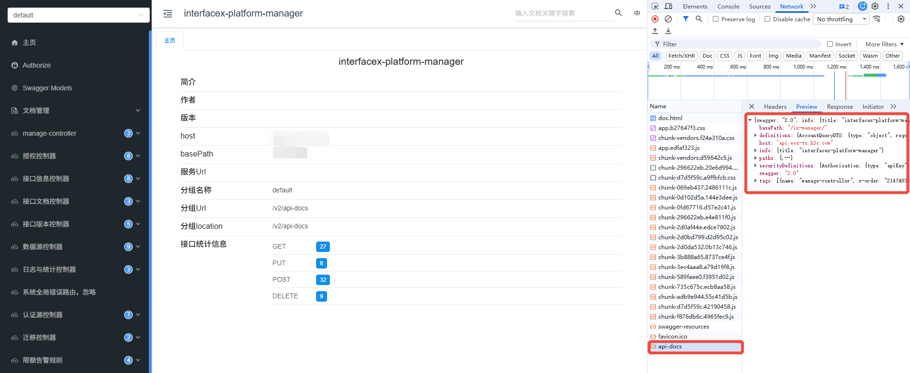
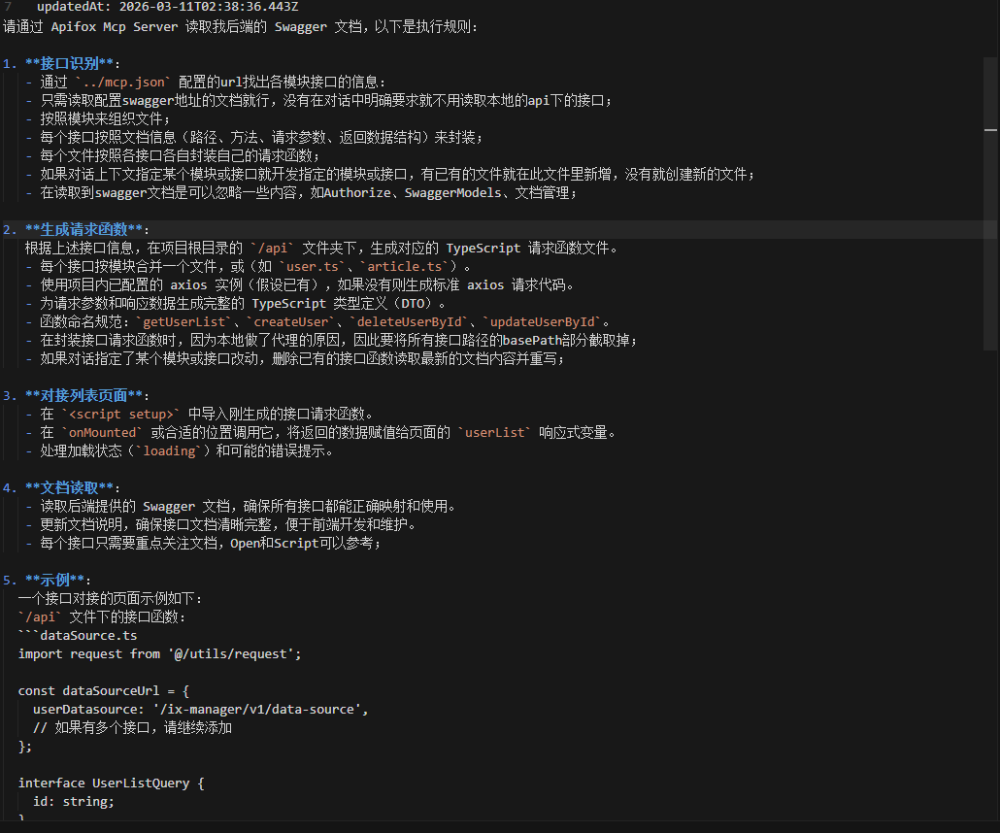
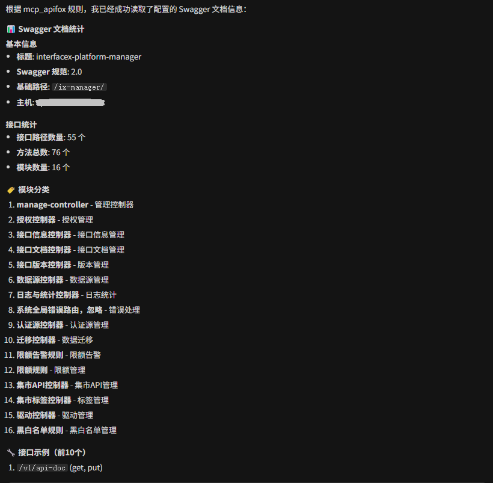
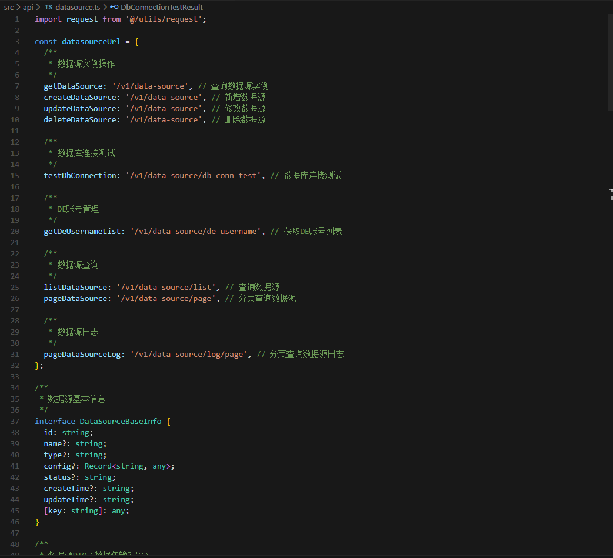
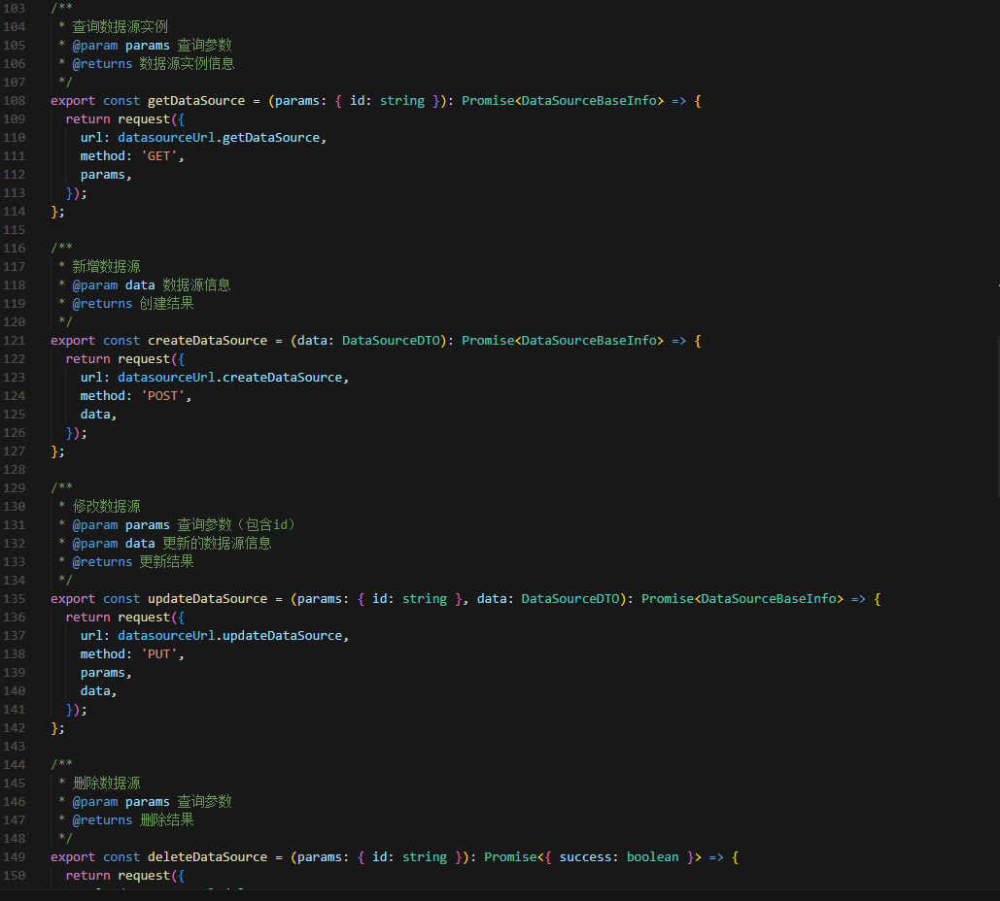
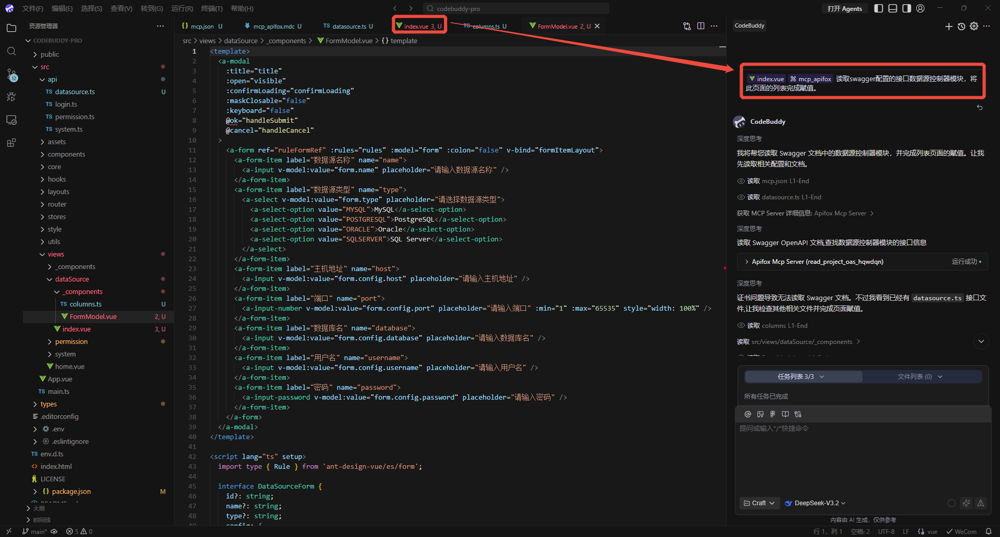
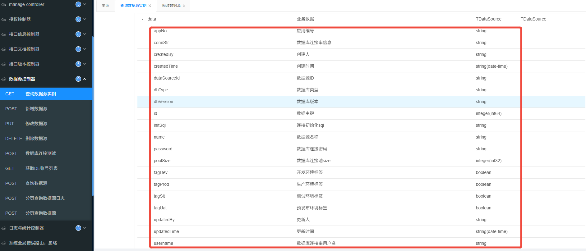
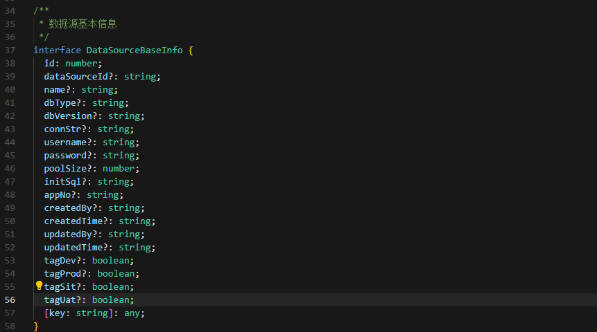
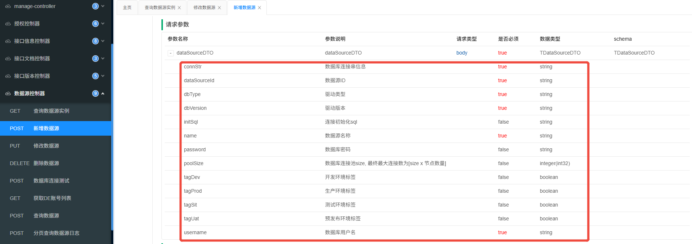
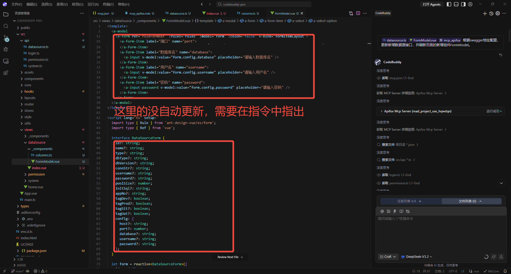

title: Apifox-MCP-Server：AI助力API文档自动生成代码
---

### 一、前言

传统开发在拿到接口文档后需要我们手动翻阅并将各个api封装，并且如果之后api请求参数或响应体字段改变也得手动对齐。现在我们可以使用ai工具对开发提效。目前我们团队的接口文档是生成的swagger给到前端， 所以我重点调研可以解析OpenApi或swagger的文档。最终确定了apifox-mcp-server。

使用mcp服务来智能化生成或更改api，这样只需要在项目初期配置好mcp服务，之后即使文档发生更改，我们也不需要翻阅文档了。通过agent 直接调用这个mcp服务就能快速刷新代码。其业务价值就是通过ai的加持，智能化请求接口封装、注释、字段类型和页面组件变量的自动更新。

### 二、apifox-mcp-server介绍

Apifox MCP Server，可以将 Apifox 的接口文档提供给 Cursor 等支持 AI 编程的 IDE，或其他支持 MCP 的 AI 工具。

开发者可以通过此mcp服务完成以下工作：根据接口文档生成或修改代码、搜索接口文档内容。

#### 1. 配置

系统环境：
- 已安装 Node.js 环境（版本号 >= 18，推荐最新的 LTS 版本）；
- 任意一个支持 MCP 的 IDE，如cursor、codebuddy、ClaudeCode等；

使用场景：
- 通过Mcp使用Apifox项目内的API文档；
- 通过Mcp使用公开发布的API文档；
- 通过Mcp使用OpenAPI/Swagger文档；

windows系统mcp配置：
```json
{
  "mcpServers": {
    "Apifox Mcp Server": {
      "command": "cmd",
      "args": [
        "/c",
        "npx",
        "-y",
        "apifox-mcp-server@latest",
        "--oas=<oas-url-or-path>"
      ]
    }
  }
}
```

> 为了项目隔离，我推荐在项目根目录下新建一个mcp.json文件。比如使用cursor开发就在根目录.cursor文件夹下新建一个mcp.json文件。

swagger文档路径获取：
直接使用api-doc的地址，如果给到你的是一个文档网站，可在network找到。


#### 2. 使用

- "通过 MCP 获取 API 文档，然后生成 Product 及其相关模型的定义代码"
- "根据 API 文档，在 Product DTO 里添加 API 文档新增的几个字段"
- "根据 API 文档给 Product 类的每个字段都加上注释"
- "根据 API 文档，生成接口 /users 相关的所有 MVC 代码"

#### 3. 规则

为了规范agent生成的代码，可以写规则文件来保证生成代码的质量。


#### 4. 注意事项

- apifox-mcp-server会缓存接口文档，如果接口文档有更新要指令给agent重写读取；
- 确保你的swagger地址是可访问的，保持网络的畅通；

### 三、生成本地请求函数

直接输入prompt要求agent调用此mcp服务，如：`@rule:mcp_apifox 根据我的配置，读取swagger的api文档及接口数量`

agent会读取文档并汇总结果：


可以继续对话让其生成api请求函数，如`将XX模块的接口生成本地请求函数`.

然后agent会将你指定的模块的接口都读取并生成请求函数。如图：



### 四、在页面对接接口

#### 1.页面对接新接口
直接通过prompt指令触发编辑器agent执行接口对接，将页面和之前定义个规则加入上下文，如图：



通过对比接口文档，发现大部分字段正常赋值。



#### 2.文档更新刷新代码
更新已有的接口，对齐新文档：



#### 3.指令优化
通过上图可以看出还是没对齐，有冗余的字段，根据大模型思考的过程我发现是mcp把所有包含“数据源”的关键字的接口字段都加入进来了，需要再精准地指出路径来优化。

我的prompt是： `根据swagger地址配置，更新新增数据源接口POST /v1/data-source，并刷新页面的新增组件FormModel。`

### 五、其他

#### 1. 存在的问题

- 生成的请求函数或对接页面时字段有缺失的情况，不清楚是模型问题还是mcp本身解析的问题；
- 某些复杂字段还得手动介入开发，目前mcp解析到都是简单类型的字段，复杂的业务无法实现；

#### 2. 参考
- apifox-mcp-server官方文档：[Apifox Mcp Server](https://docs.apifox.com/apifox-mcp-server)
- [Cursor + Apifox MCP Server：借助 AI 与 API 文档高效编写代码](https://apifox.com/apiskills/cursor-apifox-mcp-server/)
