title: 基于AI的前端全链路开发工作流
---

### 一、前言

#### 1.开发需求背景

现在aiCoding对开发的帮助越来越大，我们也可以用ai对自己平时的各个工作环节或流程提效。在研究各个流程后，我发现可以将前端开发的所有流程都跑通了，将各流程串联起来已经完成了前端开发的全链路闭环。本文我将各个环节的ai提效做出总结，并以项目实战来演示整个开发流程。

#### 2.几个概念

Prompt： 用户向 AI 模型输入的指令或信息集合，可输入自然语言、图片、规则、上下文和指令等，用来触发模型生成特定输出的指令集合。

MCP： MCP（Model Context Protocol） 是一种开放协议，定义了 AI 模型与外部数据源、工具、服务之间的标准化交互方式，使模型能够动态获取上下文并执行实际操作（如查询数据库、调用 API），解决了大模型在实时数据与行动能力上的局限。

Skill：Skill 是将完成某一类任务所需的指令、逻辑、脚本、资源等进行封装的可复用能力单元。它可以包含 prompt、调用外部工具的方式、处理流程等。当任务匹配时，AI（通常通过 Agent）可以按需加载并执行该 Skill，以提高效率和稳定性。

Agent：Agent 是一个具备自主决策与执行能力的 AI 实体。它能理解复杂目标，进行任务规划，调用多个工具或 Skills，并根据执行结果进行迭代调整，直至完成目标。相比单次 Prompt 交互，Agent 拥有记忆、规划和多步骤执行的能力。

### 二、ai驱动原型设计

#### 1.masterGo设计工具AI快搭

> 我们团队采购了mastergo所以我用这个工具来演示，其他工具也有ai设计功能，比如：figma、pixso。可自行了解。


从图中可以看到，下方左侧主要功能包括创建新页面、选择设计类型、选择开发语言和ui库、输入自然语言和上传本地截图等。


点击`代码icon`可以在右侧预览代码。


点击`局部修改`可以在上方对部分区域选定，然后可以针对性修改。

#### 2.使用

如图所示，可以看到下方可以选择`插入到画布`来保存到设计稿；也可以切换开发语言框架和代码预览；右侧的输入框下方也可以选择局部不满意的地方优化。
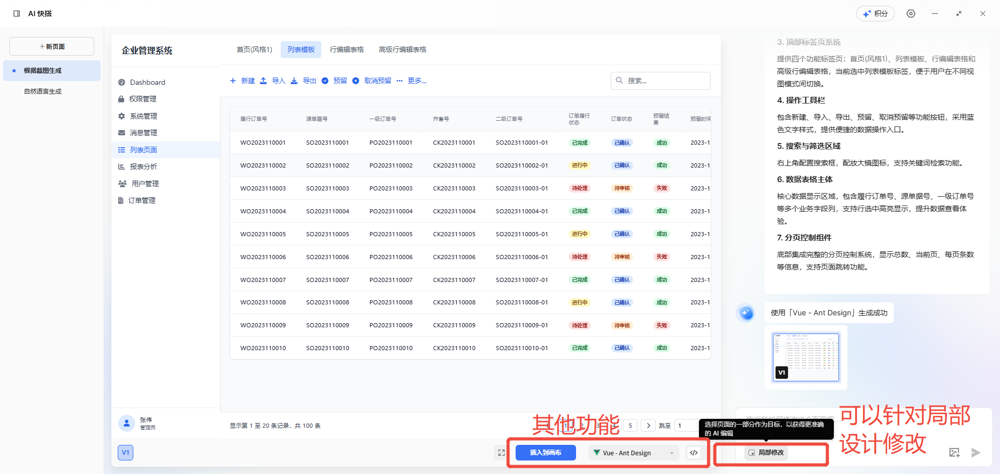

如图是设计的最终效果。


### 三、mastergo-mcp生成UI

我使用cursor作为演示工具，其他的编辑器请按照各自的方式添加mcp。

#### 1.配置

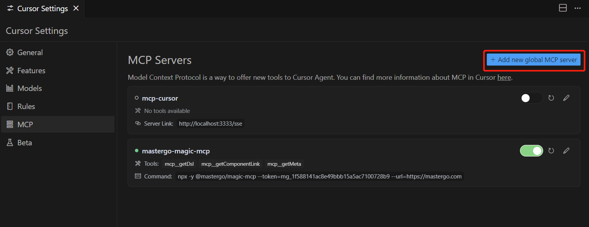
选择 `MCP` 菜单，可点击 'Add new global MCP server' 来添加自己的mcp服务器。

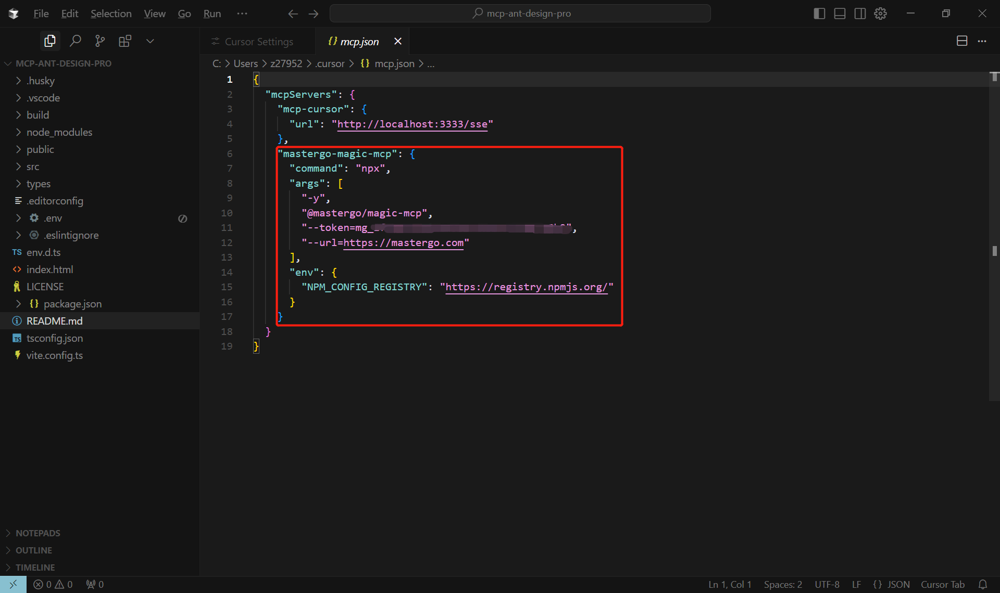
点击进来后根据自己需求来配置，mastergo的配置如图。

#### 2.使用步骤

1) 获取设计稿链接
   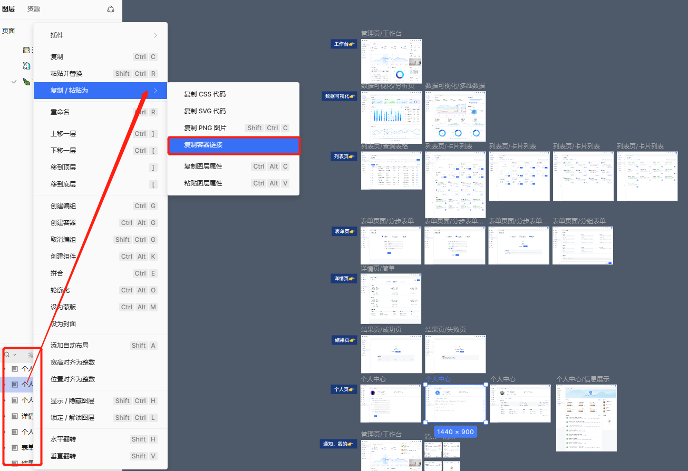
   进入项目，如果想要开发某个页面，选择页面对应图层，右键找到 `复制/粘贴为` 选择 `复制容器链接`。
2) agent对话
   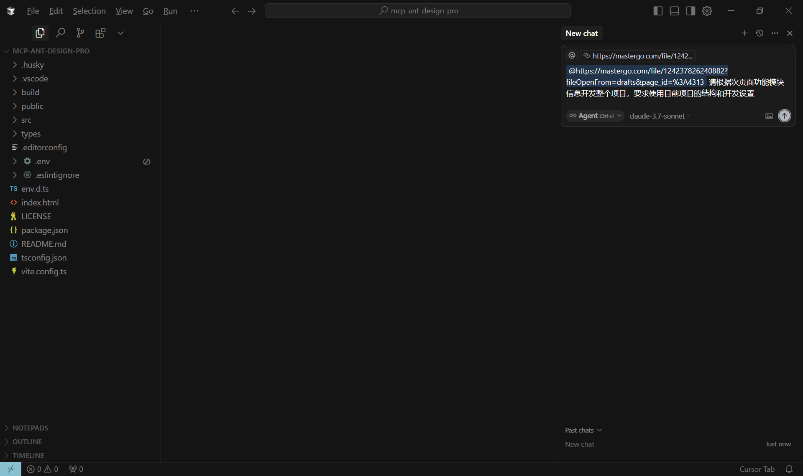
   粘贴复制的链接，后续编写自己的prompt，然后发送即可。
3) 获取dsl
   点击 `run tool` 执行工具，获取dsl信息。

    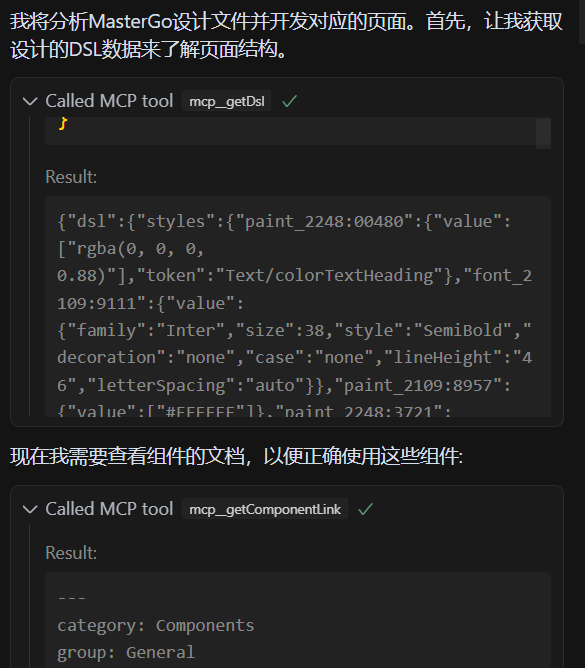
    可以看到获取到的dsl信息是一颗json树，描述了设计稿转换信息，ai将会根据这些描述来生成代码。
    
    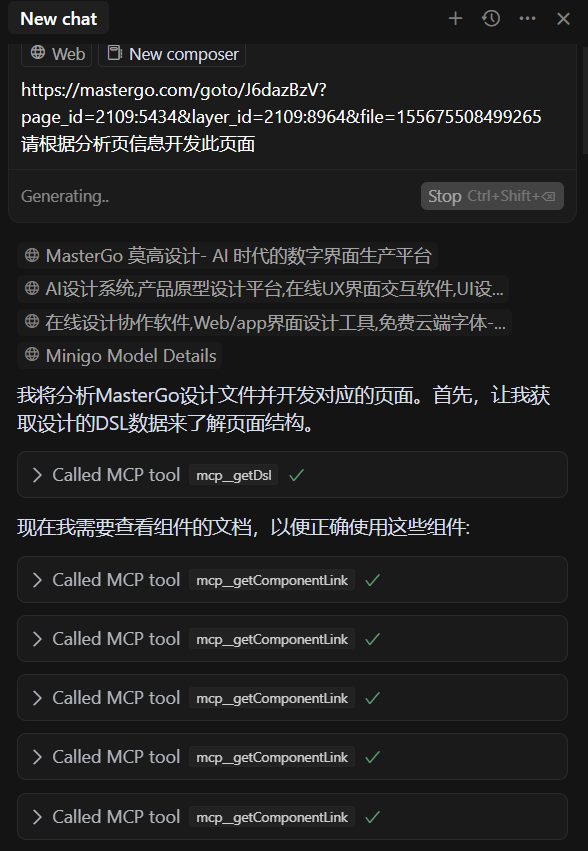
    完整的执行工具如图展示。
4) 多轮调用受限
   在使用多轮生成后需要手动授权，在出现手动授权。

    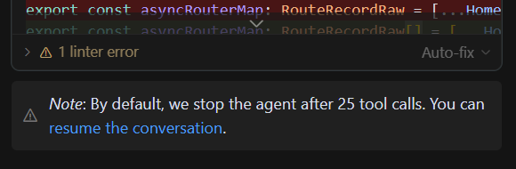
    点击图中出现的 `resume the conversation`，然后会继续构建页面代码。

> 现在的大模型上下文限制比较大，应该不太会出现这个情况了。

### 四、apifox-mcp对接接口

#### 1.配置

系统环境：
- 已安装 Node.js 环境（版本号 >= 18，推荐最新的 LTS 版本）；
- 任意一个支持 MCP 的 IDE，如cursor、codebuddy、ClaudeCode等；

使用场景：
- 通过Mcp使用Apifox项目内的API文档；
- 通过Mcp使用公开发布的API文档；
- 通过Mcp使用OpenAPI/Swagger文档；

windows系统mcp配置：
```json
{
  "mcpServers": {
    "Apifox Mcp Server": {
      "command": "cmd",
      "args": [
        "/c",
        "npx",
        "-y",
        "apifox-mcp-server@latest",
        "--oas=<oas-url-or-path>"
      ]
    }
  }
}
```

> 为了项目隔离，我推荐在项目根目录下新建一个mcp.json文件。比如使用cursor开发就在根目录.cursor文件夹下新建一个mcp.json文件。

swagger文档路径获取：
直接使用api-doc的地址，如果给到你的是一个文档网站，可在network找到。
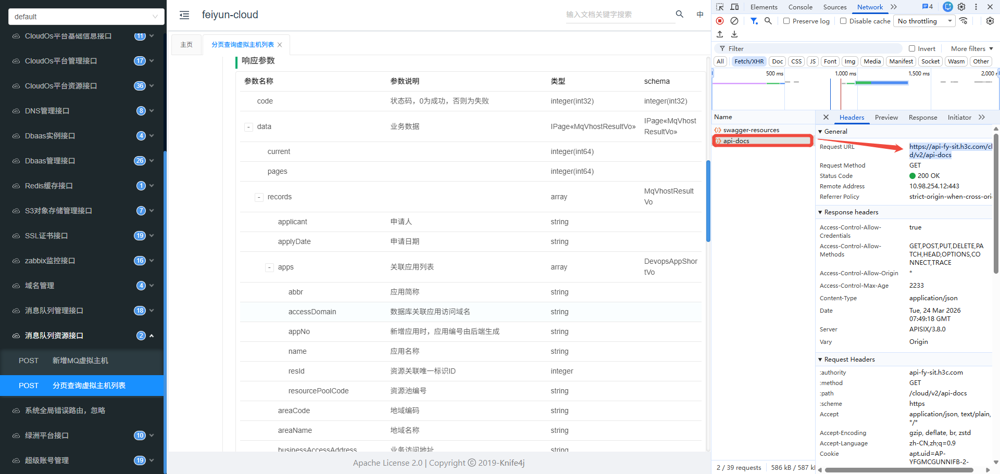

#### 2.使用步骤

1) 生成本地请求函数

   直接输入prompt要求agent调用此mcp服务，如：`@rule:mcp_apifox 根据我的配置，读取swagger的api文档及接口数量`

    agent会读取文档并汇总结果：
    
    
    可以继续对话让其生成api请求函数，如`将XX模块的接口生成本地请求函数`.然后agent会将你指定的模块的接口都读取并生成请求函数。如图：
    
    

2) 页面对接接口

   i. 页面对接新接口

   直接通过prompt指令触发编辑器agent执行接口对接，将页面和之前定义个规则加入上下文，如图：

   
    
    通过对比接口文档，发现大部分字段正常赋值。
    
    
    
    ii. 文档更新刷新代码
    更新已有的接口，对齐新文档：
    
    

### 五、ai代码评审

代码评审也是开发工作中会遇到的环节，而且某些场景下是非常重要的，尤其是对于安全方面。在谈论code review时我觉得应该分2个视角来看：一个视角是开发的角度，利用ai工具帮我们快速review，有问题直接就解决，极大降低人力成本，提升开发者的效能；另一个视角是从团队管理者或者说是资产所有者的角度，不信任任何未经平台审核的代码，即使开发使用了团队的规范也存在篡改的可能，因此因该要有一个平台性质的工具来做最终的code review。

#### 1.code-reviewer

这是一个skill([code-reviewer-skill](https://skillsmp.com/skills/google-gemini-gemini-cli-gemini-skills-code-reviewer-skill-md))，由 Google Gemini 团队推出，支持审查本地已暂存/未暂存的改动，也支持直接审查远程 PR（只需提供 PR 编号或 URL）。它会分析代码的正确性、可维护性、性能等，并给出明确结论（如批准合并或要求修改）。

使用方式： `pnpm dlx skills add google-gemini/gemini-cli`
> 我个人推荐将其下载到本地项目下使用，这样可以针对自己的个人习惯或团队要求定制化更改。

#### 2.ai-codereview-gitlab

这是一个开源的aicr工具，[AI-Codereview-Gitlab](https://github.com/sunmh207/AI-Codereview-Gitlab) 是一个基于大模型的自动化代码审查工具，帮助开发团队在代码合并或提交时，快速进行智能化的审查(Code Review)，提升代码质量和开发效率。

##### 1. 私有化部署

我们通过官方的Docker 部署方式来部署的：

1) 准备环境文件
    - 克隆项目仓库
    ```
    git clone https://github.com/sunmh207/AI-Codereview-Gitlab.git
    cd AI-Codereview-Gitlab
    ```
    - 创建配置文件
   ```
   cp conf/.env.dist conf/.env
   ```
    - 编辑conf/.env文件
   ```
    #大模型供应商配置,支持 zhipuai , openai , deepseek 和 ollama
    LLM_PROVIDER=deepseek
    
    #DeepSeek
    DEEPSEEK_API_KEY={YOUR_DEEPSEEK_API_KEY}
    
    #支持review的文件类型(未配置的文件类型不会被审查)
    SUPPORTED_EXTENSIONS=.java,.py,.php,.yml,.vue,.go,.c,.cpp,.h,.js,.css,.md,.sql
    
    #钉钉消息推送: 0不发送钉钉消息,1发送钉钉消息
    DINGTALK_ENABLED=0
    DINGTALK_WEBHOOK_URL={YOUR_WDINGTALK_WEBHOOK_URL}
    
    #Gitlab配置
    GITLAB_ACCESS_TOKEN={YOUR_GITLAB_ACCESS_TOKEN}
    ```
2) 启动服务
    ```
   docker-compose up -d
   ```
3) 验证
    - 主服务验证：
        - 访问 http://your-server-ip:5001
        - 显示 "The code review server is running." 说明服务启动成功。
    - Dashboard 验证：
        - 访问 http://your-server-ip:5002
        - 看到一个审查日志页面，说明 Dashboard 启动成功。

##### 2. 配置gitlab webhook

1) 创建Access Token
    - 方法一：在 GitLab 个人设置中，创建一个 Personal Access Token
    - 方法二：在 GitLab 项目设置中，创建Project Access Token
      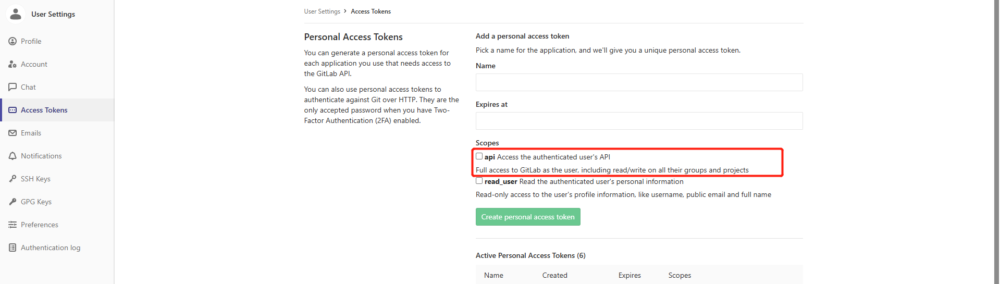
2) 配置webhook
   在 GitLab 项目设置中，配置 Webhook：
    - URL：http://your-server-ip:5001/review/webhook
    - Trigger Events：勾选 Push Events 和 Merge Request Events (不要勾选其它Event)
    - Secret Token：上面配置的 Access Token(可选)
      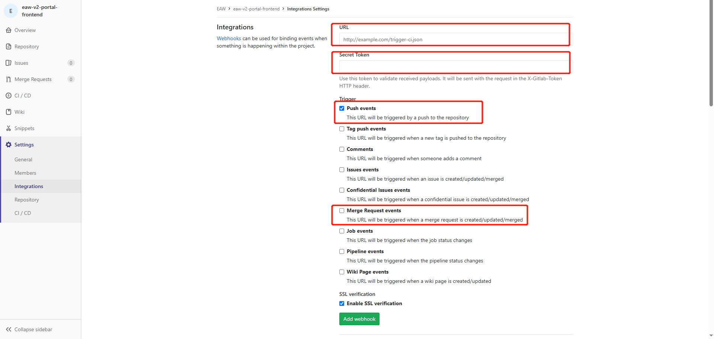

> 请确保gitlab网络环境和本系统互通。

##### 3. push触发事件

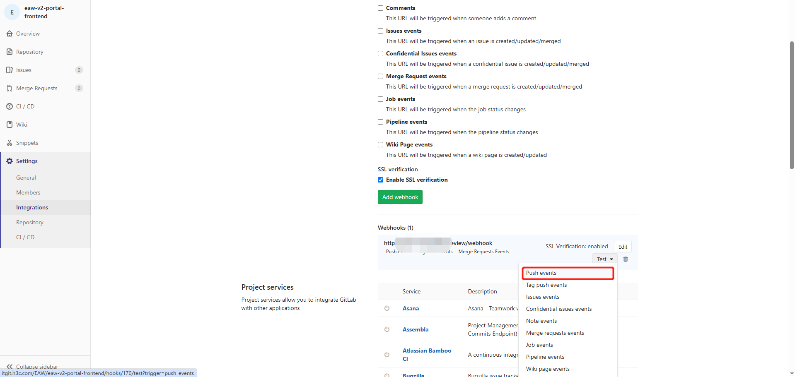

在配置好webhook后可以点击测试按钮 `Test`看下网络是否畅通。

##### 4. 查看审查报告

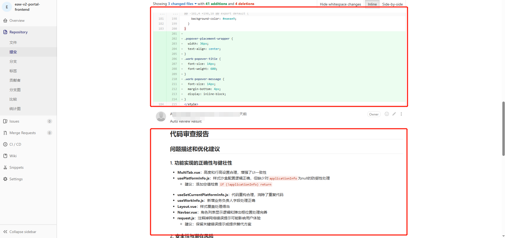

代码push后会在提交note下增加审查报告。

##### 5. 查看审查日志

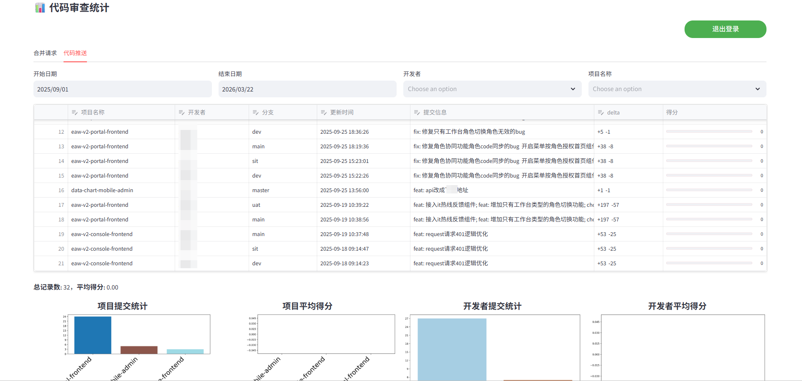

这个集合了日志和面板统计，也可以进行简单的筛选。从score列查看评分，针对性对代码进行优化。

> 消息通知可以配置钉钉、飞书和企业微信，具体流程可参考官方文档。
> 局限性：现在对项目整个仓库的评审没有前端页面的配置项，暂且只能用作者给出的指令: python -m biz.cmd.review

#### 3.vscode插件

使用vscode编辑器的开发者也可以安装`DeepSeek R1`和 `腾讯云代码助手 CodeBuddy`。

在添加并启用插件后，在相应的页面或组件直接右键可以看到相关的评审功能。
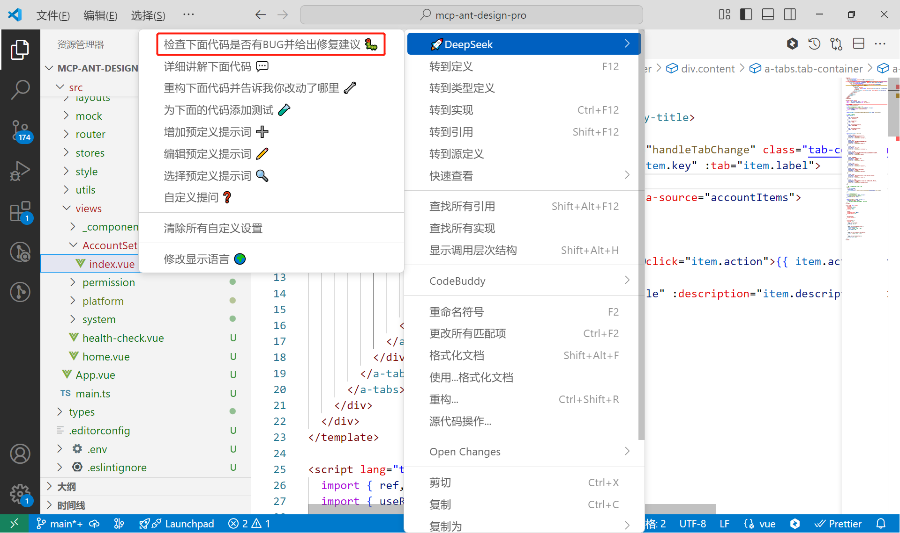
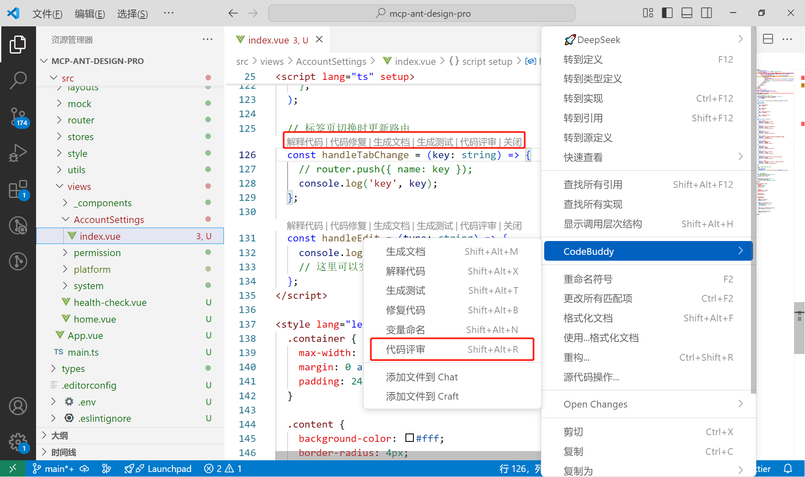

腾讯的代码助手可以在函数顶部添加相关功能按钮，可快速使用。

为方便使用，可以参考cursor的布局，将这2个插件移动到右侧。
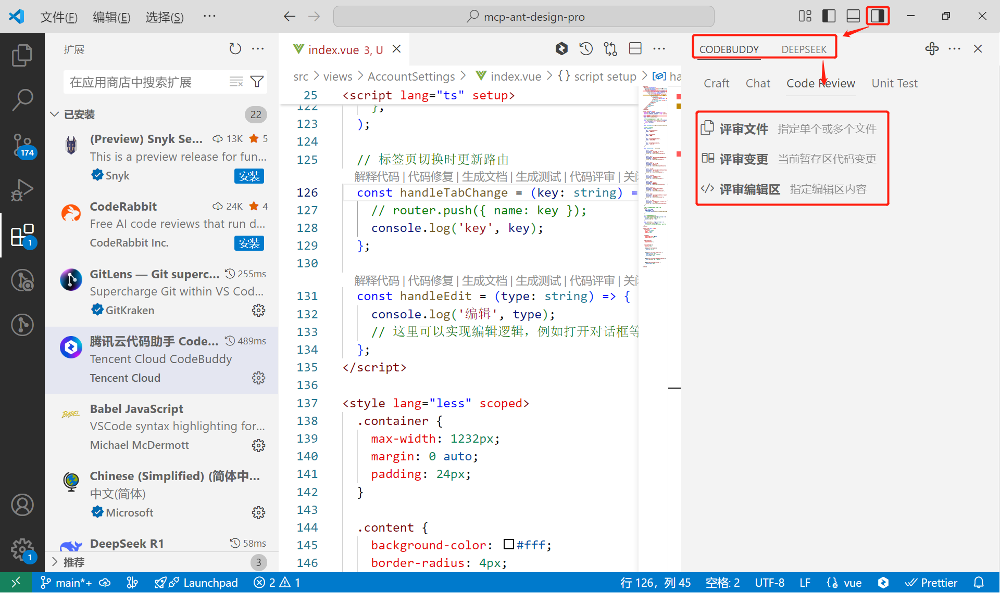

### 六、项目实战

#### 1.项目预设

我们预设项目的环境是中后台业务系统，增删改查列表页面，这个列表页面上面有表单查询和新建功能按钮，下面是表格。点击新建和操作列的编辑可以唤起表单modal组件。

> 可以做一个项目通用的列表设计，后续可以直接截图给大模型，只改表格的字段就行。甚至可以更进一步，将业务系统列表页面的重复性工作标准化，封装成skill。

为了更细致展示整个开发流程，我将各个环节做了拆分，下面将各个环节分步展示。

#### 2.设计

在masterGo的设计文件里点击上方的ai快搭标志开启窗口并输入prompt。
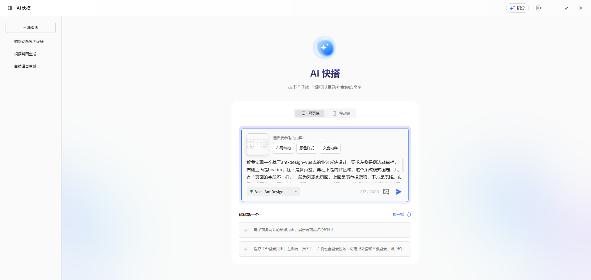

然后点击开始创作，会得到初步的设计稿。
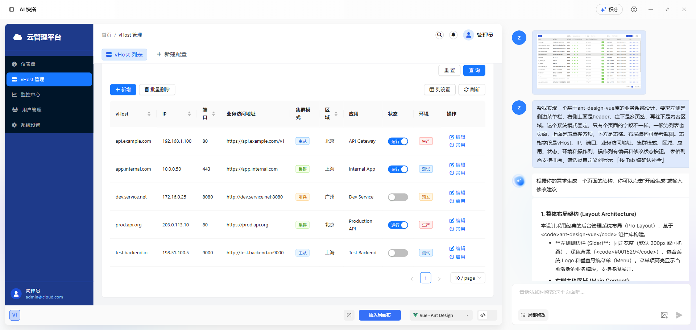

针对其进行校正，将细节补充，得到最终的设计稿。
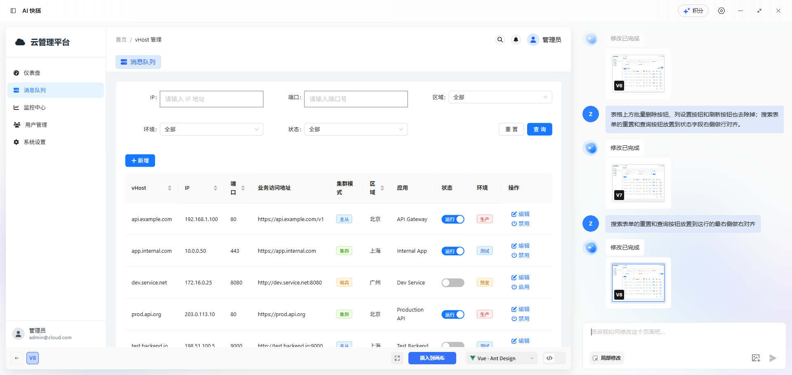

点击下方的插入到画布就是最终的设计稿了。

> 使用其他设计工具如figma的需要会员请自购，使用mcp需要token验证。

#### 3.生成UI

在设计稿选择这个页面可以复制容器链接，获取后用于生成ui代码。
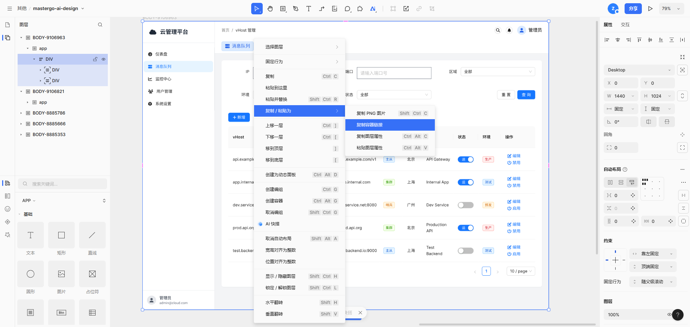

打开你的ai编辑器，输入指令生成ui。我的指令是：

```text
https://mastergo.com/goto/RCmBpTWJ?page_id=M&layer_id=68:1854&file=65624275281607 根据链接在项目新增消息队列模块。
```
生成代码运行效果：
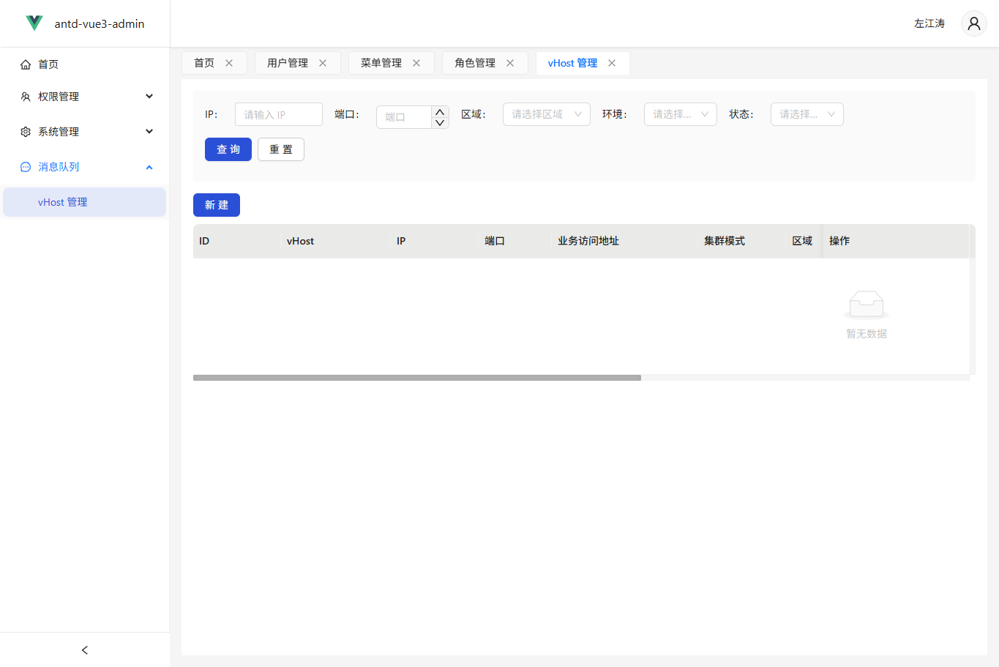

看到和设计还是有差别的，尤其上上方的表单搜索，我们可以在设计稿拷贝form的容器链接继续优化。
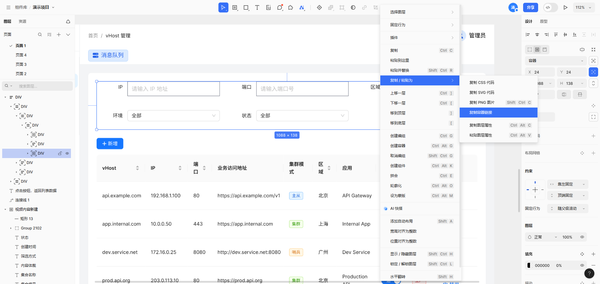

继续给指令要求优化上方的form区块：
```text

index.vue:2-36[这里我把生成的页面添加到了对话上下文]
https://mastergo.com/goto/RCotiGtR?page_id=M&layer_id=68:2584&file=65624275281607 根据链接将表单搜索区块重写。
```

优化后的效果：
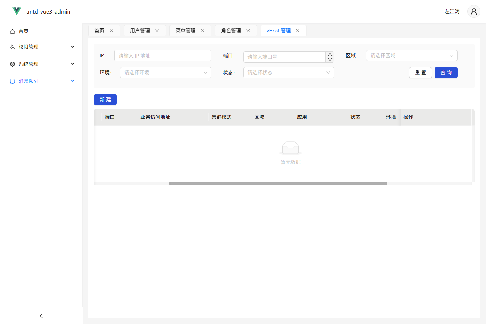

> 如果你使用了figma作为设计工具，请在你使用的编辑器mcp市场自行搜索figma添加，也可以手动添加[Figma-Context-MCP](https://github.com/GLips/Figma-Context-MCP)。

#### 4.对接接口

在对接接口前记得先添加apifox-mcp-server并配置你的swagger地址。[通过 MCP 使用 OpenAPI/Swagger 文档](https://docs.apifox.com/6327891m0)

直接通过指令要求获取你需要的模块或某个指定的接口。我的指令是：
```text
根据我配置的swagger地址，将消息队列资源接口模块封装成请求函数，如果本地已有就覆盖重写。
```
封装的请求函数部分截图：
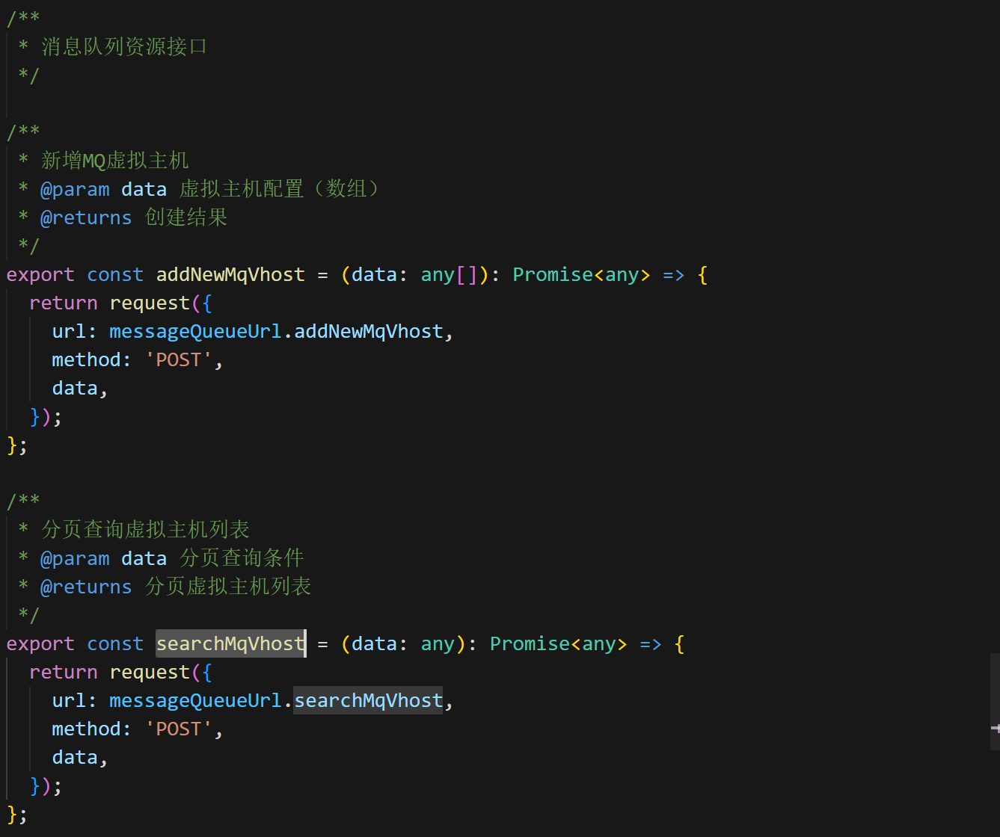

然后再对应的页面对接接口。
```text
index.vue[生成的UI页面]
将消息队列资源接口模块的分页查询虚拟主机列表接口对接。
```

前端显示效果：
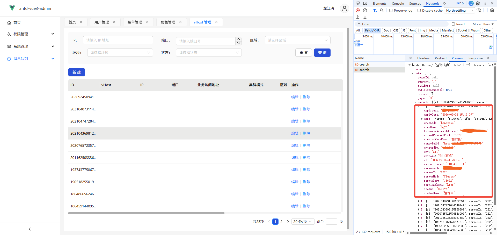

因为我们是将环节拆分，所以各阶段是各自生成的。此时看到虽然获取到了，但是字段没和swagger响应体字段对齐，我们可以再次下指令让其使用获取的字段更新即可。
```text
columns.ts[这里我将表格列字段的文件添加到对话上下文]
将表格列的字段和swagger文档POST /cloud//v1/mq/resource/list/search 接口的响应体字段对应
```
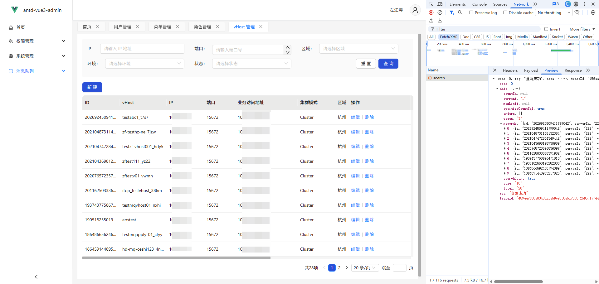

#### 5.其他

##### 1.生成指令
为了展示各环节的过程，所以我将生成过程给拆分。实际上可以一口气从零生成代码的，一个简单的prompt指令模板如下：
```text
根据我给出的规则和项目结构依次执行下列任务，完成前端项目的开发。
先根据这个链接(https://mastergo.com.goto/xxx?xx)生成前端UI页面和组件；
然后根据apifox-mcp-server服务我配置的swagger地址来获取文档，并将整个文档的模块分别封装请求函数；
最后在生成前端页面将对应的接口对接，如果表格的columns和文档接口响应体字段不一致请按照文档更新字段。
```

> 根据url生成前端页面ui我演示的是一张页面的，整站生成参考官网 [官网全站生成教程](https://mastergo.com/file/155675508499265?page_id=8740:3698)。
> 为了准确我建议页面UI的生成还是一张一张来，这样速度快而且发生错误及时更正，后续代码或者任务回退影响最小。

##### 2.模型选择

经过我多次的尝试，国外的模型claude、gemeni都可以执行，国内的deepseek也可以完成我的任务计划。其他模型我花费几天时间没有成功。
如果想用国外优质模型的可以使用codebuddy国际版和trae国际版，直接购买会员省心不少（也可自行购买第三方聚合中转apiKey）。codebuddy的中国版也有deekseek-v3.2模型可供大家使用。

##### 3.规则和技能

为了更高效的使用ai的能力，对于ai模型的约束和引导是必须的。目前我个人使用的多的是规则rules和技能skills。由于篇幅所限我不深入细聊细节，总之宗旨是尽可能明确、细颗粒度、对不想要的后果命令禁止，最好给出示例。

分享下我使用mastergo-mcp生成列表场景UI代码的rule：
````text
# 列表场景开发最佳实践

## 1. 列表结构分析处理

  ### 1.1 列表结构分析

  在开发列表组件之前，首先需要对列表结构进行详细的分析，了解列表的数据来源、展示方式、交互需求等，为后续的开发工作奠定基础。

  具体参考模板可参考路径：`src/views/permission/menu/index.vue`。

  此模板中，上方为表单，下面是表格。
  表单一般是左侧新建按钮，右侧AInput组件做模糊查询。新建功能则在同级`_components`下新建FormModel组件并且引入到列表页使用。
  表格直接使用Atable组件，通过传入columns和dataSource属性即可实现。
  而表格的columns属性，则需要根据数据结构进行分析，确定表格的列数、列名、列宽、列对齐方式等。

  ### 1.2 各文件说明

  - `index.vue`：列表页面，用于展示列表数据。
  - `_components/FormModel.vue`：新建、编辑组件，用于处理表单数据。
  - `_components/columns.ts`：列表列配置，用于定义表格的列数、列名、列宽、列对齐方式等。
  - `src/hooks/useCurd.ts`：列表公共逻辑hook封装；
  - `src/hooks/useFormModel.ts`：新建、编辑公共逻辑hook封装；


## 2. 列表数据处理
  - 在使用apifox-mcp-server读取文档时，将列表的表格字段与文档的响应体字段对应；
  - 在表格的字段UI设计有简单处理时，如badge、tooltip，可先将对应字段开发，复杂处理可直接空下或用字段值占位；
  - 如果mastergo-mcp读取到某块设计比较复杂或有后续的交互功能，可以询问开发者，得到答复再做进一步处理；

## 3. 列表交互处理

  ### 3.1 新建、编辑组件

  新建、编辑组件通常用于处理表单数据的增删改操作。在列表页面中，通过点击按钮可以打开新建或编辑弹窗，进行数据的输入和提交。

  具体实现可参考路径：`src/views/permission/menu/_components/FormModel.vue`。

  在此组件中，使用了Ant Design Vue的表单组件（如`a-form`、`a-input`等）来构建表单界面，并通过表单验证和提交逻辑来处理用户输入的数据。

  ### 3.2 数据查询


  当只有input搜索时，布局为左侧新建按钮，右侧AInput组件做模糊查询；
  当多条目项表单查询时，按照表单布局，在上方表单，下面新建按钮。


  ### 3.3 数据删除

  一般是表格的操作列会有删除按钮，点击后弹出确认框，确认后删除数据。本项目已经封装了hooks，见`src/hooks/useCurd.ts`，直接调用方法即可。

## 4. 列表列处理

在开发时，遇到表格列有特殊样式或字段处理，可使用插槽。具体使用方法如下：

1. 在表格列配置中，为需要特殊处理的列设置`customRender`属性，指定插槽名称。
2. 在模板中使用`<template #columnKey="{ column, record }">`语法定义插槽内容。

示例：
```vue
<a-table-column title="操作" dataIndex="action">
  <template #customRender="{ record }">
    <a>编辑</a>
    <a>删除</a>
  </template>
</a-table-column>
```

## 5. 列表性能优化

一般数据量不太大，直接按照上方规则，或者下面的代码示例即可。

## 6. 列表代码示例

### 6.1 列表页面代码

  ```vue
  <template>
    <div class="table-toolbar">
      <a-button type="primary" @click="formModelRef.open(0)"> 新建 </a-button>
      <a-input style="width: 250px" v-model:value="fuzzyContent" placeholder="请输入权限名称或编码" />
    </div>

    <a-table
      ref="table"
      rowKey="id"
      size="middle"
      :scroll="{ y: calcTableScrollYHeightWithoutPagination }"
      :dataSource="data"
      :columns="columns"
      :loading="loading"
      :pagination="false"
      @change="handlePageChange"
    >
      <template #bodyCell="{ column, record }">
        <template v-if="column.dataIndex === 'action'">
          <a @click="formModelRef.open(1, record)">编辑</a>
          <a-divider type="vertical" />
          <a @click="formModelRef.open(0, record)" :disabled="record.resourceType !== 'MENU'">添加</a>
          <a-divider type="vertical" />
          <a @click.prevent="showDelTableFormDialog(record.id)">删除</a>
          <contextHolder />
        </template>
      </template>
    </a-table>

    <!-- FormPage -->
    <FormModel ref="formModelRef" @submit="submitMethod" />
  </template>

  <script lang="ts" setup>
    import FormModel from './_components/FormModel.vue';
    import { columns } from './_components/columns';
    import { MenuEnum } from '@/core/enums/permissionEnum';
    import { useMenuPermission } from '@/views/_components/useMenuPermission';

    const {
      calcTableScrollYHeightWithoutPagination,
      formModelRef,
      fuzzyContent,
      data,
      loading,
      contextHolder,
      showDelTableFormDialog,
      submitMethod,
      handlePageChange,
    } = useMenuPermission(MenuEnum.SearchMenuType);
  </script>
  ```

### 6.2 新建组件代码

  ```vue
  <template>
    <a-modal
      :title="title"
      :open="visible"
      :confirmLoading="confirmLoading"
      :maskClosable="false"
      :keyboard="false"
      @ok="handleSubmit"
      @cancel="handleCancel"
    >
      <a-form ref="ruleFormRef" :rules="rules" :model="form" :colon="false" v-bind="formItemLayout">
        <a-form-item label="资源类型" name="resourceType">
          <a-radio-group v-model:value="form.resourceType" :disabled="formStatus === 1">
            <a-radio :value="'MENU'"> 菜单 </a-radio>
            <a-radio :value="'BUTTON'"> 按钮 </a-radio>
          </a-radio-group>
        </a-form-item>
        <a-form-item label="上级菜单" name="parentId">
          <a-select v-model:value="form.parentId" placeholder="请输入上级菜单" :disabled="formStatus === 1">
            <a-select-option v-for="item in permissions" :key="item.value">
              {{ item.label }}
            </a-select-option>
          </a-select>
        </a-form-item>
        <a-form-item label="资源编码" name="resourceCode">
          <a-input v-model:value="form.resourceCode" placeholder="请输入资源编码" :disabled="formStatus === 1" />
        </a-form-item>
        <a-form-item label="权限名称" name="permissionName">
          <a-input v-model:value="form.permissionName" placeholder="请输入权限名称" />
        </a-form-item>
        <a-form-item label="路由名" name="routeName" v-if="form.resourceType === 'MENU'">
          <a-input v-model:value="form.routeName" placeholder="请输入路由名" />
        </a-form-item>
        <a-form-item label="路由" name="route" v-if="form.resourceType === 'MENU'">
          <a-input v-model:value="form.route" placeholder="请输入路由" />
        </a-form-item>
        <a-form-item label="meta" name="formMeta" v-if="form.resourceType === 'MENU'">
          <a-textarea v-model:value="form.formMeta" placeholder="请按照此格式{'path': '/index', 'title': '首页'}" />
        </a-form-item>
        <a-form-item label="排序号" name="priority">
          <a-input-number v-model:value="form.priority" />
        </a-form-item>
        <a-form-item label="是否显示" name="display" v-if="form.resourceType === 'MENU'">
          <a-switch v-model:checked="form.display" />
        </a-form-item>
      </a-form>
    </a-modal>
  </template>

  <script lang="ts" setup>
    import { defineExpose, defineEmits } from 'vue';
    import type { Rule } from 'ant-design-vue/es/form';
    import { getMenuList } from '@/api/permission';

    let form = reactive({
      id: '',
      parentId: '0',
      resourceType: 'MENU',
      name: '根节点',
      priority: 0,
      display: true,
      meta: undefined,
      formMeta: undefined,
    });
    let visible = ref<boolean>(false);
    const emit = defineEmits(['submit']); // 使用 defineEmits 来定义 emit 函数
    const { ruleFormRef, formStatus, title, confirmLoading, formItemLayout, handleSubmit, handleCancel } = useFormModel(
      visible,
      form,
      emit,
    );
    const rules: Record<string, Rule[]> = {
      resourceType: [{ required: true, message: '请输入资源类型', trigger: 'blur' }],
      permissionName: [{ required: true, message: '请输入权限名称', trigger: 'blur' }],
      resourceCode: [{ required: true, message: '请输入资源编码', trigger: 'blur' }],
      parentId: [{ required: true }],
    };

    let permissions = reactive([
      {
        value: '0',
        label: '根节点',
      },
    ]); // 角色已绑定权限列表

    watch(
      () => form.routeName,
      val => {
        form.formMeta = JSON.stringify({
          title: val,
        });
        form.meta = {
          title: val,
        };
      },
    );

    /**
     * 父组件调用并传值给formModel
     * */
    // 打开
    const open = async (type, info) => {
      visible.value = true;
      formStatus.value = type;
      // 新建/添加时将记录父菜单的id，用于将数据绑定到父菜单
      if (info && info.id) {
        const { id: parentId } = info;
        form.parentId = parentId;
      }
      if (type === 1) {
        await getPermissionList();
        const {
          id,
          parentId,
          resourceType,
          resourceCode,
          parentPermissionName,
          permissionName,
          menuTitle,
          route,
          meta,
          priority,
          display,
        } = info;
        Object.assign(form, {
          id,
          parentId,
          resourceType,
          resourceCode,
          parentPermissionName: parentPermissionName || '根节点',
          permissionName,
          routeName: menuTitle,
          route,
          formMeta: JSON.stringify(meta),
          meta,
          priority,
          display,
        });
        console.log(form);
      }
    };
    // 关闭
    const close = () => handleCancel();

    // 获取权限列表
    async function getPermissionList() {
      const params = {
        searchType: 1, // 1: menu/button 类型
        treeData: false, // 不获取树形结构
      };
      const { data } = await getMenuList(params);
      const fetchPermissions = data
        .filter(item => item.id !== form.id)
        .map(item => {
          return {
            value: item.id,
            label: item.menuTitle,
          };
        });
      permissions = [...permissions, ...fetchPermissions];
    }

    defineExpose({ open, close }); // 暴漏出去给父组件用
  </script>
  ```

### 6.3 表格columns文件代码

  ```typescript
  import type { TableColumnType } from 'ant-design-vue';

  type TableDataType = {
    menuTitle: string;
    resourceCode: string;
    resourceType: string;
    permissionName: string;
    priority: number;
    display?: boolean;
    createdTime?: string;
    action: null;
  };

  export const columns: TableColumnType<TableDataType>[] = [
    {
      title: '菜单名称',
      dataIndex: 'menuTitle',
      width: 200,
      fixed: 'left',
    },
    {
      title: '编码',
      dataIndex: 'resourceCode',
      width: 150,
      ellipsis: true,
    },
    {
      title: '类型',
      dataIndex: 'resourceType',
      width: 200,
    },
    {
      title: '权限名称',
      dataIndex: 'permissionName',
      width: 200,
      ellipsis: true,
    },
    {
      title: '排序号',
      dataIndex: 'priority',
      width: 200,
    },
    {
      title: '是否显示',
      dataIndex: 'display',
      width: 200,
    },
    {
      title: '创建时间',
      dataIndex: 'createdTime',
      width: 200,
    },
    {
      title: '操作',
      dataIndex: 'action',
      width: 150,
      fixed: 'right',
    },
  ];
  ```
````

使用提升还是比较明显的，没有规则约束时ai按着自己的理解生成500行以上的代码。有了规则约束，同一个页面在效果一样的情况下生成的代码180行左右。ai自己理解开发不总是使用项目内的组件和hooks，所以要通过规则指定。

### 七、结语

本文通过将前端开发流程做拆解，将各个环节使用的ai工具进行介绍，并以项目实战来演示纯ai驱动生成一个完整的列表页面。从原型设计到UI代码生成，再到读取swagger文档接口对接。对于项目开发有着很明显的提升，后续开发可以将重复性的工作ai托管，开发者只需要关注业务逻辑代码即可。
