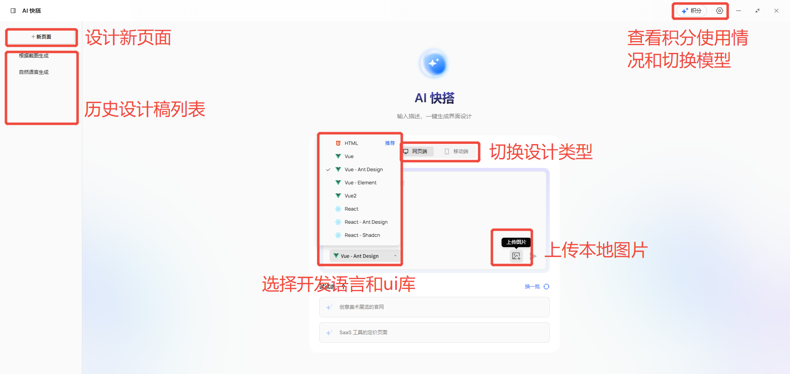
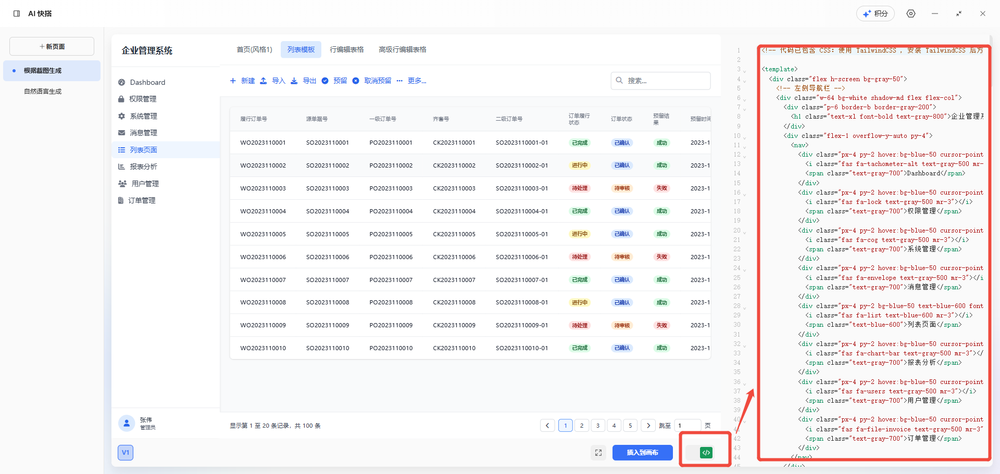
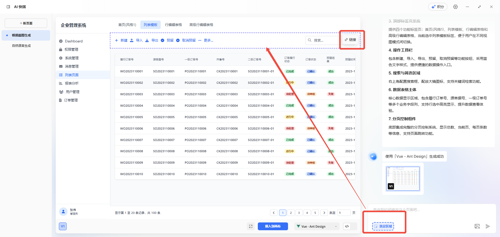
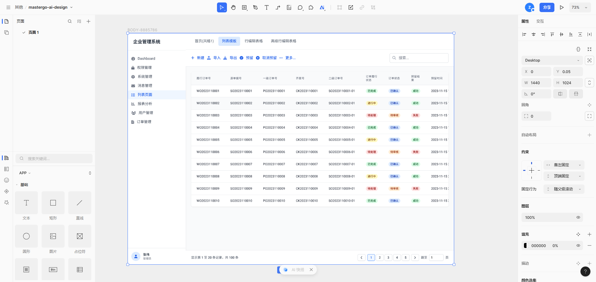
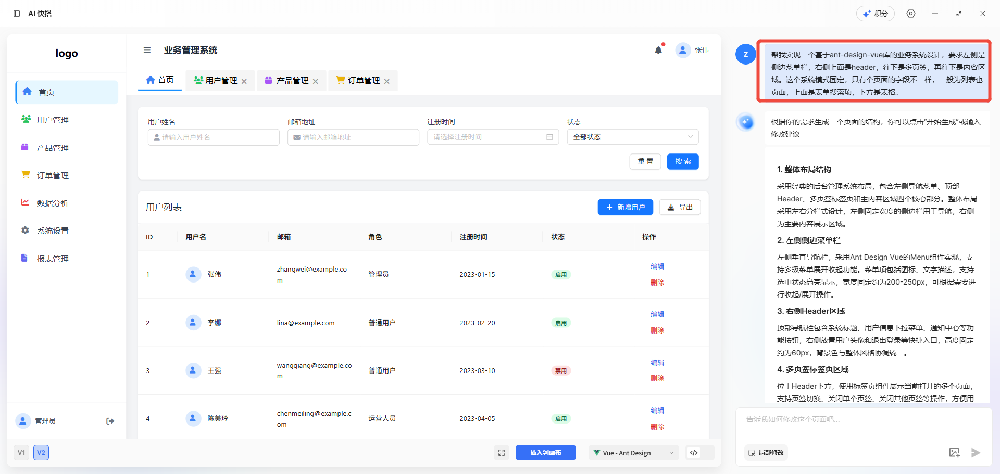
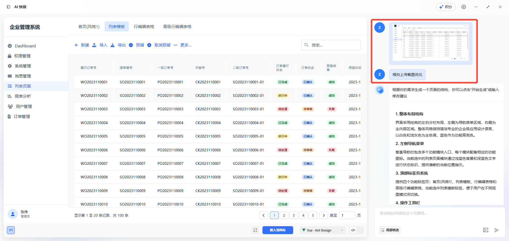
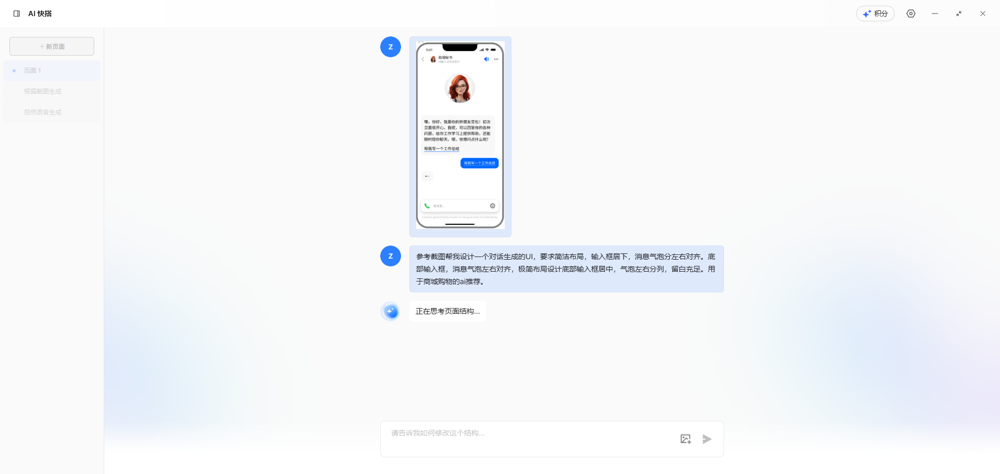
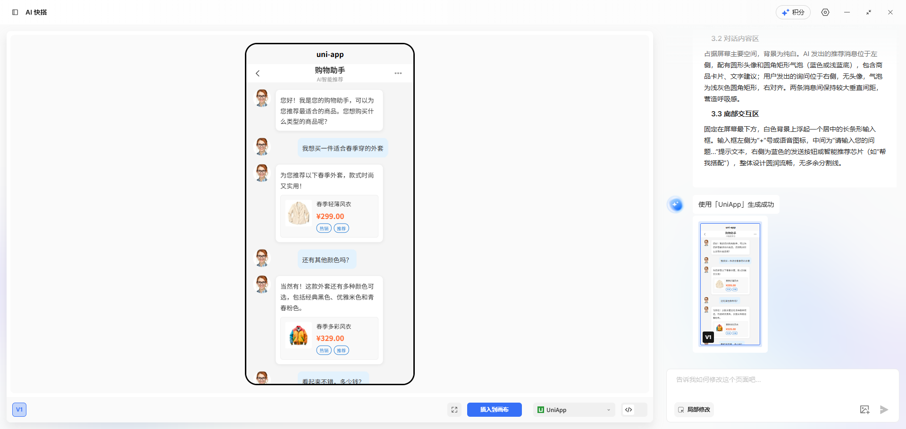

title: MasterGo AI快搭原型设计
---

### 一、需求背景

传统的开发模式是产品给出原型设计，然后UI/UX出高清设计稿和视觉稿，然后再给到前端开发。至于缺少设计师的中小团队，要么开发人员自己排版，要么在开源的中后台系统上二次开发。
但是在复杂业务或自定义较强的场景就很头疼。现在ai能力日益强大，我们也可以利用ai能力来为我们直接出设计稿解决这一痛点。强大的ai工具既可以直接给我们高可用
设计，在审美方面也比开发人员要强不少。

本文我通过mastergo的ai设计工具（ai快搭）来展示怎么使用ai的设计能力，以及更好的对其使用。使用ai快搭来作为我们的产品设计和视觉设计，方便开发人员的快速开发。

### 二、MasterGo AI功能介绍

#### 1. 基础功能

从图中可以看到，下方左侧主要功能包括创建新页面、选择设计类型、选择开发语言和ui库、输入自然语言和上传本地截图等。右侧的输入框下方也可以选择局部不满意的地方优化。

点击`代码icon`可以在右侧预览代码。

点击`局部修改`可以在上方对部分区域选定，然后可以针对性修改。

#### 2. 设计成品功能

点击`插入到画布`可以将设计稿保存，之后就可以自己查看使用了。

如梭所示，可以看到下方可以选择`插入到画布`来保存到设计稿；也可以切换开发语言框架和代码预览；

### 三、设计实践

#### 1. 通过自然语言驱动设计

输入自然语言可以想使用chat对话一样，告诉ai你的需求和想法即可。

#### 2. 上传本地截图驱动设计

也可以直接上传本地图片，如竞品截图，已有的页面截图等。之后可以再此基础上补充你的需求。

#### 3. 移动端设计

针对移动端设计，我们也可以做个测试。如图：

效果图：

### 四、其他

#### 1.生成质量

masterGo的模型对业务中台系统生成质量给还行。移动端对语料理解和生成还是差点，后续再找几个工具对比下。

#### 2.积分使用情况

分大匠模型和小匠模型，小匠模型每张生成5积分，每次修改2积分；大匠模型每张生成25积分，每次修改10积分。免费版每月赠送100积分。

#### 3.其他建议

对于比较通用的设计可以做成组件库，这样就可以省下积分，只需要手动更改某些字段即可。比如业务系统的列表页面。

#### 4.试用通道

访问官网 [定价](https://mastergo.com/pricing) 页面，点击「免费试用」按钮。试用期为 30 天。
