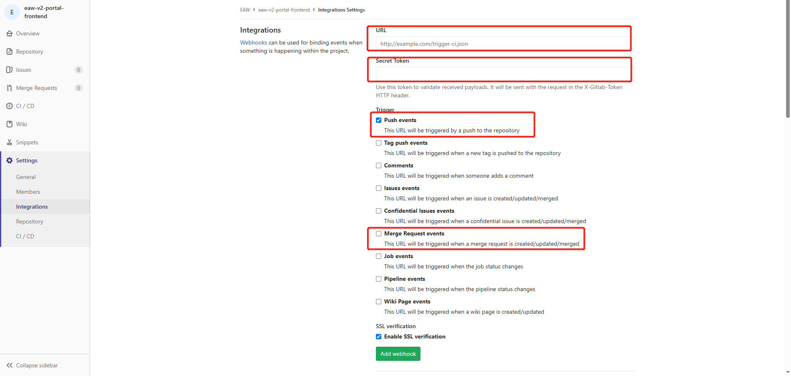

title: AI代码评审方案
---

### 一、需求现状

代码审查一直是项目开发的一个重要环节，但是要花费大量时间，我们希望能够使用工具来缩短这个环节的时间，给开发人员减负。业务团队也对我们提出了这方面的需求，
之前的sonarqube已经不能满足各业务团队的需求，尤其是对历史项目的审查。大量的项目审查带来巨大的工作量。在ai模型和mcp服务蓬勃发展的今天，代码审查也可以借助ai的力量。

在代码审查时我们关注代码的逻辑性错误、代码健壮性、安全性、性能等几个维度，在工具使用时关注文档、是否免费、能不能私有化部署、审查效率怎样。针对业务和开发的需求，我做了一些调研。

### 二、调研

对代码的审查分为**开发即时审查**和**代码变更审查**（平台类审查）。
开发即时审查主要调研了代码编辑器的插件，cursor的mcp服务插件和vscode的插件，这些插件可根据开发者自己的需求来进行评审。
市面上平台类审查工具具有ai能力的审查工具包括CodeRabbit、Snyk，包括SonarQube有可以接入ai能力。

| 维度	       | CodeRabbit	        | SonarQube     	 | DeepCode/Snyk Code  |
|-----------|--------------------|-----------------|---------------------|
| 核心优势     | PR 实时交互、AI 建议      | 多语言支持、深度静态分析    | 安全漏洞检测、语义级 AI       |
| GitLab集成  | ✅ 直接 Merge Request 集成 | ✅ CI/CD 流水线集成   |	✅ CI/CD 或插件集成 |
| AI 能力     | 高（对话式 LLM）         | 低（规则引擎为主）       |	中高（语义分析+ML） |
| 数据隐私     | 云端服务	              | 支持本地部署	         | 云端/企业版本地部署 |
| 成本	       | 中（按用户/仓库）          | 	低（社区版）到高（企业版）  |	中高（安全专项） |
| 最佳适用场景  | 敏捷团队的 PR 交互审查      | 	严格规范的长期项目维护    |	安全敏感的现代应用开发 |

synk的只有企业版才可以私有化部署，且它是偏重于安全方面的；CodeRabbit是云服务，不能私有化部署；而SonarQube侧重于代码的规范和规则，ai能力不足，不能最大限度使用ai的能力。
而且ai定制能力受限，只能使用官方集成的，不能针对自己的项目做prompt定制。

所以上面的都不能满足现有的需求，因此我又调研别的工具，找到一个开源的工具 `AI-Codereview-Gitlab`。

### 三、编辑器插件

#### 1. cursor

直接使用 `@vibesnipe/code-review-mcp` mcp服务插件。

1) 添加mcp配置


2) 项目根目录增加 `.cursor/rules/project.mdc` 文件，内容：
```text
## Slash Commands

/review-staged: Use the perform_code_review tool from the code-reviewer MCP server to review staged changes. Use anthropic provider with claude-3-7-sonnet-20250219 model. Base the task description on our current conversation context and focus on code quality and best practices.

/review-head: Use the perform_code_review tool from the code-reviewer MCP server to review all uncommitted changes (HEAD). Use openai provider with o3 model. Base the task description on our current conversation context and focus on code quality and best practices.

/review-security: Use the perform_code_review tool from the code-reviewer MCP server to review staged changes. Use anthropic provider with claude-3-5-sonnet-20241022 model. Base the task description on our current conversation context and specifically focus on security vulnerabilities, input validation, and secure coding practices.
```

> 其他更多属性配置，可以看：https://www.npmjs.com/package/@vibesnipe/code-review-mcp

3) 使用方式：可输入 `/review-head`。


> 如果你是python开发者也可以使用 https://github.com/mehmetakinn/gitlab-mcp-code-review

#### 2. vscode

cursor需要20美元的月费，vscode上的免费插件也有不错的效果，我推荐 `DeepSeek R1`和 `腾讯云代码助手 CodeBuddy`。 这2个插件都是免费的。

在添加并启用插件后，在相应的页面或组件直接右键可以看到相关的评审功能。


腾讯的代码助手可以在函数顶部添加相关功能按钮，可快速使用。

为方便使用，可以参考cursor的布局，将这2个插件移动到右侧。


> 虽然在功能ai模型上vscode的免费插件比不上cursor，但是在代码开发方面来说，可以应对绝大部分的开发场景。

### 四、AI-Codereview-Gitlab

这是一个开源的aicr工具，[AI-Codereview-Gitlab](https://github.com/sunmh207/AI-Codereview-Gitlab) 是一个基于大模型的自动化代码审查工具，帮助开发团队在代码合并或提交时，快速进行智能化的审查(Code Review)，提升代码质量和开发效率。

#### 1. 私有化部署

我们通过官方的Docker 部署方式来部署的：

1) 准备环境文件
    - 克隆项目仓库
    ```
    git clone https://github.com/sunmh207/AI-Codereview-Gitlab.git
    cd AI-Codereview-Gitlab
    ```
    - 创建配置文件
   ```
   cp conf/.env.dist conf/.env
   ```
    - 编辑conf/.env文件
   ```
    #大模型供应商配置,支持 zhipuai , openai , deepseek 和 ollama
    LLM_PROVIDER=deepseek
    
    #DeepSeek
    DEEPSEEK_API_KEY={YOUR_DEEPSEEK_API_KEY}
    
    #支持review的文件类型(未配置的文件类型不会被审查)
    SUPPORTED_EXTENSIONS=.java,.py,.php,.yml,.vue,.go,.c,.cpp,.h,.js,.css,.md,.sql
    
    #钉钉消息推送: 0不发送钉钉消息,1发送钉钉消息
    DINGTALK_ENABLED=0
    DINGTALK_WEBHOOK_URL={YOUR_WDINGTALK_WEBHOOK_URL}
    
    #Gitlab配置
    GITLAB_ACCESS_TOKEN={YOUR_GITLAB_ACCESS_TOKEN}
    ```
2) 启动服务
    ```
   docker-compose up -d
   ```
3) 验证
    - 主服务验证：
      - 访问 http://your-server-ip:5001
      - 显示 "The code review server is running." 说明服务启动成功。
    - Dashboard 验证：
      - 访问 http://your-server-ip:5002
      - 看到一个审查日志页面，说明 Dashboard 启动成功。

#### 2. 配置gitlab webhook

1) 创建Access Token
   - 方法一：在 GitLab 个人设置中，创建一个 Personal Access Token
   - 方法二：在 GitLab 项目设置中，创建Project Access Token

2) 配置webhook
   在 GitLab 项目设置中，配置 Webhook：
   - URL：http://your-server-ip:5001/review/webhook
   - Trigger Events：勾选 Push Events 和 Merge Request Events (不要勾选其它Event)
   - Secret Token：上面配置的 Access Token(可选)


> 请确保gitlab网络环境和本系统互通。

#### 3. push触发事件


在配置好webhook后可以点击测试按钮 `Test`看下网络是否畅通。

#### 4. 查看审查报告


代码push后会在提交note下增加审查报告。

#### 5. 查看审查日志


这个集合了日志和面板统计，也可以进行简单的筛选。从score列查看评分，针对性对代码进行优化。

> 消息通知可以配置钉钉、飞书和企业微信，具体流程可参考官方文档。
> 局限性：现在对项目整个仓库的评审没有前端页面的配置项，暂且只能用作者给出的指令: python -m biz.cmd.review

### 五、结语
对于普通的项目，vscode的即时审查插件(deepseek和codebuddy)和开源工具(AI-Codereview-Gitlab)就可以零预算来对项目进行审查。

我自己负责的几个项目都按着这个方案做代码审查，效果还是不错的。审查报告会找出不合理的代码片段并给出建议，对不易发现的性能和安全漏洞及时发现并解决。
