title: Cursor+MCP，AI时代前端开发工作流
---

### 一、MCP介绍

AI时代下，大模型不断更新迭代，针对代码开发的场景需求也涌现出许多优秀大模型。随着mcp服务和ai的成熟，我们可以利用AI代码辅助来帮我们高效开发项目。以往的ai模型都是问答式的，Anthropic推出的mcp协议可以桥接外部工具和数据，让AI直接上手帮我们实现业务场景需求。

[MCP](https://www.anthropic.com/news/model-context-protocol) 是 Claude (Anthropic) 主导发布的一个开放的、通用的、有共识的协议标准。，它标准化了应用程序向 LLM 提供上下文的方式。可以将 MCP 视为 AI 应用程序的 USB-C 端口。正如 USB-C 提供了一种将设备连接到各种外围设备和配件的标准化方式一样，MCP 提供了一种将 AI 模型连接到不同数据源和工具的标准化方式。

在ai辅助代码方面也有许多ai模型可以很好的理解并生成代码，我们可以利用mcp服务将其与设计图桥接，让ai阅读设计稿帮我们生成前端代码。本文以mastergo+cursor来展示如何利用mcp服务辅助代码生成。

### 二、cursor配置

cursor是一个ai代码编辑器，其内部集成许多ai模型，让我们在各场景和各语言下都能有高效的开发体验。[CURSOR官网](https://www.cursor.com/cn)

#### 1. setting各项配置

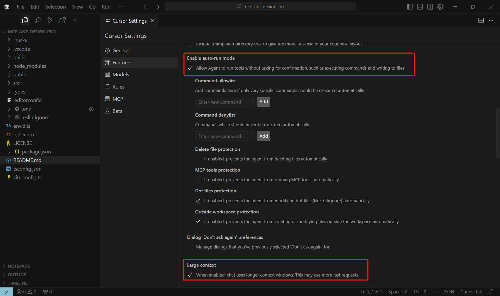
设置打开自动运行，可不用授权自动运行服务或工具。下面的各项保护可根据自己需求来开启。


cursor集成的ai模型，也可以自己增加新的ai模型。

#### 2. mcp配置

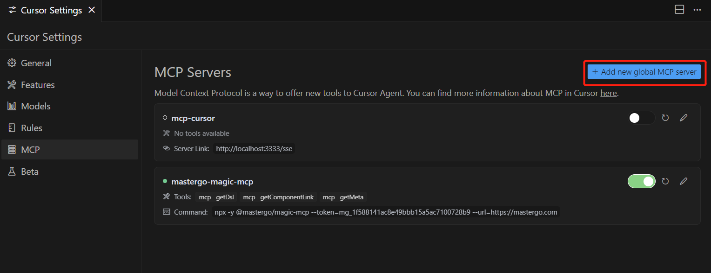
选择 `MCP` 菜单，可点击 'Add new global MCP server' 来添加自己的mcp服务器。

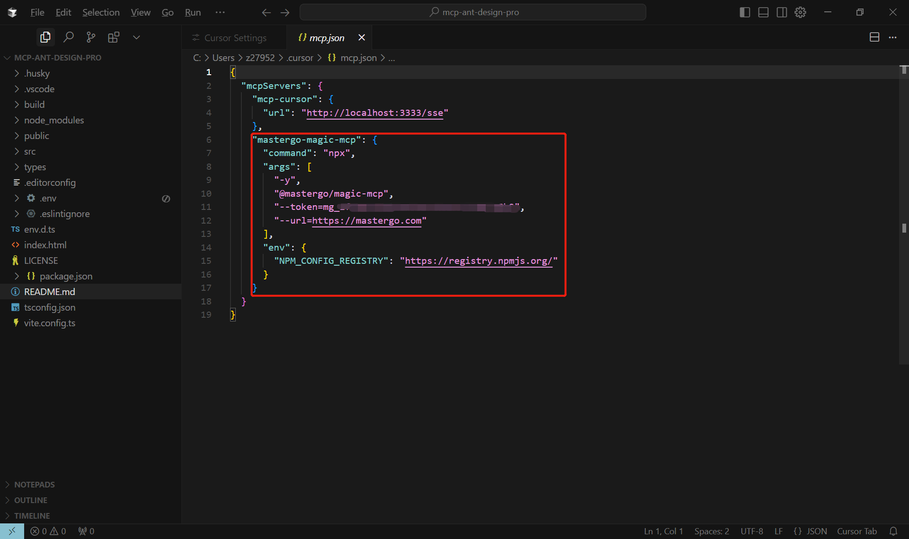
点击进来后根据自己需求来配置，mastergo的配置如图。

#### 3. prompt

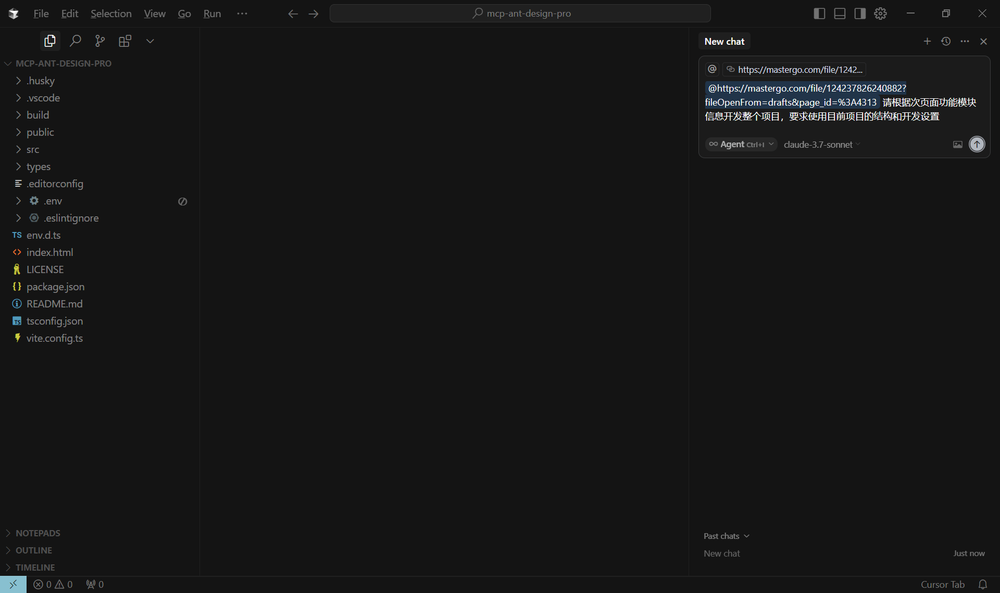
如图，右侧打开chat栏，可粘贴设计稿链接，然后直接写prompt即可。

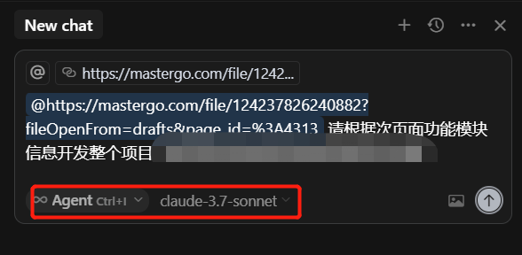
mode使用`agent`，ai模型推荐使用`claude-3.7-sonnet`或`claude-3.7-sonnet-max`。

#### 4. mac和windows分别配置

MacOS/Linux:
```json
{
  "mcpServers": {
    "Framelink MCP Mac": {
      "command": "npx",
      "args": ["-y", "mcp-service-name", "--your-api-key=YOUR-KEY", "--stdio"]
    }
  }
}
```

Windows:
```json
{
  "mcpServers": {
    "Framelink MCP Windows": {
      "command": "cmd",
      "args": ["/c", "npx", "-y", "mcp-service-name", "--your-api-key=YOUR-KEY", "--stdio"]
    }
  }
}
```

### 三、使用步骤

#### 1. mcp服务配置

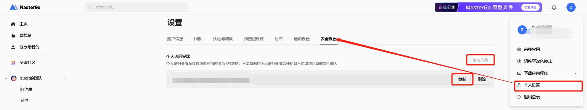
登录mastergo网站，从 `个人设置` 进去，在 `安全设置` 点击生成令牌，然后复制。


然后在Cursor Settings的MCP配置中填写token值。

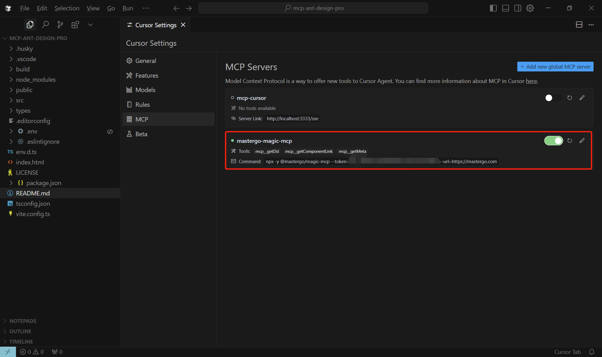
返回设置，看到前面的绿点亮起说明成功配置。

#### 2. 复制链接

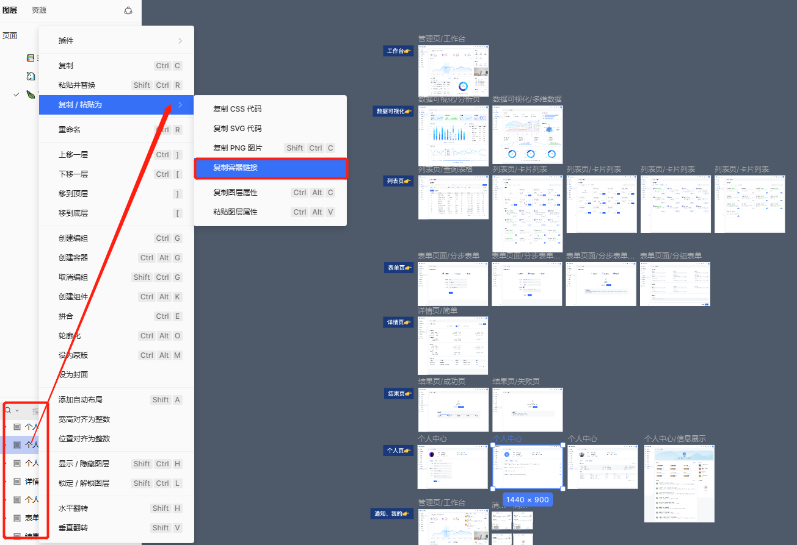
进入项目，如果想要开发某个页面，选择页面对应图层，右键找到 `复制/粘贴为` 选择 `复制容器链接`。

#### 3. 创建chat


粘贴复制的链接，后续编写自己的prompt，然后发送即可。

#### 4. 获取dsl

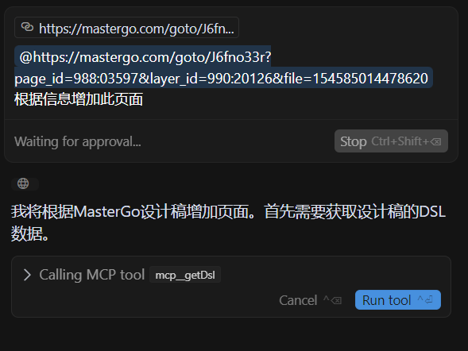
点击 `run tool` 执行工具，获取dsl信息。

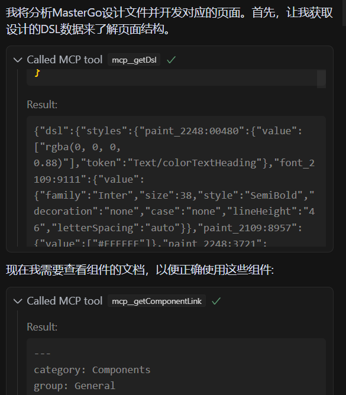
可以看到获取到的dsl信息是一颗json树，描述了设计稿转换信息，ai将会根据这些描述来生成代码。

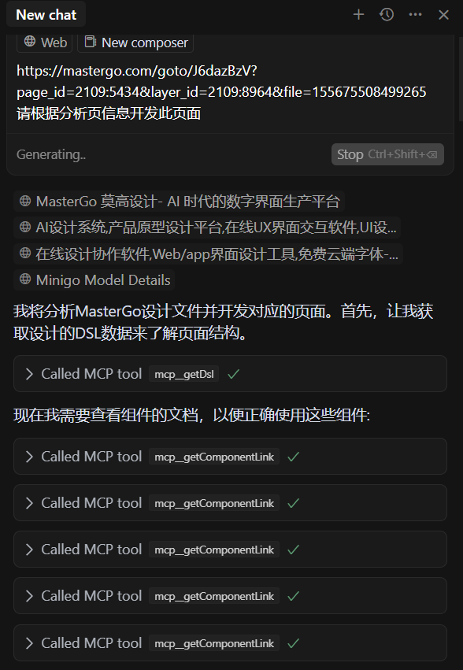
完整的执行工具如图展示。

#### 5. 多轮调用受限

在使用多轮生成后需要手动授权，在出现手动授权。


点击图中出现的 `resume the conversation`，然后会继续构建页面代码。

#### 6. 开发

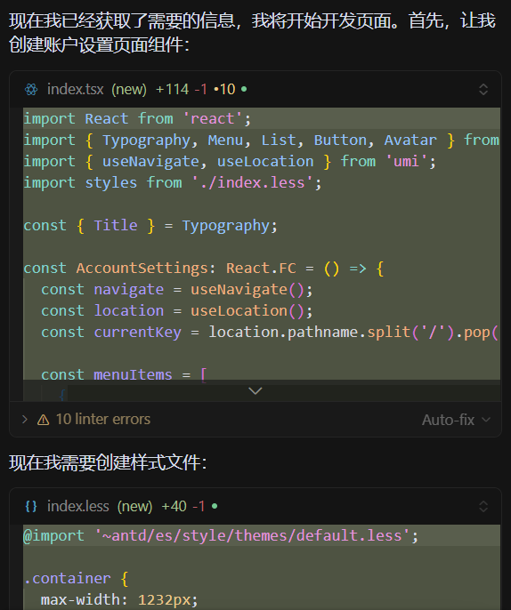
如图，ai开始生成代码。

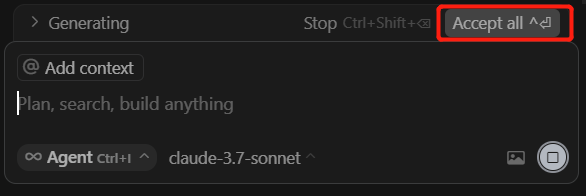
记得最后点击 `accept all`确定接受更改。

然后自己就可以运行查看效果。

### 四、进阶使用

#### 1. 各场景prompt推荐

在使用cursor时要给出明确的指令，提示尽可能具体清晰，否则cursor会按着自己的想法来生成代码。

**组件生成**：

比如想要将设计的*日历行程*封装成组件，可以加一些具体要求。
```text
请根据组件信息生成日历行程组件，要求：
1. 使用vue3+typescript方式开发；
2. 组件传入参数props需要account、userId、status、workType字段；
3. 代码符合当前项目的eslint规范和文件结构；
```

**数据图表**：
可使用@file 关键字指定项目文件路径，cursor会根据已有的文件来开发。
```text
请根据图表信息开发，要求：
1. 使用echarts开发，且各组件独立开发；
2. 使用@file hooks下已经封装好的useEcharts；
3. 全局的echarts组件引入请在 @file plugins/echarts下增加新组件；
```

**提供示例文档开发新领域**：
对不熟悉的框架或工具可提供文档链接让他现学现用。
```text
请用svelte帮我把链接的组件开发成webComponent，这里是相关文档：
https://blog.csdn.net/u012181546/article/details/128355988
```

#### 2. 自定义规则

在配置mcp的地方可增加rule关键字来配置自己的规则。
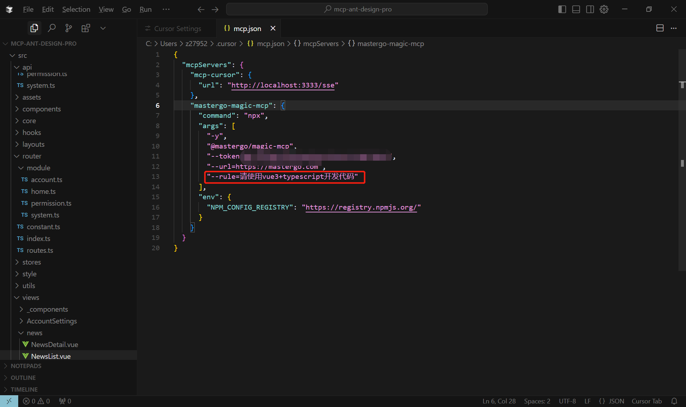

#### 3. 整站生成

mastergo官方的要求是需要一个meta信息，这个meta里面包含项目的路由结构和跳转原型设计；先执行getMeta生成站点的需求列表文档，然后根据文档上的信息来开发相应的页面；

我使用官网的教程试着开发了下全站点生成。[官网全站生成教程](https://mastergo.com/file/155675508499265?page_id=8740%3A3698)
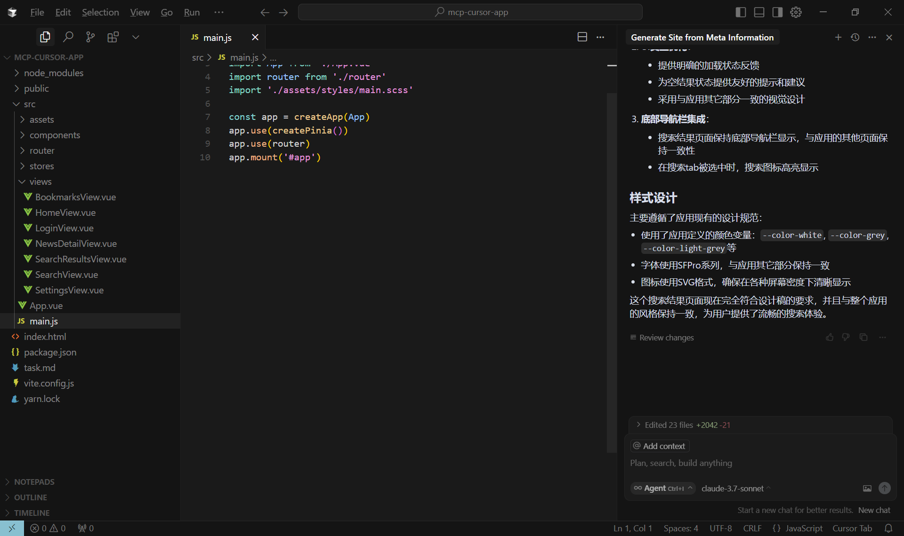
生成的工程结构。

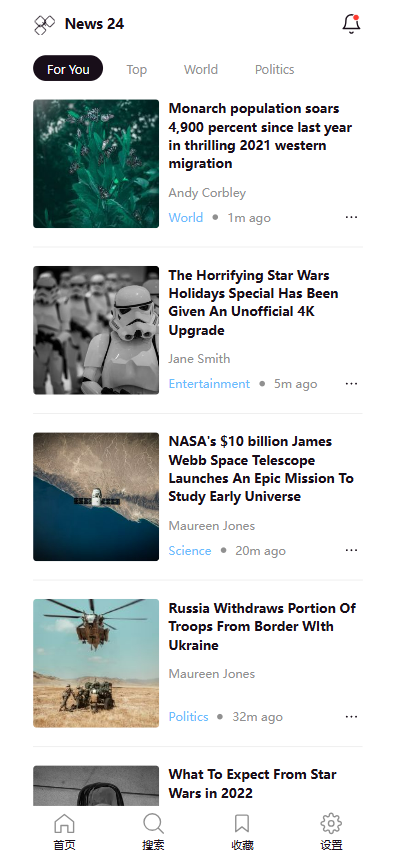
安装依赖后运行，可以看到效果图，这个小项目的效果超出我的预期，相信未来mcp和ai模型的优化会更加精准的为高效开发赋能。

### 五、其他

#### 1. 其他MCP服务获取

最简单的就是去[百度搜索开放平台](https://sai.baidu.com/ai/mcp)了，直接搜索自己感兴趣的即可。

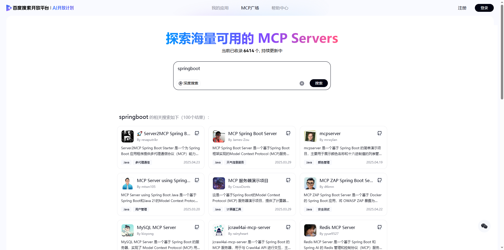

也可以输入关键字搜索其他领域的相关mcp服务，比如输入天气、地图或者sql。然后找到自己感兴趣的直接点击进去看使用文档。

#### 2. 参考
- [mastergo-mcp官方教程](https://mastergo.com/file/155675508499265?page_id=158%3A0002)
- [AI编码陷阱防不胜防看看 Cursor使用技巧](https://juejin.cn/post/7497250572736233484)
- [MCP (Model Context Protocol)，一篇就够了](https://zhuanlan.zhihu.com/p/29001189476)
- [Cursor + MCP = 王炸！彻底颠覆我的 Cursor工作流，效率直接起飞](https://zhuanlan.zhihu.com/p/28235501098)
