title: 前端监控系统Sentry
---

### 一、前端监控系统

#### 1. 什么是监控系统？为什么要对项目监控？

在IT界内，监控系统指对项目运行的各项指标的实时记录的系统或服务，旨在提升项目质量和量化项目的各项指标，为项目发展提供可量化的依据。

一般来说项目监控是为了：
* 更快的发现和解决线上问题；
* 做产品和制定需求的决策依据；
* 为业务扩展提供了更多可能性；
* 对项目质量提供真实数据；

#### 2. 监控哪些指标？哪些参数可量化？

* 白屏时间；
* 首屏加载时间；
* 用户可交互时间；
* 总下载时间；
* DNS解析时间；
* TCP连接时间；
* HTTP请求时间；
* HTTP响应时间；
* pv；
* uv；
* 用户行为统计；
* 界面js异常及报错；
* 用户设备信息: ip、浏览器、操作系统等；

#### 3. 有哪些成熟方案？
现在市场上有不少的成熟方案，包括fundebug、webfunny、阿里ARMS、腾讯BadJS、Sentry。

#### 4. 成熟方案比较

| 监控平台           | 是否支持异常监控 | 是否支持性能监控 | 是否有免费版 | 是否开源 | 是否能私有化部署 | 是否支持多端多语言 | 是否有告警系统 | 备注                    |
|:---------------|:--------:|:--------:|:------:|:----:|:--------:|:---------:|:-------:|:----------------------|
| mmTrix         |    √     |    √     |   ×    |  ×   |    ×     |     ×     |    ×    | 云服务                   |
| 监控宝            |    √     |    √     |   ×    |  ×   |    ×     |     ×     |    ×    | 云服务                   |
| OneAPM         |    √     |    √     |   ×    |  ×   |    ×     |     -     |    ×    | 服务端和客户端分离，支持语言有限      |
| 听云             |    √     |    √     |   √    |  ×   |    ×     |     ×     |    ×    |                       |
| FrontJs        |    √     |    -     |   √    |  ×   |    -     |     ×     |    √    | 价格阶梯服务，免费版功能受限,没有性能监控 |
| FunDebug       |    √     |    √     |   √    |  ×   |    -     |     -     |    √    | 免费版功能受限               |
| Webfunny       |    √     |    √     |   √    |  ×   |    -     |     ×     |    √    | 免费版功能受限               |
| 阿里ARMS         |    √     |    √     |   -    |  ×   |    ×     |     ×     |    √    | 15天免费                 |
| 腾讯BadJS        |    √     |    ×     |   √    |  √   |    √     |     ×     |    ×    |                       |
| web-monitoring |    √     |    √     |   √    |  √   |    √     |     ×     |    √    | 由个人开发者开源              |
| newrelic       |    √     |    √     |   √    |  √   |    √     |     √     |    √    |                       |
| Sentry         |    √     |    √     |   √    |  √   |    √     |     √     |    √    |                       |

从这个表中分析可知，一个兼顾异常监控和性能监控，且能够私有化部署的平台有Sentry、newrelic、web-monitoring。 如果小团队仅使用前端监控的话，[web-monitoring](https://github.com/kisslove/web-monitoring/)就可以满足需要了。 在考虑产品问世时间，市场占有率之后我选择了Sentry。

下图是这2个npm近一年下载趋势比较图表：
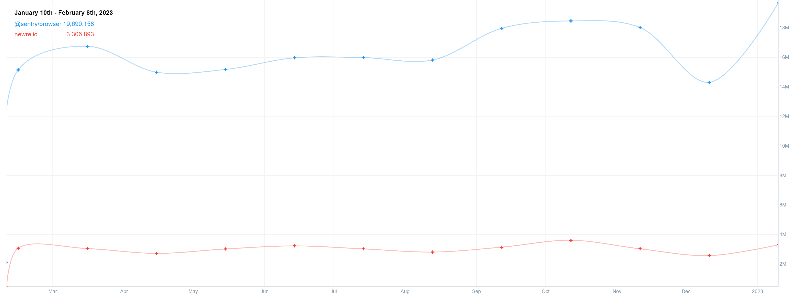

### 二、Sentry使用流程

#### 1. 官方文档

官方文档站点：[Sentry官网](https://docs.sentry.io/)

#### 2. 术语介绍

* FP(First Paint)：首次绘制时间，包括了任何用户自定义的背景绘制，它是首先将像素绘制到屏幕的时刻；
* FCP(First Content Paint)：首次内容绘制。浏览器将第一个 DOM 渲染到屏幕的时间，可能是文本、图像、SVG 等。这其实就是白屏时间；
* FMP(First Meaningful Paint)：首次有意义绘制。页面有意义的内容渲染的时间；
* LCP(Largest Contentful Paint)。最大内容渲染。代表在 viewport 中最大的页面元素加载的时间；
* DCL(DomContentLoaded)：DOM 加载完成。当 HTML 文档被完全加载和解析完成之后，DOMContentLoaded 事件被触发。无需等待样式表，图像和子框架的完成加载；
* L(onload)：当依赖的资源全部加载完毕之后才会触发；
* TTI(Time to Interactive)：可交互时间。用于标记应用已进行视觉渲染并能可靠响应用户输入的时间点；
* FID(First Input Delay)：首次输入延迟。用户首次和页面交互(单击链接、点击按钮等)到页面响应交互的时间；


这些术语代表了页面加载声明周期的几个阶段用于衡量页面性能的指标。

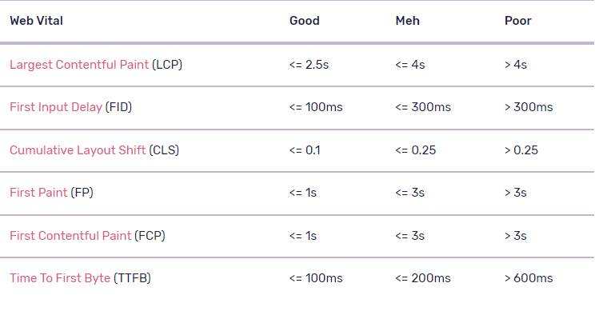
Google为这些指标制定了一个打分规则，用于衡量网站的质量。我们可以根据sentry对性能指标的打分来针对性的优化项目。

#### 3. 部署流程

方式一：通过Docker Compose部署

官方提供了docker-compose，也是它推荐的部署方式，参考地址：https://github.com/getsentry/onpremise。
``` bash
git clone https://github.com/getsentry/onpremise.git

cd onpremise

./install.sh

docker-compose up -d 
```

方式二：k8s部署

另外关于sentry的高可用方案，k8s部署，参考地址：https://github.com/sentry-kubernetes/charts。

#### 4. sentry结构

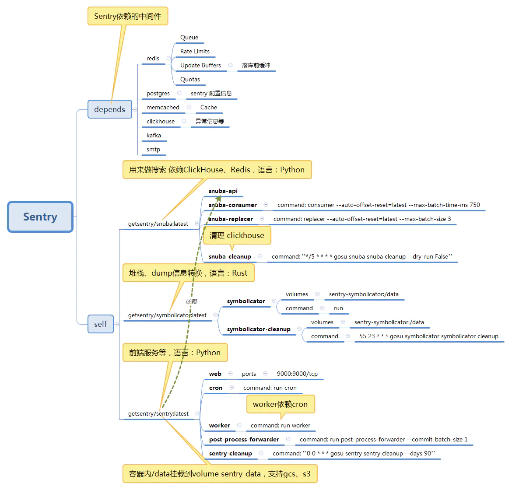

### 三、 项目使用

我们以vue项目来展示下如何使用。

#### 1. 安装依赖
``` bash
// npm
npm install --save @sentry/vue @sentry/tracing

// yarn
yarn add @sentry/vue @sentry/tracing
```

#### 2. sentry平台创建项目
项目 > 创建项目
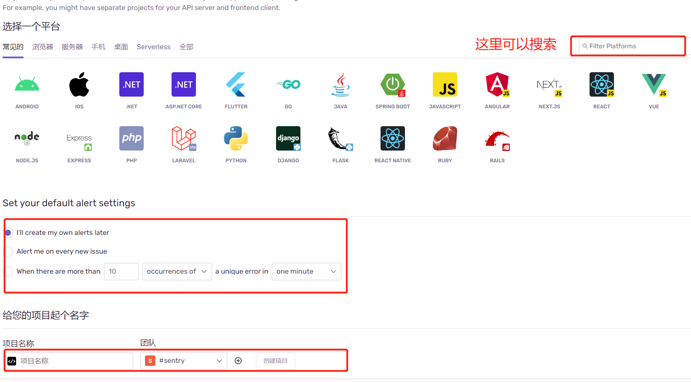

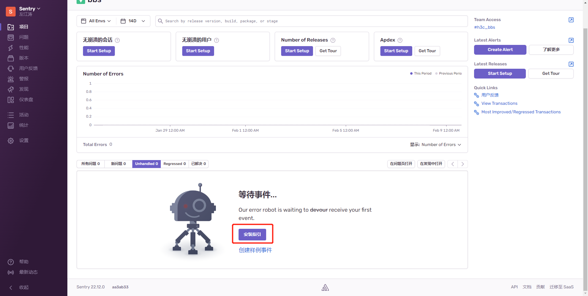

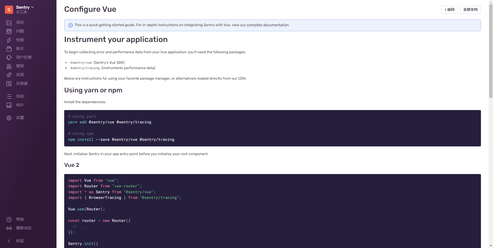

> 进入创建好的项目有详细的使用步骤。可以在说明里获取dsn，用于项目引入设置。

#### 3. 项目引入
// sentry.js
```js
import Vue from "vue";
import Router from "vue-router";
import * as Sentry from "@sentry/vue";
import { BrowserTracing } from "@sentry/tracing";

Vue.use(Router);

const router = new Router({
  // ...
});

Sentry.init({
  Vue,
  dsn: "https://examplePublicKey@o0.ingest.sentry.io/0", // 这里是创建项目获取的dsn
  integrations: [
    new BrowserTracing({
      routingInstrumentation: Sentry.vueRouterInstrumentation(router),
      tracingOrigins: ["localhost", "my-site-url.com", /^\//],
    }),
  ],
  // Set tracesSampleRate to 1.0 to capture 100%
  // of transactions for performance monitoring.
  // We recommend adjusting this value in production
  tracesSampleRate: 1.0,
});

// ...

new Vue({
  router,
  render: h => h(App),
}).$mount("#app");
```

// main.js
```js
if (process.env.NODE_ENV === 'production') {
  import('@/../sentry') // use sentry for monitor
}
```

#### 4. 线上验证

将配置好的项目重新部署，我们可以看下有什么变化？


可以看到数据已经在上报了，那么我们继续看下具体上报了什么东西？
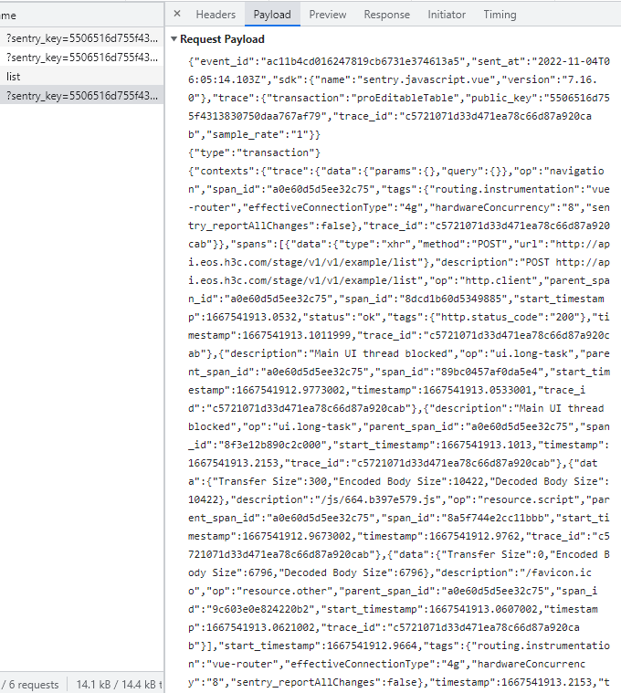

将数据格式化，我们看下。
```
sentry_key:
	5506516 d755f4313830750daa767af79
sentry_version:
	7
sentry_client:
	sentry.javascript.vue % 2 F7 .16 .0 {
		"event_id": "ac11b4cd016247819cb6731e374613a5",
		"sent_at": "2022-11-04T06:05:14.103Z",
		"sdk": {
			"name": "sentry.javascript.vue",
			"version": "7.16.0"
		},
		"trace": {
			"transaction": "proEditableTable",
			"public_key": "5506516d755f4313830750daa767af79",
			"trace_id": "c5721071d33d471ea78c66d87a920cab",
			"sample_rate": "1"
		}
	} {
		"type": "transaction"
	} {
		"contexts": {
			"trace": {
				"data": {
					"params": {},
					"query": {}
				},
				"op": "navigation",
				"span_id": "a0e60d5d5ee32c75",
				"tags": {
					"routing.instrumentation": "vue-router",
					"effectiveConnectionType": "4g",
					"hardwareConcurrency": "8",
					"sentry_reportAllChanges": false
				},
				"trace_id": "c5721071d33d471ea78c66d87a920cab"
			}
		},
		"spans": [{
			"data": {
				"type": "xhr",
				"method": "POST",
				"url": "http://api.eos.h3c.com/stage/v1/v1/example/list"
			},
			"description": "POST http://api.eos.h3c.com/stage/v1/v1/example/list",
			"op": "http.client",
			"parent_span_id": "a0e60d5d5ee32c75",
			"span_id": "8dcd1b60d5349885",
			"start_timestamp": 1667541913.0532,
			"status": "ok",
			"tags": {
				"http.status_code": "200"
			},
			"timestamp": 1667541913.1011999,
			"trace_id": "c5721071d33d471ea78c66d87a920cab"
		}, {
			"description": "Main UI thread blocked",
			"op": "ui.long-task",
			"parent_span_id": "a0e60d5d5ee32c75",
			"span_id": "89bc0457af0da5e4",
			"start_timestamp": 1667541912.9773002,
			"timestamp": 1667541913.0533001,
			"trace_id": "c5721071d33d471ea78c66d87a920cab"
		}, {
			"description": "Main UI thread blocked",
			"op": "ui.long-task",
			"parent_span_id": "a0e60d5d5ee32c75",
			"span_id": "8f3e12b890c2c000",
			"start_timestamp": 1667541913.1013,
			"timestamp": 1667541913.2153,
			"trace_id": "c5721071d33d471ea78c66d87a920cab"
		}, {
			"data": {
				"Transfer Size": 300,
				"Encoded Body Size": 10422,
				"Decoded Body Size": 10422
			},
			"description": "/js/664.b397e579.js",
			"op": "resource.script",
			"parent_span_id": "a0e60d5d5ee32c75",
			"span_id": "8a5f744e2cc11bbb",
			"start_timestamp": 1667541912.9673002,
			"timestamp": 1667541912.9762,
			"trace_id": "c5721071d33d471ea78c66d87a920cab"
		}, {
			"data": {
				"Transfer Size": 0,
				"Encoded Body Size": 6796,
				"Decoded Body Size": 6796
			},
			"description": "/favicon.ico",
			"op": "resource.other",
			"parent_span_id": "a0e60d5d5ee32c75",
			"span_id": "9c603e0e824220b2",
			"start_timestamp": 1667541913.0607002,
			"timestamp": 1667541913.0621002,
			"trace_id": "c5721071d33d471ea78c66d87a920cab"
		}],
		"start_timestamp": 1667541912.9664,
		"tags": {
			"routing.instrumentation": "vue-router",
			"effectiveConnectionType": "4g",
			"hardwareConcurrency": "8",
			"sentry_reportAllChanges": false
		},
		"timestamp": 1667541913.2153,
		"transaction": "proEditableTable",
		"type": "transaction",
		"transaction_info": {
			"source": "custom",
			"changes": [],
			"propagations": 1
		},
		"platform": "javascript",
		"event_id": "ac11b4cd016247819cb6731e374613a5",
		"environment": "production",
		"sdk": {
			"integrations": ["InboundFilters", "FunctionToString", "TryCatch", "Breadcrumbs", "GlobalHandlers", "LinkedErrors", "Dedupe", "HttpContext", "BrowserTracing"],
			"name": "sentry.javascript.vue",
			"version": "7.16.0",
			"packages": [{
				"name": "npm:@sentry/vue",
				"version": "7.16.0"
			}]
		},
		"breadcrumbs": [{
			"timestamp": 1667541890.766,
			"category": "navigation",
			"data": {
				"from": "/",
				"to": "/dashboard/list"
			}
		}, {
			"timestamp": 1667541891.027,
			"category": "navigation",
			"data": {
				"from": "/dashboard/list",
				"to": "/components/table/ProTablePlus"
			}
		}, {
			"timestamp": 1667541891.195,
			"category": "xhr",
			"data": {
				"method": "POST",
				"url": "http://api.eos.h3c.com/stage/v1/v1/example/list",
				"status_code": 200
			},
			"type": "http"
		}, {
			"timestamp": 1667541891.355,
			"category": "xhr",
			"data": {
				"method": "GET",
				"url": "http://api.eos.h3c.com/stage/v1/import/template/list?componentKey=portal-application-table",
				"status_code": 200
			},
			"type": "http"
		}, {
			"timestamp": 1667541891.356,
			"category": "xhr",
			"data": {
				"method": "GET",
				"url": "http://api.eos.h3c.com/stage/v1/export/template/list?componentKey=portal-application-table",
				"status_code": 200
			},
			"type": "http"
		}, {
			"timestamp": 1667541891.357,
			"category": "xhr",
			"data": {
				"method": "GET",
				"url": "http://api.eos.h3c.com/stage/v1/view/list/portal-application-table",
				"status_code": 200
			},
			"type": "http"
		}, {
			"timestamp": 1667541892.364,
			"category": "sentry.transaction",
			"event_id": "38a33b9586c040ae819f14c5784b0f4d",
			"message": "38a33b9586c040ae819f14c5784b0f4d"
		}, {
			"timestamp": 1667541892.368,
			"category": "xhr",
			"data": {
				"method": "GET",
				"url": "http://rap2api.taobao.org/app/mock/270426/city?bussinessId=324",
				"status_code": 200
			},
			"type": "http"
		}, {
			"timestamp": 1667541892.466,
			"category": "xhr",
			"data": {
				"method": "GET",
				"url": "http://rap2api.taobao.org/app/mock/270426/getCascaderList?bussinessId=324",
				"status_code": 200
			},
			"type": "http"
		}, {
			"timestamp": 1667541893.469,
			"category": "sentry.transaction",
			"event_id": "8f2e3e3f21fb4c5baa189d99652b14b6",
			"message": "8f2e3e3f21fb4c5baa189d99652b14b6"
		}, {
			"timestamp": 1667541912.963,
			"category": "ui.click",
			"message": "div > i.anticon.anticon-close.ant-tabs-close-x > svg"
		}, {
			"timestamp": 1667541912.979,
			"category": "navigation",
			"data": {
				"from": "/components/table/ProTablePlus",
				"to": "/components/editableTable/proEditableTable"
			}
		}, {
			"timestamp": 1667541913.102,
			"category": "xhr",
			"data": {
				"method": "POST",
				"url": "http://api.eos.h3c.com/stage/v1/v1/example/list",
				"status_code": 200
			},
			"type": "http"
		}],
		"request": {
			"url": "http://preview.eos.h3c.com/components/editableTable/proEditableTable",
			"headers": {
				"User-Agent": "Mozilla/5.0 (Windows NT 10.0; WOW64) AppleWebKit/537.36 (KHTML, like Gecko) Chrome/106.0.0.0 Safari/537.36"
			}
		}
	}
```

可以看到上报的数据除了sentry自己的信息外，包括了页面的资源，事件交互信息，接口请求及设备信息等。
这些信息都将上报到sentry平台用于性能分析。

那么如果页面报错了呢？是否会按照我们预想的一样，也会在平台上看到呢？
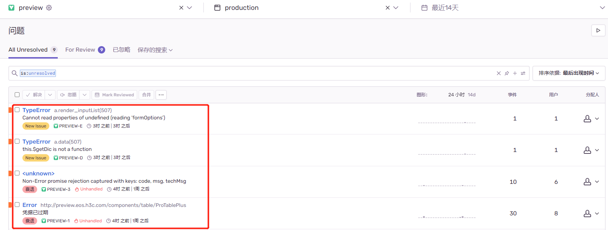
可以看到，错误信息确实上报到了平台。

#### 5. 功能介绍

部署好之后登录进入，显示：


我们着重介绍项目、问题、性能、警报和设置。

_**[项目](https://docs.sentry.io/product/projects/)**_
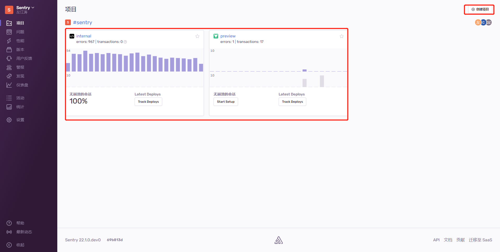

_**[问题](https://docs.sentry.io/product/issues/)**_
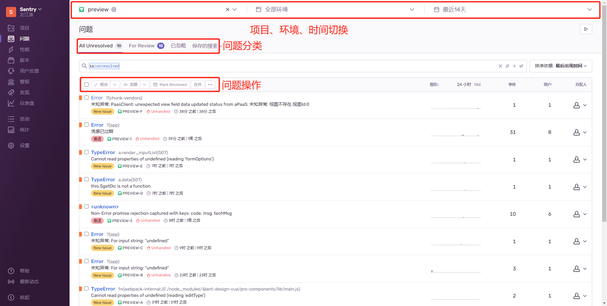

_**问题详情**_
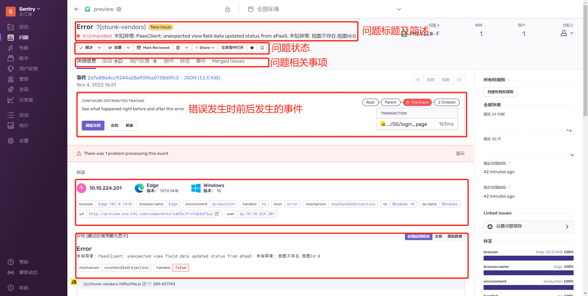

**_[性能](https://docs.sentry.io/product/performance/web-vitals/)_**
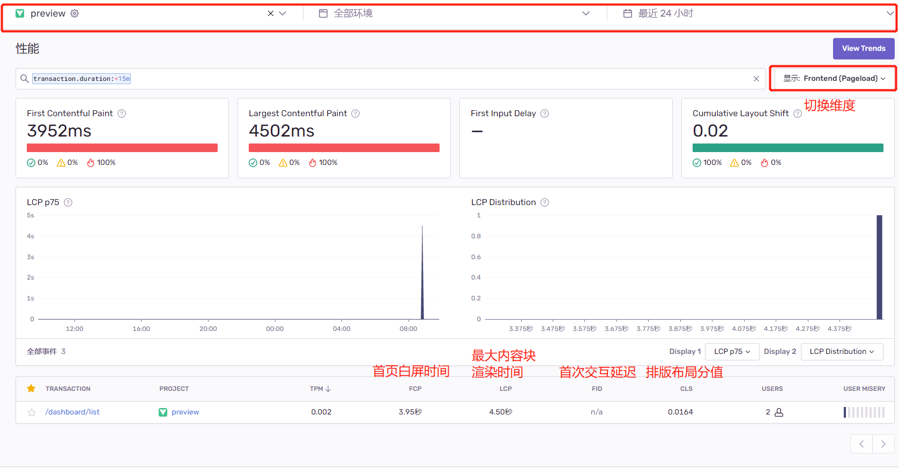

_**[警告](https://docs.sentry.io/product/alerts/)**_

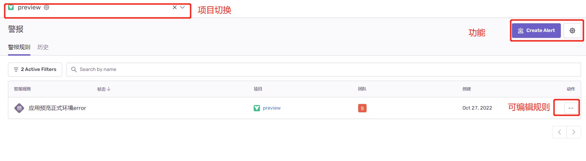

_**[设置](https://docs.sentry.io/product/accounts/getting-started/)**_
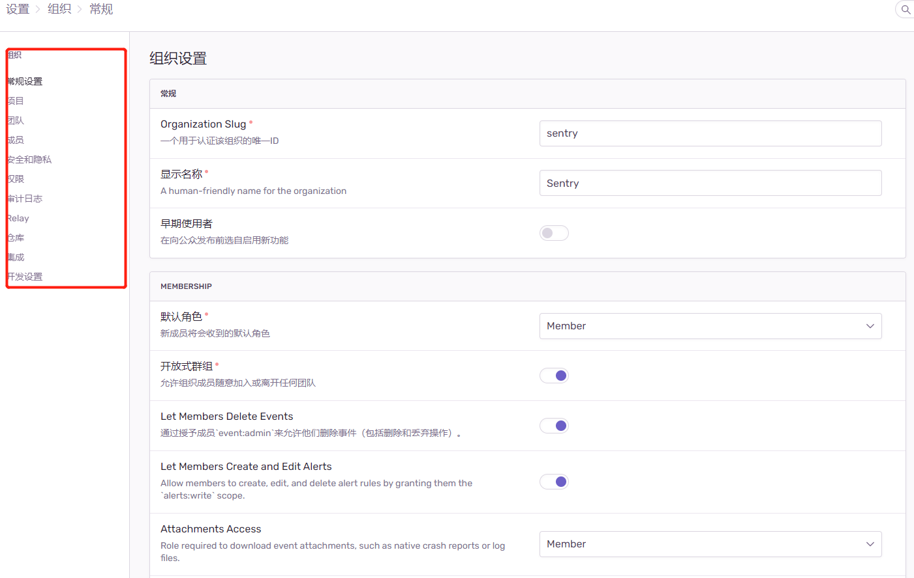

#### 6. 邮件通知配置

一般说来，我们不会时时刻刻地盯着平台看自己的项目是否有线上错误。我们需要的是只有在线上项目报错的时候知道，然后尽快解决即可。
因此我们需要使用告警功能，而sentry的告警功能很强大。这里我们只介绍邮件告警，其他的大家自己去看。

邮件告警配置很简单。
首先进入警报页面，然后点击右上角的 `Create Alert` 按钮，如图：
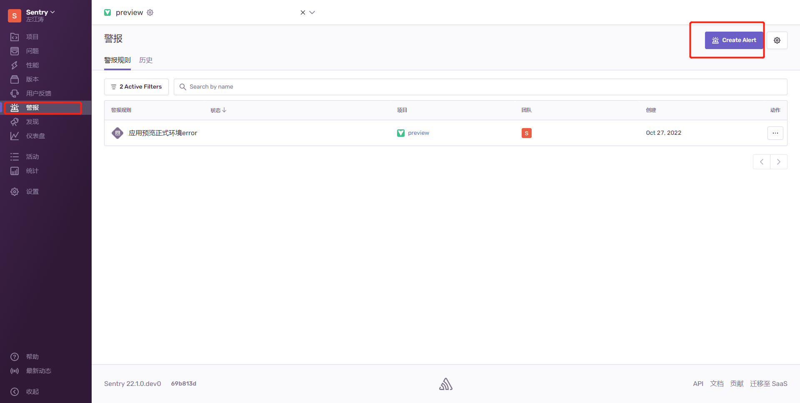

然后进入 `Select Alert` 页面，这里可以选择告警的类型，如问题还是性能等。如图：
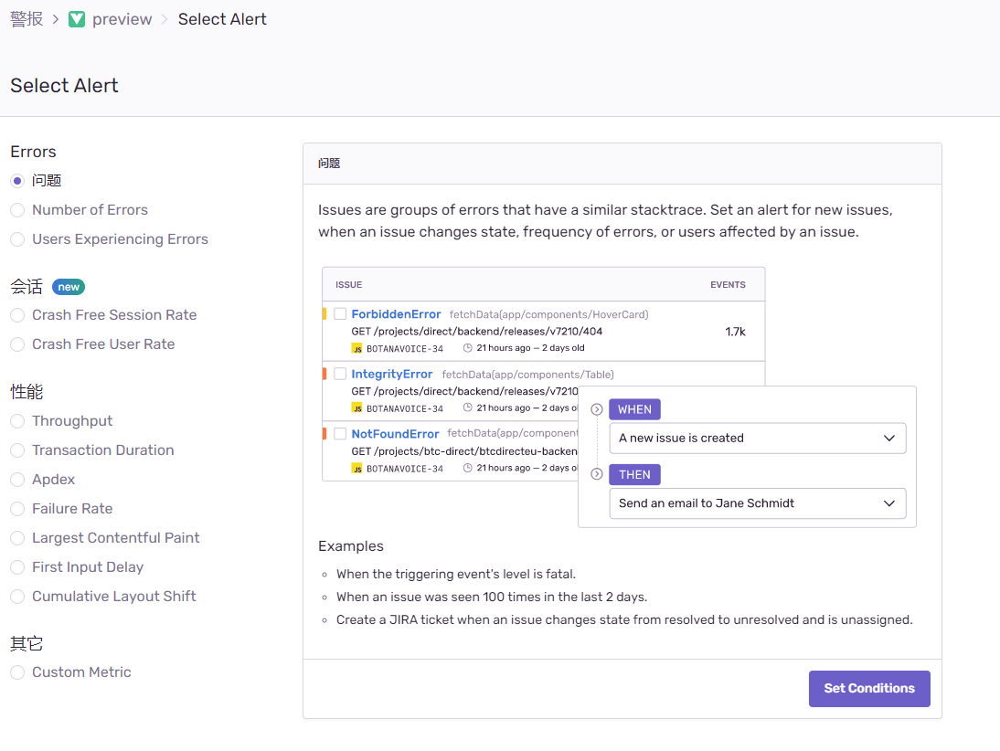

最后点击右下角的 `Set Conditions` 按钮进入配置规则页面。如图：
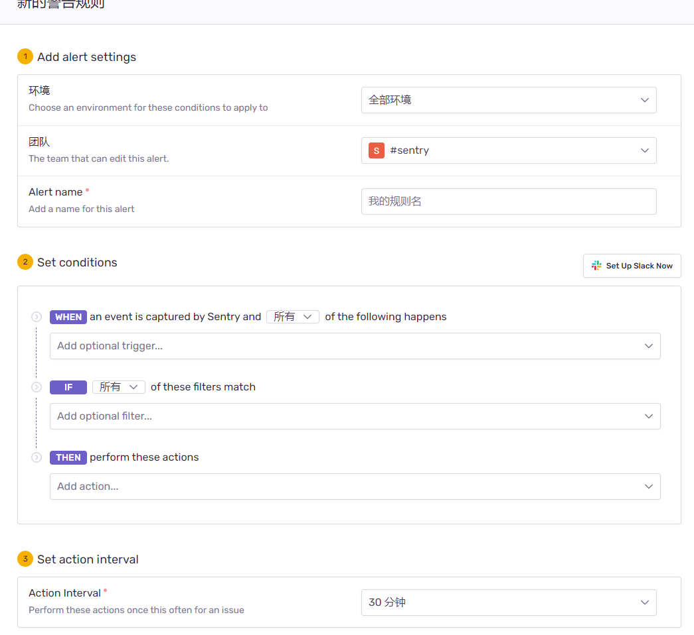

在配置规则页面，第一步是配置环境和想要通知的团队；第二步配置规则；第三步配置告警事件间隔。最后点击最下方的 `保存规则` 按钮即可。

这样在配置好规则后，当线上环境报错后会邮件通知相关人员。如图：
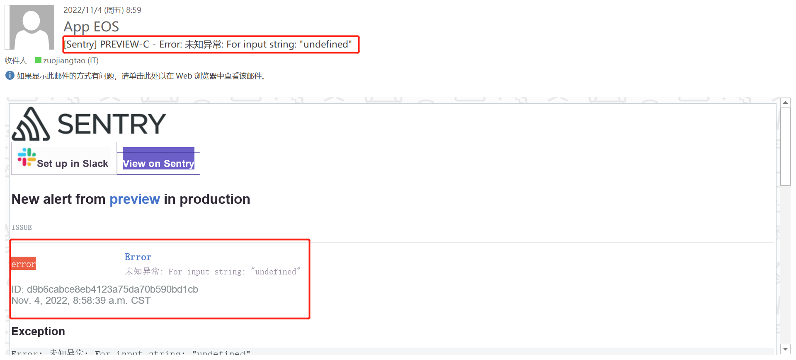

#### 7. 上传用户信息
在处理错误时，我们想知道异常的用户信息。可以通过sentry提供的方法主动上报用户信息。

```js
// ...void 之前的sentry代码

// 用户信息设置
Sentry.setUser({
  // id: storage.get('userName'), // userId cookie.get('userId')
  // email: 'test@qq.com', // cookie.get('email')
  username: storage.get('userName'), // cookie.get('username')
})
```

线上报错可以看到已经上传用户信息：
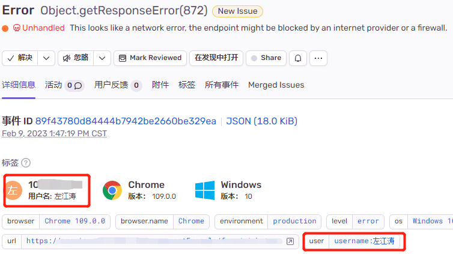

#### 8. 快照
要实现异常快照要额外安装依赖 `rrweb`和`@sentry/rrweb`。

```js
import Vue from 'vue'
import router from '../router'
import * as Sentry from '@sentry/vue'
import { BrowserTracing } from '@sentry/tracing'
import SentryRRWeb from '@sentry/rrweb'
import storage from 'store'

Sentry.init({
    Vue,
    dsn: process.env.VUE_APP_SENTRY_DSN,
    integrations: [
        new BrowserTracing({
            routingInstrumentation: Sentry.vueRouterInstrumentation(router),
            tracingOrigins: ['https', 'xxx.yyy.zzz.com/', /^\//],
        }),
        new SentryRRWeb({
            checkoutEveryNms: 10 * 1000, // 每10秒重新制作快照
            checkoutEveryNth: 200, // 每 200 个 event 重新制作快照
            maskAllInputs: false, // 将所有输入内容记录为 *
        }),
    ],
    // Set tracesSampleRate to 1.0 to capture 100%
    // of transactions for performance monitoring.
    // We recommend adjusting this value in production
    tracesSampleRate: 1.0,
    environment: process.env.NODE_ENV,
})
```

查看报错快照:
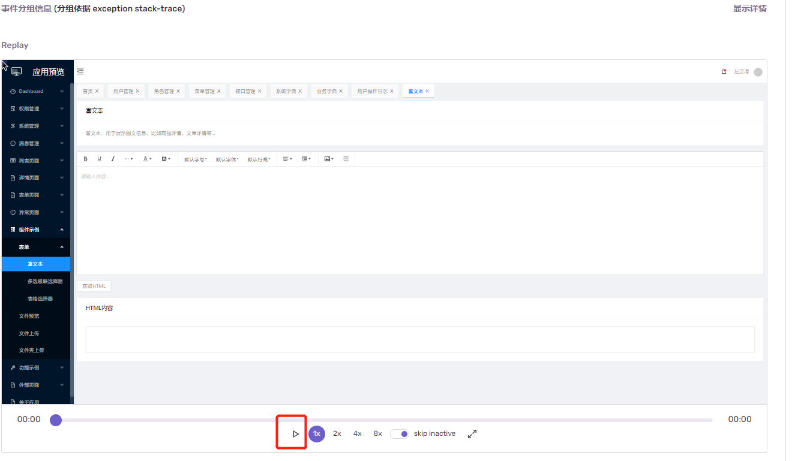
点击播放可以看到报错过程。

#### 9. sourceMap文件上传
安装依赖
```
npm install --save-dev @sentry/webpack-plugin
```

// webpack.config.js
```js
const SentryWebpackPlugin = require("@sentry/webpack-plugin");

module.exports = {
  // ... other config above ...

  devtool: "source-map", // Source map generation must be turned on
  plugins: [
    new SentryWebpackPlugin({
      org: "example-org",
      project: "example-project",

      // Specify the directory containing build artifacts
      include: "./dist",

      // Auth tokens can be obtained from https://sentry.io/settings/account/api/auth-tokens/
      // and needs the `project:releases` and `org:read` scopes
      authToken: process.env.SENTRY_AUTH_TOKEN,

      // Optionally uncomment the line below to override automatic release name detection
      // release: process.env.RELEASE,
    }),
  ],
};
```
Sentry Webpack 插件会自动将发布值注入 SDK，因此您必须省略release选项Sentry.init或确保Sentry.init的release选项与插件的release选项完全匹配：

authToken设置路径：
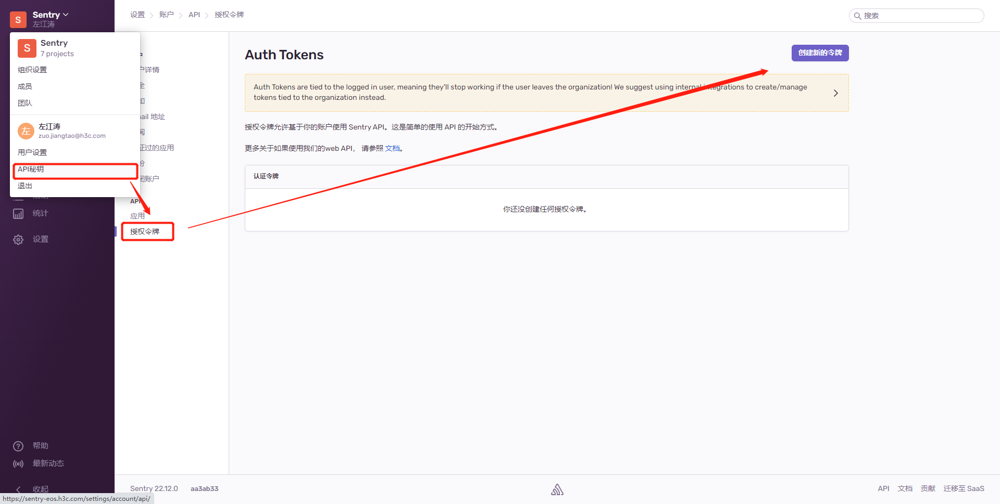

### 四、遇到的问题

1. 部署时，报错服务器cpu缺少指令集的问题。  
    我们将源代码下载到本地，修改源码的校验规则跳过对这一条的校验。现在运行了一段时间，可以正常使用。
2. KafkaError{code=UNKNOWN_TOPIC_OR_PART,val=3,str="Subscribed topic not available: snuba-transactions-commit-log: Broker: Unknown topic or partition"}  
    这一条是Kafka的错误，**暂未解决**。
3. 微前端qiankun方案下，多个子应用上报的问题。  
    在单页存在多个子应用时，报错会全部发到父应用。这极大地影响正常的异常监控。我在网上找到了一个解决方案。
[使用 Sentry 做异常监控 - 如何优雅的解决 Qiankun 下 Sentry 异常上报无法自动区分项目的问题 ?](https://juejin.cn/post/7139452175088320520)

### 五、相关资料参考
1. [Sentry的应用接入与部署运维](http://events.jianshu.io/p/64a3b3283f0a)
2. [知乎-你是如何搭建 Web 前端性能监控系统的？](https://www.zhihu.com/question/37585246)
3. [使用 Sentry 做性能监控 - 基于 qiankun 的实践篇](https://juejin.cn/post/7151753156341268487)
