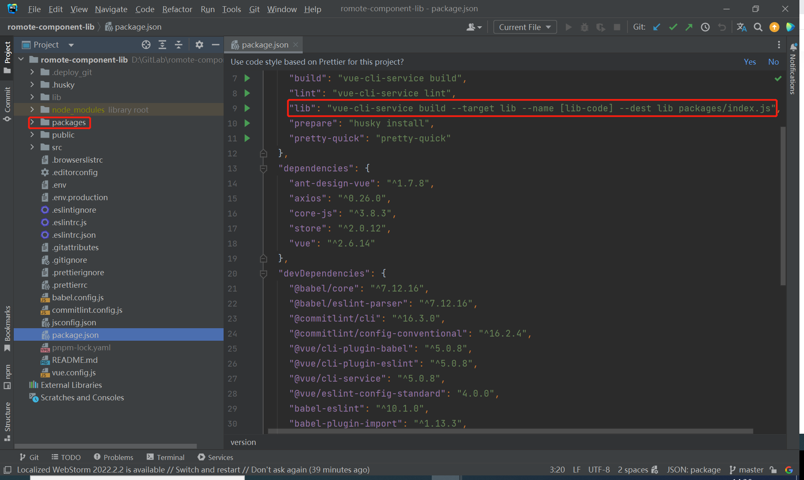
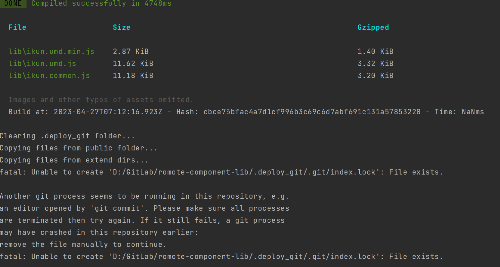
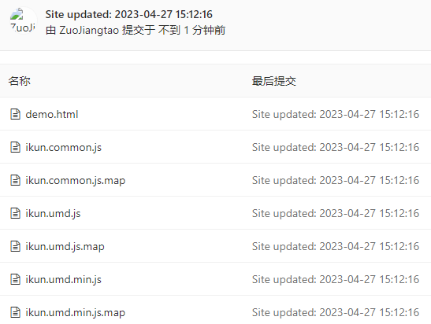

title: Webpack Plugin开发实践
---

本文带你一起学习webpack的插件开发，以实际项目需求为入口，深入浅出学习webpack插件开发流程，通过学习本文让你能够开发自己的webpack插件。

本文相关源代码地址: [git-deployer-webpack-plugin](https://github.com/Zuojiangtao/git-deployer-webpack-plugin)。

> 本文以webpack5为例。

### 一、需求背景

目前业务部门存在这样一个需求,需要一种能够将部分业务组件抽离为远程组件的方案,即一处开发多处复用。实际场景是在某个项目内将其中一部分单独抽离为远程组件,例如一些数据可视化面板可能在多个项目中使用,这确实可以减少重复开发的工作量。

后续的讨论方案是将可复用的面板打包为远程组件库,在需要使用的时候动态加载。

但是,这同时也带来了一个不太方便的问题,源代码存放在一个Git库中,而打包出来的远程组件库也需要Git仓库管理。虽然可以通过调整Jenkins发布流水线或者单独为远程组件库建立Git库的方式解决这个问题,但两种方案各有其不足之处。第一种方案不具有很强的通用性,并且不是所有开发人员都具备这方面的能力;第二种方案略显繁琐,需要开发人员将编译后的组件库lib包单独拷贝到新Git仓库后再上传。每次组件库有更新,都需要重复此过程,既费时又易出错。

因此,我想如果能在编译远程组件库后自动将编译得到的lib包上传到Git远程仓库,那就很理想。首先想到的就是之前使用过的Hexo,通过deploy命令将本地文件生成并上传到GitHub。那么,如果自己编写一个Webpack插件,在编译阶段完成后执行这个过程,是不是个不错的主意呢?

### 二、webpack插件开发介绍

#### 1. 官方文档

这里是官方介绍：[自定义插件](https://webpack.docschina.org/contribute/writing-a-plugin/#creating-a-plugin)

#### 2. 重要知识点

webpack 插件由以下组成:
1. 一个 JavaScript 命名函数或 JavaScript 类。
2. 在插件函数的 prototype 上定义一个 apply 方法。
3. 指定一个绑定到 webpack 自身的事件钩子。
4. 处理 webpack 内部实例的特定数据。
5. 功能完成后调用 webpack 提供的回调。

`Compiler` 它扩展自 `Tapable` 类，设置了一系列事件钩子和各种配置参数，并定义了 webpack 诸如启动编译、观测文件变动、将编译结果文件写入本地等一系列核心方法。

常见事件钩子介绍：
* beforeRun：在编译器开始读取 records 之前执行;
* run：在读取 records 之前;
* thisCompilation：在 compilation 初始化时执行;
* compilation：在 compilation 创建之后执行;
* make：在 complication 完成之前执行;
* afterCompilation：在 compilation 完成后执行;
* emit：在生成文件到 output 目录之前执行;
* afterEmit：在生成文件到 output 目录之后执行;
* done：在 compilation 完成之后执行;

`Compilation` 类扩展(extend)自 `Tapable`，并提供了以下生命周期钩子:
* addChunk
* `addEntry`
* deleteAsset
* buildModule
* optimize

#### 3. 需求分析

根据上述文档介绍，我们可以将所需实现的功能锁定为编译成功并输出assets之后的阶段——即`afterEmit`之后的钩子。在这里，我们选择使用`done`钩子。
接下来，我们需要分析的是等待编译完成并将静态资源上传到指定的Git远程仓库。为此，我们只需要使用`compiler`即可。
基本框架已经确定了。根据文档，在一个命名函数或类内应用 `apply` 方法，并在 compiler 的`done`钩子期间应用我们的业务逻辑。然后，针对不同的场景，可以将这些场景参数化，并将参数传递到业务逻辑函数中。
至于业务逻辑，即读取并复制指定文件到`.deploy_git`中，并手动写入Git命令上传。此外，需要对空值进行判断。

### 三、需求实现

#### 1. 基础架构

```js
/**
 * GitDeployerWebpackPlugin
 * 一个将指定文件推送到Git远程仓库的webpack插件。
 * A webpack plugin that pushes specified files to a Git remote repository.
 **/
const deployer = require('./lib/deployer')

const PLUGIN_ID = 'git-deployer-webpack-plugin'

class GitDeployerWebpackPlugin {
  constructor(options) {
    this.options = options
  }

  apply(compiler) {
    compiler.hooks.done.tap(PLUGIN_ID, () => {
      deployer(this.options)
    })
  }
}

module.exports = GitDeployerWebpackPlugin
```

#### 2. 业务逻辑编写

详细代码请看：[git-deployer-webpack-plugin/lib /deployer.js](https://github.com/Zuojiangtao/git-deployer-webpack-plugin/blob/main/lib/deployer.js)。

通过阅读源代码，可以发现代码逻辑很简单，就是将制定文件下的内容拷贝到 `.deploy_git` 下，并写出git命令将这些文件推送到远程git仓库指定分支。

#### 3. 验证

```shell
// 先建立软链接
yarn link

// 然后在测试项目中使用
yarn link "git-deployer-webpack-plugin"

// 然后在测试项目运行编译命令
yarn run lib
```

#### 4. 发布npm包

发布npm包不在此赘述。发布后可在npm上查看 [git-deployer-webpack-plugin](https://www.npmjs.com/package/git-deployer-webpack-plugin) 或在npm上搜索 `git-deployer-webpack-plugin`查看详情。

### 四、项目中使用plugin

#### 1. 创建编译入口文件

为了和正常编译 `build` 命令区分，要创建一个新的编译入口文件并将需要暴漏的组件注册。

根目录创建 `packages/index.js` 文件，在此文件内将需要暴漏的组件引入并注册。



```js
// package/index.js
import BarChart from '../src/components/BarChart'
import LineChart from '../src/components/LineChart'
// 组件集合，用于遍历
const components = [BarChart, LineChart]

// 定义 install 方法
const install = function (Vue) {
  if (install.installed) return
  // 遍历注册全局组件
  components.map(component => Vue.component(component.name, component))
}

// 判断是否是直接引入文件
if (typeof window !== 'undefined' && window.Vue) {
  install(window.Vue)
}
export default {
  install, // 导出的对象必须具备一个 install 方法
  ...components, // 组件列表
}
```

是否在根目录创建取决于你的打包编译命令的入口文件路径。我这里这样做为了醒目区分。

#### 2. vue项目命令更改

> @vue/cli有3种构建目标，除了常用的应用构建，还有库构建和web components组件2种。具体见官方：[构建目标](https://cli.vuejs.org/zh/guide/build-targets.html)。

```json
{
  // ...
  "script": {
    "lib": "vue-cli-service build --target lib --name ikun --dest lib packages/index.js",
  },
  // ...
}
```

我这里使用了lib库构建，具体使用哪种构建目标应该结合你自己的业务。命令也是可以各自命名，如：`build:lib`, `deploy`等命令。

#### 3. 项目中使用

安装依赖：
```shell
npm install git-deployer-webpack-plugin -D
```

webpack配置：
```js
// vue.config.js
const GitDeployerWebpackPlugin = require('git-deployer-webpack-plugin')

// ...
configureWebpack = {
    plugins: [
        new GitDeployerWebpackPlugin({
            type: 'git',
            repo: '/*your gitlab repo url*/', // git url
            branch: 'master', // 指定上传目标分支
            public_dir: 'lib', // 指定本地需要上传的文件夹name
        }),
    ]
}
// ...
```

#### 4. 运行编译命令

```shell
npm run lib
```



可以看到，在编译成功后会自动将代码拷贝到 `.deploy_git` 文件下，自动将编译包推送到制定git远程仓库。

> 在运行库构建模式时可能会报错，这是@vue/cli改写了webpack导致的，不影响代码推送。

#### 5. 查看git仓库验证



### 五、总结

通过学习Webpack的编译阶段及其生命周期，我们了解到可以选择合适的阶段来满足自身业务需求，并将其应用于项目中。
本文实现了一个Webpack插件，通过其可将指定文件上传至Git远程仓库，以满足将项目中部分组件抽离为公用组件库，将其编译包上传至新的Git仓库，并流水线发布为公用组件库的需求。
通过之前的需求开发，你也明白了，除了满足项目需求之外，该插件在其他需要将文件上传Git的场景中同样适用。

### 资料参考

- [webpack中文](https://webpack.docschina.org/)
- [Vue Cli——构建目标](https://cli.vuejs.org/zh/guide/build-targets.html)
